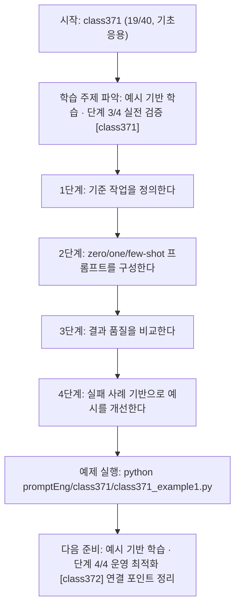
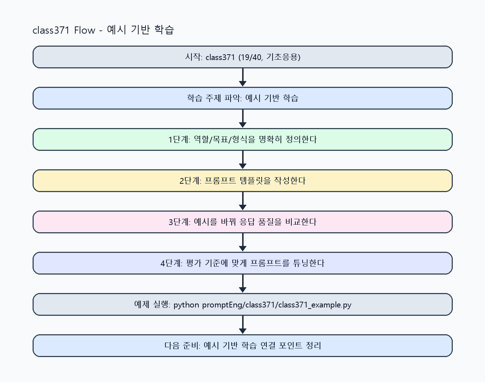

<!-- 이 파일은 www.edumgt.co.kr 의 에듀엠지티에 저작권이 있습니다 -->
# class371 자기주도 학습 가이드

## 1) 오늘의 학습 정보
- 교과목: **프롬프트 엔지니어링**
- 학습 주제: **예시 기반 학습 · 단계 3/4 실전 검증 [class371]**
- 세부 시퀀스: **19/40**
- 일정: **Day 47 / 3교시**
- 난이도: **기초응용**

### 교과목·학습주제 어휘 해설 (IT 강사 스타일)
#### 교과목 표현 분석: `프롬프트 엔지니어링`
- 문법 포인트: 핵심 개념 명사를 중심으로 한 명사구 구조입니다.
- 기술 포인트: 프롬프트 설계로 모델 응답 품질을 제어하는 생성형 AI 교과목입니다.
| 용어 | 문법/품사 | 한글·한자 | 영어 | 기술 설명 |
| --- | --- | --- | --- | --- |
| `프롬프트` | 명사(외래어) | 프롬프트 (한자 없음) | prompt | 모델의 응답 방향을 결정하는 입력 지시문입니다. |
| `엔지니어링` | 명사(외래어) | 엔지니어링 (한자 없음) | engineering | 재현 가능한 품질을 목표로 설계·검증하는 공학적 접근입니다. |

#### 학습주제 표현 분석: `예시 기반 학습 · 단계 3/4 실전 검증 [class371]`
- 문법 포인트: 핵심 개념 명사를 중심으로 한 명사구 구조입니다.
- 기술 포인트: 이번 차시는 `예시 기반 학습` 핵심 개념을 코드 구현, 결과 해석, 점검 기준으로 연결합니다.
| 용어 | 문법/품사 | 한글·한자 | 영어 | 기술 설명 |
| --- | --- | --- | --- | --- |
| `예시` | 명사(주제 핵심 용어) | 예시 (한자 없음) | (topic-specific) | 이번 차시 맥락: 모델이 문제 유형을 빠르게 파악하도록 예시를 적절히 제공하면 오답과 형식 오류를 줄일 수 있습니다. 이를 기준으로 `예시`를 코드와 결과 해석에 연결합니다. |
| `학습` | 명사 | 학습 (學習) | training/learning | 데이터로부터 모델 파라미터를 조정하는 과정입니다. |
| `Zero-shot` | 영문 기술명/약어 | Zero-shot (한자 없음) | Zero-shot | 이번 차시 맥락: Zero-shot, One-shot, Few-shot 패턴을 비교해 프롬프트 성능을 개선하는 차시입니다. 이를 기준으로 `Zero-shot`를 코드와 결과 해석에 연결합니다. |
| `One-shot` | 영문 기술명/약어 | One-shot (한자 없음) | One-shot | 이번 차시 맥락: Zero-shot, One-shot, Few-shot 패턴을 비교해 프롬프트 성능을 개선하는 차시입니다. 이를 기준으로 `One-shot`를 코드와 결과 해석에 연결합니다. |
| `Few-shot` | 영문 기술명/약어 | Few-shot (한자 없음) | Few-shot | 이번 차시 맥락: Zero-shot, One-shot, Few-shot 패턴을 비교해 프롬프트 성능을 개선하는 차시입니다. 이를 기준으로 `Few-shot`를 코드와 결과 해석에 연결합니다. |

## 2) 이전에 배운 내용 (복습)
- 이전 차시: **class370 / 예시 기반 학습 · 단계 2/4 기초 구현 [class370]** (Day 47 / 2교시)
- 복습 연결: 이전에 배운 **예시 기반 학습 · 단계 2/4 기초 구현 [class370]** 를 떠올리며, 오늘 **예시 기반 학습 · 단계 3/4 실전 검증 [class371]** 와 어떤 점이 이어지는지 비교해 보세요.

## 3) 주제를 아주 쉽게 이해하기
- 한 줄 설명: Zero-shot, One-shot, Few-shot 패턴을 비교해 프롬프트 성능을 개선하는 차시입니다.
- 왜 배우나요?: 모델이 문제 유형을 빠르게 파악하도록 예시를 적절히 제공하면 오답과 형식 오류를 줄일 수 있습니다.

### 핵심 개념 3가지
1. `Zero-shot`은 예시 없이 지시만으로 수행합니다.
2. `One-shot`은 기준 예시 1개를 제공해 출력 패턴을 고정합니다.
3. `Few-shot`은 다양한 예시로 일반화 성능을 높입니다.

### 비유로 이해하기
- 친구에게 길을 물을 때 목적지와 조건을 정확히 말해야 정확한 답을 듣는 것과 같아요.

## 4) 실습 환경 만들기 (항상 먼저)
아래 명령은 **처음 한 번** 준비해 두면 이후 학습이 쉬워집니다.

### Windows PowerShell
```powershell
cd C:\DevOps\Python-AI_Agent-Class
python -m venv .venv
.\.venv\Scripts\Activate.ps1
python -m pip install --upgrade pip
pip install -r requirements.txt
```

### Linux/macOS (bash)
```bash
cd /path/to/Python-AI_Agent-Class
python3 -m venv .venv
source .venv/bin/activate
python -m pip install --upgrade pip
pip install -r requirements.txt
```

## 5) 오늘의 예제 코드
- 예제 파일: `class371_example1.py`
- 실행 명령:
```bash
python promptEng/class371/class371_example1.py
```

### example1~example5 단계별 테스트 확장
1. example1: zero-shot 기준 응답을 생성한다.
2. example2: one-shot 예시 1개를 추가해 비교한다.
3. example3: few-shot 예시 확장으로 오답 감소를 점검한다.
4. example4: 예시 품질/개수 trade-off를 분석한다.
5. example5: 예시 기반 템플릿 표준을 정리한다.

<!-- AUTO-GENERATED: TECH_STACK_FLOW START -->
### 기술 스택
- 언어: `Python 3`
- 실행: `CLI` (`python promptEng/class371/class371_example1.py`)
- 주요 문법: `shot 템플릿`, `예시 목록(list)`, `비교 실험 루프`, `품질 점수 집계`
- 학습 포커스: `예시 기반 학습 · 단계 3/4 실전 검증 [class371]`

### 실습 example1.py 동작 원리 (Mermaid Flowchart)


### Flow PNG 캡처

<!-- AUTO-GENERATED: TECH_STACK_FLOW END -->

### 예제 코드를 볼 때 집중할 포인트
1. 예시가 목표 작업과 동일 분포인지 확인하기
2. 예시 과적합으로 일반 입력 성능이 떨어지지 않는지 점검하기
3. 예시 추가 비용 대비 성능 이득을 기록하는지 확인하기

## 6) 퀴즈로 복습하기 (10문항)
- 퀴즈 파일: `class371_quiz.html`
- 브라우저에서 열기:
```bash
promptEng/class371/class371_quiz.html
```
- 버튼 설명:
1. `채점하기`: 현재 선택한 답으로 점수를 계산해요.
2. `다시풀기`: 선택을 모두 지우고 처음부터 다시 풀어요.

## 7) 혼자 실습 순서 (초등학생 버전)
1. 코드를 한 번 그대로 실행해요.
2. 숫자/문장 값을 1개 바꿔요.
3. 결과가 왜 바뀌었는지 한 줄로 적어요.
4. 함수를 1개 더 만들어 작은 기능을 추가해요.

### 실습 미션
1. 동일 작업을 zero/one/few-shot으로 각각 실행해 비교하세요.
2. 예시 개수와 품질을 바꿔 오답률 변화를 확인하세요.
3. 실패 케이스를 예시에 반영해 재실행하세요.

## 8) 스스로 점검 체크리스트
- [ ] zero/one/few-shot 차이를 설명할 수 있다.
- [ ] 예시 추가 전후 품질 차이를 수치/근거로 제시했다.
- [ ] 실패 패턴을 예시 설계에 반영했다.

## 9) 막히면 이렇게 해결해요
1. 에러 메시지 마지막 줄을 먼저 읽어요.
2. 함수 이름과 괄호 짝을 확인해요.
3. `print()`를 넣어 중간 값을 확인해요.
4. 그래도 안 되면 어제 성공한 코드와 한 줄씩 비교해요.

## 10) 학습 후 다음에 배울 내용
- 다음 차시: **class372 / 예시 기반 학습 · 단계 4/4 운영 최적화 [class372]** (Day 47 / 4교시)
- 미리보기: 다음 차시 전에 **예시 기반 학습 · 단계 3/4 실전 검증 [class371]** 핵심 코드 1개를 다시 실행해 두면 예시 기반 학습 · 단계 4/4 운영 최적화 [class372] 학습이 더 쉬워집니다.

## 11) 다음 차시 연결
- 다음 차시에서는 Chain-of-thought 개념과 step-by-step 유도 방식을 적용합니다.
- 오늘 코드를 복사하지 말고, 직접 다시 작성해 보세요.
