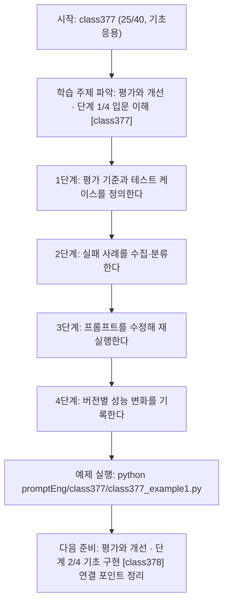
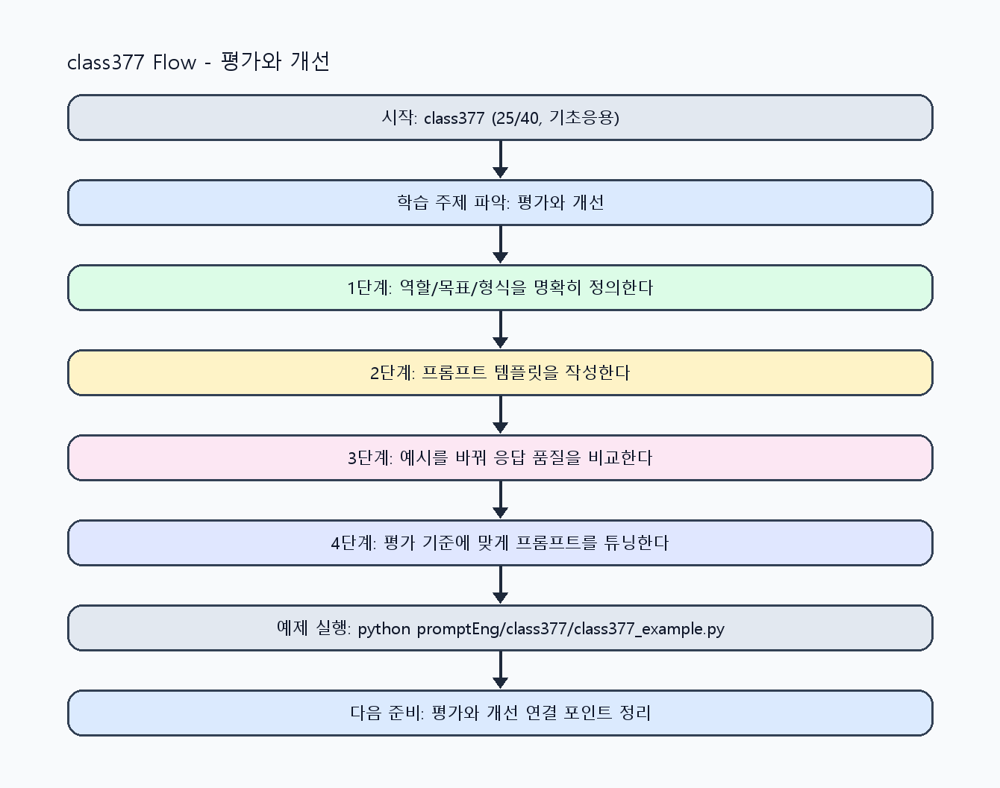

<!-- 이 파일은 www.edumgt.co.kr 의 에듀엠지티에 저작권이 있습니다 -->
# class377 자기주도 학습 가이드

## 1) 오늘의 학습 정보
- 교과목: **프롬프트 엔지니어링**
- 학습 주제: **평가와 개선 · 단계 1/4 입문 이해 [class377]**
- 세부 시퀀스: **25/40**
- 일정: **Day 48 / 1교시**
- 난이도: **기초응용**

### 교과목·학습주제 어휘 해설 (IT 강사 스타일)
#### 교과목 표현 분석: `프롬프트 엔지니어링`
- 문법 포인트: 핵심 개념 명사를 중심으로 한 명사구 구조입니다.
- 기술 포인트: 프롬프트 설계로 모델 응답 품질을 제어하는 생성형 AI 교과목입니다.
| 용어 | 문법/품사 | 한글·한자 | 영어 | 기술 설명 |
| --- | --- | --- | --- | --- |
| `프롬프트` | 명사(외래어) | 프롬프트 (한자 없음) | prompt | 모델의 응답 방향을 결정하는 입력 지시문입니다. |
| `엔지니어링` | 명사(외래어) | 엔지니어링 (한자 없음) | engineering | 재현 가능한 품질을 목표로 설계·검증하는 공학적 접근입니다. |

#### 학습주제 표현 분석: `평가와 개선 · 단계 1/4 입문 이해 [class377]`
- 문법 포인트: 명사와 명사를 대등하게 묶는 병렬 명사구 구조입니다.
- 기술 포인트: 이번 차시는 `평가와 개선 · 단계 1/4 입문 이해 [class377]` 용어를 중심으로 문제 정의, 코드 구현, 결과 검증까지 연결합니다.
| 용어 | 문법/품사 | 한글·한자 | 영어 | 기술 설명 |
| --- | --- | --- | --- | --- |
| `평가` | 명사 | 평가 (評價) | evaluation | 지표 기반으로 모델이나 결과물 품질을 측정하는 단계입니다. |
| `개선` | 명사(기술 개념어) | 개선 (한자 없음) | (context-specific) | 용어 `개선`: 이번 학습주제에서 정의해야 할 핵심 개념 용어입니다. |
| `단계` | 명사(기술 개념어) | 단계 (한자 없음) | (context-specific) | 용어 `단계`: 이번 학습주제에서 정의해야 할 핵심 개념 용어입니다. |
| `입문` | 명사(기술 개념어) | 입문 (한자 없음) | (context-specific) | 용어 `입문`: 이번 학습주제에서 정의해야 할 핵심 개념 용어입니다. |
| `이해` | 명사(기술 개념어) | 이해 (한자 없음) | (context-specific) | 용어 `이해`: 이번 학습주제에서 정의해야 할 핵심 개념 용어입니다. |
| `class377` | 영문 기술명/약어 | class377 (한자 없음) | class377 | 용어 `class377`: 이번 차시에서 쓰이는 핵심 기술 용어입니다. |

## 2) 이전에 배운 내용 (복습)
- 이전 차시: **class376 / 단계적 추론 유도 · 단계 4/4 운영 최적화 [class376]** (Day 47 / 8교시)
- 복습 연결: 이전에 배운 **단계적 추론 유도 · 단계 4/4 운영 최적화 [class376]** 를 떠올리며, 오늘 **평가와 개선 · 단계 1/4 입문 이해 [class377]** 와 어떤 점이 이어지는지 비교해 보세요.

## 3) 주제를 아주 쉽게 이해하기
- 한 줄 설명: 애매한 지시 수정, 실패 패턴 분석, 반복 개선으로 프롬프트 성능을 체계적으로 올리는 차시입니다.
- 왜 배우나요?: 프롬프트는 한 번에 완성되지 않으며, 실패 원인 분석과 버전 관리가 있어야 지속적으로 개선할 수 있습니다.

### 핵심 개념 3가지
1. `실패 패턴 분석`은 오답 유형을 분류해 개선 우선순위를 정하는 과정입니다.
2. `반복 개선`은 가설 수립 -> 수정 -> 재평가 루프를 의미합니다.
3. `프롬프트 템플릿화`는 개선 결과를 재사용 가능 자산으로 남기는 방법입니다.

### 비유로 이해하기
- 친구에게 길을 물을 때 목적지와 조건을 정확히 말해야 정확한 답을 듣는 것과 같아요.

## 4) 실습 환경 만들기 (항상 먼저)
아래 명령은 **처음 한 번** 준비해 두면 이후 학습이 쉬워집니다.

### Windows PowerShell
```powershell
cd C:\DevOps\Python-AI_Agent-Class
python -m venv .venv
.\.venv\Scripts\Activate.ps1
python -m pip install --upgrade pip
pip install -r requirements.txt
```

### Linux/macOS (bash)
```bash
cd /path/to/Python-AI_Agent-Class
python3 -m venv .venv
source .venv/bin/activate
python -m pip install --upgrade pip
pip install -r requirements.txt
```

## 5) 오늘의 예제 코드
- 예제 파일: `class377_example1.py`
- 실행 명령:
```bash
python promptEng/class377/class377_example1.py
```

### example1~example5 단계별 테스트 확장
1. example1: 실패 응답을 수집해 유형별로 분류한다.
2. example2: 애매한 지시를 수정해 개선 실험을 수행한다.
3. example3: 반복 개선 루프(v1→v2→v3)를 실행한다.
4. example4: 개선 효과를 지표와 함께 비교한다.
5. example5: 프롬프트 개선 운영 체크리스트를 정리한다.

<!-- AUTO-GENERATED: TECH_STACK_FLOW START -->
### 기술 스택
- 언어: `Python 3`
- 실행: `CLI` (`python promptEng/class377/class377_example1.py`)
- 주요 문법: `평가 함수`, `실패 유형 분류`, `버전 태그`, `개선 이력 로그`
- 학습 포커스: `평가와 개선 · 단계 1/4 입문 이해 [class377]`

### 실습 example1.py 동작 원리 (Mermaid Flowchart)


### Flow PNG 캡처

<!-- AUTO-GENERATED: TECH_STACK_FLOW END -->

### 예제 코드를 볼 때 집중할 포인트
1. 평가 지표가 작업 목적과 일치하는지 확인하기
2. 개선 결과를 정성/정량 지표로 함께 기록하는지 점검하기
3. 버전별 변경 근거가 추적 가능한지 확인하기

## 6) 퀴즈로 복습하기 (10문항)
- 퀴즈 파일: `class377_quiz.html`
- 브라우저에서 열기:
```bash
promptEng/class377/class377_quiz.html
```
- 버튼 설명:
1. `채점하기`: 현재 선택한 답으로 점수를 계산해요.
2. `다시풀기`: 선택을 모두 지우고 처음부터 다시 풀어요.

## 7) 혼자 실습 순서 (초등학생 버전)
1. 코드를 한 번 그대로 실행해요.
2. 숫자/문장 값을 1개 바꿔요.
3. 결과가 왜 바뀌었는지 한 줄로 적어요.
4. 함수를 1개 더 만들어 작은 기능을 추가해요.

### 실습 미션
1. 애매한 지시문을 명확한 지시문으로 수정해 성능을 비교하세요.
2. 실패 응답을 유형별로 분류하고 원인을 기록하세요.
3. 개선 루프를 2회 이상 반복해 결과를 버전별로 정리하세요.

## 8) 스스로 점검 체크리스트
- [ ] 실패 패턴을 분류해 원인-대응을 연결했다.
- [ ] 반복 개선 루프를 수행하고 결과를 비교했다.
- [ ] 재사용 가능한 템플릿 버전을 남겼다.

## 9) 막히면 이렇게 해결해요
1. 에러 메시지 마지막 줄을 먼저 읽어요.
2. 함수 이름과 괄호 짝을 확인해요.
3. `print()`를 넣어 중간 값을 확인해요.
4. 그래도 안 되면 어제 성공한 코드와 한 줄씩 비교해요.

## 10) 학습 후 다음에 배울 내용
- 다음 차시: **class378 / 평가와 개선 · 단계 2/4 기초 구현 [class378]** (Day 48 / 2교시)
- 미리보기: 다음 차시 전에 **평가와 개선 · 단계 1/4 입문 이해 [class377]** 핵심 코드 1개를 다시 실행해 두면 평가와 개선 · 단계 2/4 기초 구현 [class378] 학습이 더 쉬워집니다.

## 11) 다음 차시 연결
- 다음 차시에서는 템플릿 자동화와 재사용 가능한 패턴 설계를 다룹니다.
- 오늘 코드를 복사하지 말고, 직접 다시 작성해 보세요.
