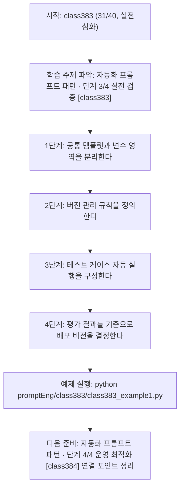
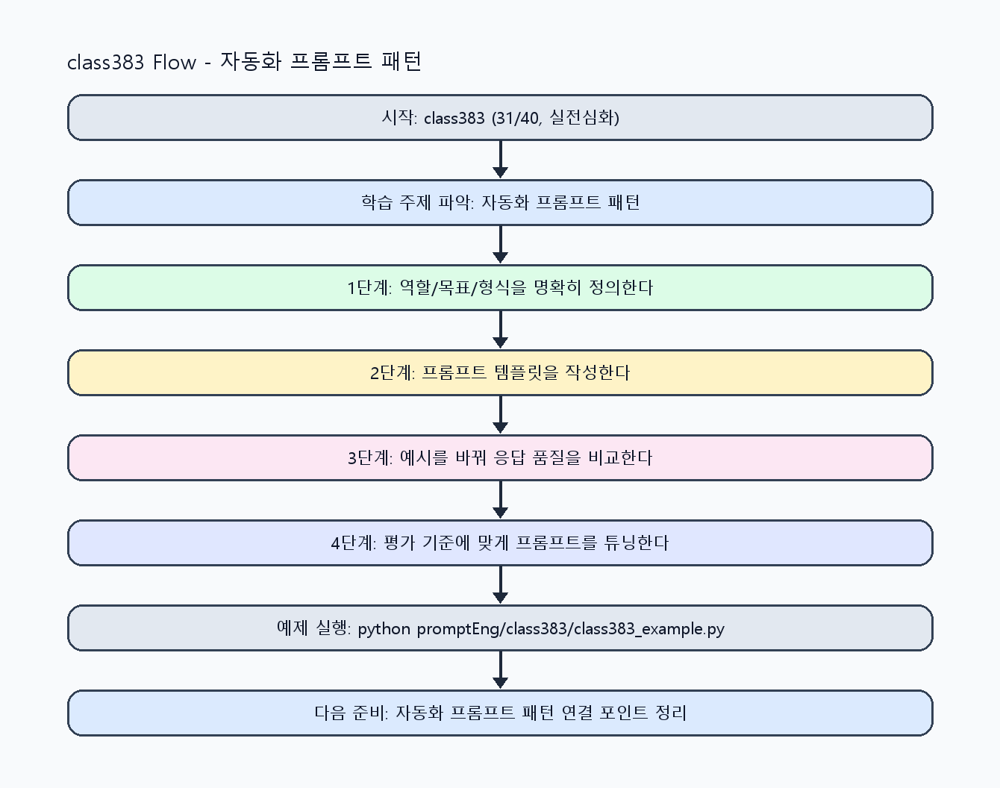

<!-- 이 파일은 www.edumgt.co.kr 의 에듀엠지티에 저작권이 있습니다 -->
# class383 자기주도 학습 가이드

## 1) 오늘의 학습 정보
- 교과목: **프롬프트 엔지니어링**
- 학습 주제: **자동화 프롬프트 패턴 · 단계 3/4 실전 검증 [class383]**
- 세부 시퀀스: **31/40**
- 일정: **Day 48 / 7교시**
- 난이도: **실전심화**

### 교과목·학습주제 어휘 해설 (IT 강사 스타일)
#### 교과목 표현 분석: `프롬프트 엔지니어링`
- 문법 포인트: 핵심 개념 명사를 중심으로 한 명사구 구조입니다.
- 기술 포인트: 프롬프트 설계로 모델 응답 품질을 제어하는 생성형 AI 교과목입니다.
| 용어 | 문법/품사 | 한글·한자 | 영어 | 기술 설명 |
| --- | --- | --- | --- | --- |
| `프롬프트` | 명사(외래어) | 프롬프트 (한자 없음) | prompt | 모델의 응답 방향을 결정하는 입력 지시문입니다. |
| `엔지니어링` | 명사(외래어) | 엔지니어링 (한자 없음) | engineering | 재현 가능한 품질을 목표로 설계·검증하는 공학적 접근입니다. |

#### 학습주제 표현 분석: `자동화 프롬프트 패턴 · 단계 3/4 실전 검증 [class383]`
- 문법 포인트: 핵심 개념 명사를 중심으로 한 명사구 구조입니다.
- 기술 포인트: 이번 차시는 `자동화 프롬프트 패턴 · 단계 3/4 실전 검증 [class383]` 용어를 중심으로 문제 정의, 코드 구현, 결과 검증까지 연결합니다.
| 용어 | 문법/품사 | 한글·한자 | 영어 | 기술 설명 |
| --- | --- | --- | --- | --- |
| `자동화` | 명사(기술 개념어) | 자동화 (한자 없음) | (context-specific) | 용어 `자동화`: 이번 학습주제에서 정의해야 할 핵심 개념 용어입니다. |
| `프롬프트` | 명사(외래어) | 프롬프트 (한자 없음) | prompt | 모델의 응답 방향을 결정하는 입력 지시문입니다. |
| `패턴` | 명사(기술 개념어) | 패턴 (한자 없음) | (context-specific) | 용어 `패턴`: 이번 학습주제에서 정의해야 할 핵심 개념 용어입니다. |
| `단계` | 명사(기술 개념어) | 단계 (한자 없음) | (context-specific) | 용어 `단계`: 이번 학습주제에서 정의해야 할 핵심 개념 용어입니다. |
| `실전` | 명사(기술 개념어) | 실전 (한자 없음) | (context-specific) | 용어 `실전`: 이번 학습주제에서 정의해야 할 핵심 개념 용어입니다. |
| `검증` | 명사 | 검증 (檢證) | validation | 결과가 요구사항과 기준을 만족하는지 확인하는 절차입니다. |

## 2) 이전에 배운 내용 (복습)
- 이전 차시: **class382 / 자동화 프롬프트 패턴 · 단계 2/4 기초 구현 [class382]** (Day 48 / 6교시)
- 복습 연결: 이전에 배운 **자동화 프롬프트 패턴 · 단계 2/4 기초 구현 [class382]** 를 떠올리며, 오늘 **자동화 프롬프트 패턴 · 단계 3/4 실전 검증 [class383]** 와 어떤 점이 이어지는지 비교해 보세요.

## 3) 주제를 아주 쉽게 이해하기
- 한 줄 설명: 재사용 가능한 프롬프트 템플릿과 자동화 패턴을 설계하는 차시입니다.
- 왜 배우나요?: 서비스 환경에서는 수동 프롬프트보다 템플릿과 파라미터 기반 자동화가 유지보수와 품질 관리에 유리합니다.

### 핵심 개념 3가지
1. `템플릿화`는 입력 변수와 고정 규칙을 분리해 재사용성을 높입니다.
2. `버전 관리`는 변경 이력과 성능 변화를 추적 가능하게 합니다.
3. `테스트 케이스 자동 평가`는 품질 회귀를 빠르게 탐지합니다.

### 비유로 이해하기
- 친구에게 길을 물을 때 목적지와 조건을 정확히 말해야 정확한 답을 듣는 것과 같아요.

## 4) 실습 환경 만들기 (항상 먼저)
아래 명령은 **처음 한 번** 준비해 두면 이후 학습이 쉬워집니다.

### Windows PowerShell
```powershell
cd C:\DevOps\Python-AI_Agent-Class
python -m venv .venv
.\.venv\Scripts\Activate.ps1
python -m pip install --upgrade pip
pip install -r requirements.txt
```

### Linux/macOS (bash)
```bash
cd /path/to/Python-AI_Agent-Class
python3 -m venv .venv
source .venv/bin/activate
python -m pip install --upgrade pip
pip install -r requirements.txt
```

## 5) 오늘의 예제 코드
- 예제 파일: `class383_example1.py`
- 실행 명령:
```bash
python promptEng/class383/class383_example1.py
```

### example1~example5 단계별 테스트 확장
1. example1: 입력 변수 분리 템플릿을 작성한다.
2. example2: 템플릿 버전 관리 규칙을 적용한다.
3. example3: 테스트 케이스 자동 평가를 연결한다.
4. example4: 회귀 실패 케이스를 자동 탐지한다.
5. example5: 재사용 가능한 패턴 라이브러리를 정리한다.

<!-- AUTO-GENERATED: TECH_STACK_FLOW START -->
### 기술 스택
- 언어: `Python 3`
- 실행: `CLI` (`python promptEng/class383/class383_example1.py`)
- 주요 문법: `템플릿 렌더러`, `버전 메타데이터`, `테스트 러너`, `결과 리포트`
- 학습 포커스: `자동화 프롬프트 패턴 · 단계 3/4 실전 검증 [class383]`

### 실습 example1.py 동작 원리 (Mermaid Flowchart)


### Flow PNG 캡처

<!-- AUTO-GENERATED: TECH_STACK_FLOW END -->

### 예제 코드를 볼 때 집중할 포인트
1. 템플릿 변수 기본값이 안전하게 설정됐는지 확인하기
2. 버전 업데이트 시 하위호환 영향을 점검하는지 확인하기
3. 자동 평가가 핵심 실패 패턴을 포함하는지 점검하기

## 6) 퀴즈로 복습하기 (10문항)
- 퀴즈 파일: `class383_quiz.html`
- 브라우저에서 열기:
```bash
promptEng/class383/class383_quiz.html
```
- 버튼 설명:
1. `채점하기`: 현재 선택한 답으로 점수를 계산해요.
2. `다시풀기`: 선택을 모두 지우고 처음부터 다시 풀어요.

## 7) 혼자 실습 순서 (초등학생 버전)
1. 코드를 한 번 그대로 실행해요.
2. 숫자/문장 값을 1개 바꿔요.
3. 결과가 왜 바뀌었는지 한 줄로 적어요.
4. 함수를 1개 더 만들어 작은 기능을 추가해요.

### 실습 미션
1. 재사용 가능한 템플릿 함수를 작성하고 입력 변수를 분리하세요.
2. 프롬프트 버전 규칙(v1, v2, v3)을 정의하고 비교하세요.
3. 기본 테스트 케이스 세트로 자동 평가를 실행하세요.

## 8) 스스로 점검 체크리스트
- [ ] 템플릿 재사용 구조를 구현했다.
- [ ] 버전 관리 규칙과 변경 로그를 남겼다.
- [ ] 테스트 케이스 기반 자동 평가를 적용했다.

## 9) 막히면 이렇게 해결해요
1. 에러 메시지 마지막 줄을 먼저 읽어요.
2. 함수 이름과 괄호 짝을 확인해요.
3. `print()`를 넣어 중간 값을 확인해요.
4. 그래도 안 되면 어제 성공한 코드와 한 줄씩 비교해요.

## 10) 학습 후 다음에 배울 내용
- 다음 차시: **class384 / 자동화 프롬프트 패턴 · 단계 4/4 운영 최적화 [class384]** (Day 48 / 8교시)
- 미리보기: 다음 차시 전에 **자동화 프롬프트 패턴 · 단계 3/4 실전 검증 [class383]** 핵심 코드 1개를 다시 실행해 두면 자동화 프롬프트 패턴 · 단계 4/4 운영 최적화 [class384] 학습이 더 쉬워집니다.

## 11) 다음 차시 연결
- 다음 차시에서는 고객상담/문서요약/코드생성 등 도메인별 템플릿을 설계합니다.
- 오늘 코드를 복사하지 말고, 직접 다시 작성해 보세요.
