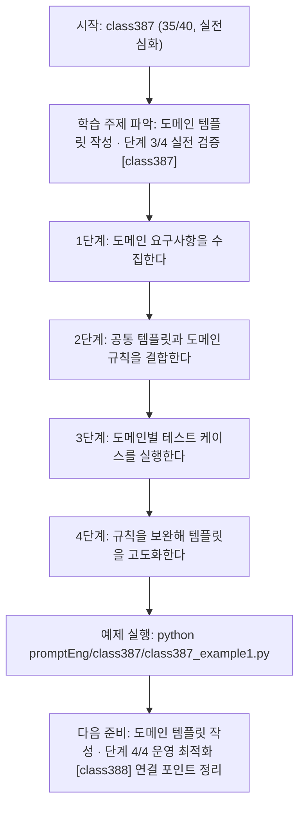
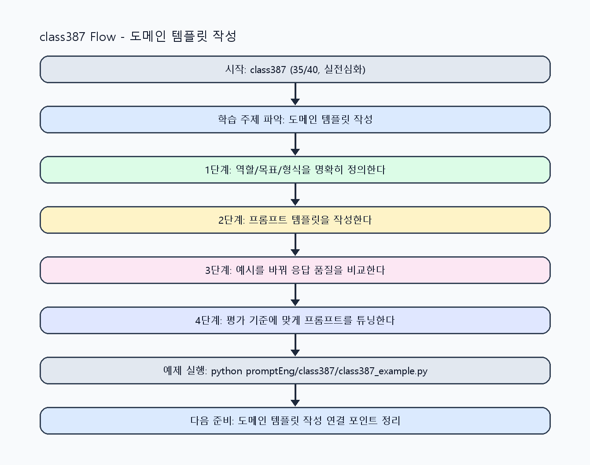

<!-- 이 파일은 www.edumgt.co.kr 의 에듀엠지티에 저작권이 있습니다 -->
# class387 자기주도 학습 가이드

## 1) 오늘의 학습 정보
- 교과목: **프롬프트 엔지니어링**
- 학습 주제: **도메인 템플릿 작성 · 단계 3/4 실전 검증 [class387]**
- 세부 시퀀스: **35/40**
- 일정: **Day 49 / 3교시**
- 난이도: **실전심화**

### 교과목·학습주제 어휘 해설 (IT 강사 스타일)
#### 교과목 표현 분석: `프롬프트 엔지니어링`
- 문법 포인트: 핵심 개념 명사를 중심으로 한 명사구 구조입니다.
- 기술 포인트: 프롬프트 설계로 모델 응답 품질을 제어하는 생성형 AI 교과목입니다.
| 용어 | 문법/품사 | 한글·한자 | 영어 | 기술 설명 |
| --- | --- | --- | --- | --- |
| `프롬프트` | 명사(외래어) | 프롬프트 (한자 없음) | prompt | 모델의 응답 방향을 결정하는 입력 지시문입니다. |
| `엔지니어링` | 명사(외래어) | 엔지니어링 (한자 없음) | engineering | 재현 가능한 품질을 목표로 설계·검증하는 공학적 접근입니다. |

#### 학습주제 표현 분석: `도메인 템플릿 작성 · 단계 3/4 실전 검증 [class387]`
- 문법 포인트: 핵심 개념 명사를 중심으로 한 명사구 구조입니다.
- 기술 포인트: 이번 차시는 `도메인 템플릿 작성` 핵심 개념을 코드 구현, 결과 해석, 점검 기준으로 연결합니다.
| 용어 | 문법/품사 | 한글·한자 | 영어 | 기술 설명 |
| --- | --- | --- | --- | --- |
| `도메인` | 명사(외래어) | 도메인 (한자 없음) | domain | 문제를 푸는 특정 업무 영역(예: 의료, 법률, 제조)을 뜻합니다. |
| `템플릿` | 명사(주제 핵심 용어) | 템플릿 (한자 없음) | (topic-specific) | 이번 차시 맥락: 도메인별 요구사항이 다르기 때문에 동일한 템플릿을 그대로 쓰면 품질 편차와 오류가 커집니다. 이를 기준으로 `템플릿`를 코드와 결과 해석에 연결합니다. |
| `작성` | 명사(주제 핵심 용어) | 작성 (한자 없음) | (topic-specific) | 이번 차시 맥락: 고객상담, 문서요약, 코드생성, 보고서 작성, 교육 콘텐츠 생성용 프롬프트를 설계하는 차시입니다. 이를 기준으로 `작성`를 코드와 결과 해석에 연결합니다. |
| `도메인별` | 명사(주제 핵심 용어) | 도메인별 (한자 없음) | (topic-specific) | 이번 차시 맥락: 도메인별 요구사항이 다르기 때문에 동일한 템플릿을 그대로 쓰면 품질 편차와 오류가 커집니다. 이를 기준으로 `도메인별`를 코드와 결과 해석에 연결합니다. |
| `설계` | 명사 | 설계 (設計) | design | 요구사항을 만족하도록 데이터 흐름, 함수/모듈 경계, 평가 기준을 구조화하는 작업입니다. |
| `고객상담` | 명사(주제 핵심 용어) | 고객상담 (한자 없음) | (topic-specific) | 이번 차시 맥락: 고객상담, 문서요약, 코드생성, 보고서 작성, 교육 콘텐츠 생성용 프롬프트를 설계하는 차시입니다. 이를 기준으로 `고객상담`를 코드와 결과 해석에 연결합니다. |

## 2) 이전에 배운 내용 (복습)
- 이전 차시: **class386 / 도메인 템플릿 작성 · 단계 2/4 기초 구현 [class386]** (Day 49 / 2교시)
- 복습 연결: 이전에 배운 **도메인 템플릿 작성 · 단계 2/4 기초 구현 [class386]** 를 떠올리며, 오늘 **도메인 템플릿 작성 · 단계 3/4 실전 검증 [class387]** 와 어떤 점이 이어지는지 비교해 보세요.

## 3) 주제를 아주 쉽게 이해하기
- 한 줄 설명: 고객상담, 문서요약, 코드생성, 보고서 작성, 교육 콘텐츠 생성용 프롬프트를 설계하는 차시입니다.
- 왜 배우나요?: 도메인별 요구사항이 다르기 때문에 동일한 템플릿을 그대로 쓰면 품질 편차와 오류가 커집니다.

### 핵심 개념 3가지
1. `도메인별 설계`는 업무 목적과 사용자의 기대 형식을 반영해야 합니다.
2. `고객상담/문서요약/코드생성/보고서/교육`은 각각 평가 지표가 다릅니다.
3. `도메인 템플릿`은 공통 구조 + 도메인 규칙 조합으로 관리합니다.

### 비유로 이해하기
- 친구에게 길을 물을 때 목적지와 조건을 정확히 말해야 정확한 답을 듣는 것과 같아요.

## 4) 실습 환경 만들기 (항상 먼저)
아래 명령은 **처음 한 번** 준비해 두면 이후 학습이 쉬워집니다.

### Windows PowerShell
```powershell
cd C:\DevOps\Python-AI_Agent-Class
python -m venv .venv
.\.venv\Scripts\Activate.ps1
python -m pip install --upgrade pip
pip install -r requirements.txt
```

### Linux/macOS (bash)
```bash
cd /path/to/Python-AI_Agent-Class
python3 -m venv .venv
source .venv/bin/activate
python -m pip install --upgrade pip
pip install -r requirements.txt
```

## 5) 오늘의 예제 코드
- 예제 파일: `class387_example1.py`
- 실행 명령:
```bash
python promptEng/class387/class387_example1.py
```

### example1~example5 단계별 테스트 확장
1. example1: 고객상담 템플릿을 작성한다.
2. example2: 문서요약/보고서 템플릿을 확장한다.
3. example3: 코드생성/교육 콘텐츠 템플릿을 비교한다.
4. example4: 도메인별 규칙 충돌 케이스를 점검한다.
5. example5: 도메인 템플릿 세트를 운영 기준으로 정리한다.

<!-- AUTO-GENERATED: TECH_STACK_FLOW START -->
### 기술 스택
- 언어: `Python 3`
- 실행: `CLI` (`python promptEng/class387/class387_example1.py`)
- 주요 문법: `도메인 템플릿 dict`, `도메인 라우터`, `규칙 셋`, `평가 매트릭스`
- 학습 포커스: `도메인 템플릿 작성 · 단계 3/4 실전 검증 [class387]`

### 실습 example1.py 동작 원리 (Mermaid Flowchart)


### Flow PNG 캡처

<!-- AUTO-GENERATED: TECH_STACK_FLOW END -->

### 예제 코드를 볼 때 집중할 포인트
1. 도메인별 필수 필드가 누락되지 않는지 확인하기
2. 도메인 규칙 충돌(톤/길이/형식)을 점검하기
3. 도메인 성능 비교 결과가 버전 정책에 반영되는지 확인하기

## 6) 퀴즈로 복습하기 (10문항)
- 퀴즈 파일: `class387_quiz.html`
- 브라우저에서 열기:
```bash
promptEng/class387/class387_quiz.html
```
- 버튼 설명:
1. `채점하기`: 현재 선택한 답으로 점수를 계산해요.
2. `다시풀기`: 선택을 모두 지우고 처음부터 다시 풀어요.

## 7) 혼자 실습 순서 (초등학생 버전)
1. 코드를 한 번 그대로 실행해요.
2. 숫자/문장 값을 1개 바꿔요.
3. 결과가 왜 바뀌었는지 한 줄로 적어요.
4. 함수를 1개 더 만들어 작은 기능을 추가해요.

### 실습 미션
1. 도메인 3개 이상에 대해 템플릿을 작성해 비교하세요.
2. 도메인별 금지 규칙과 필수 항목을 정의하세요.
3. 도메인별 테스트 케이스로 품질 차이를 검증하세요.

## 8) 스스로 점검 체크리스트
- [ ] 도메인별 프롬프트 템플릿을 분리해 설계했다.
- [ ] 도메인별 평가 기준을 정의했다.
- [ ] 실패 케이스를 도메인 규칙으로 보완했다.

## 9) 막히면 이렇게 해결해요
1. 에러 메시지 마지막 줄을 먼저 읽어요.
2. 함수 이름과 괄호 짝을 확인해요.
3. `print()`를 넣어 중간 값을 확인해요.
4. 그래도 안 되면 어제 성공한 코드와 한 줄씩 비교해요.

## 10) 학습 후 다음에 배울 내용
- 다음 차시: **class388 / 도메인 템플릿 작성 · 단계 4/4 운영 최적화 [class388]** (Day 49 / 4교시)
- 미리보기: 다음 차시 전에 **도메인 템플릿 작성 · 단계 3/4 실전 검증 [class387]** 핵심 코드 1개를 다시 실행해 두면 도메인 템플릿 작성 · 단계 4/4 운영 최적화 [class388] 학습이 더 쉬워집니다.

## 11) 다음 차시 연결
- 다음 차시에서는 개선 비교 실험과 실무 적용 기준으로 최종 튜닝을 수행합니다.
- 오늘 코드를 복사하지 말고, 직접 다시 작성해 보세요.
