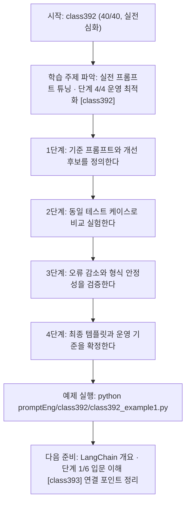
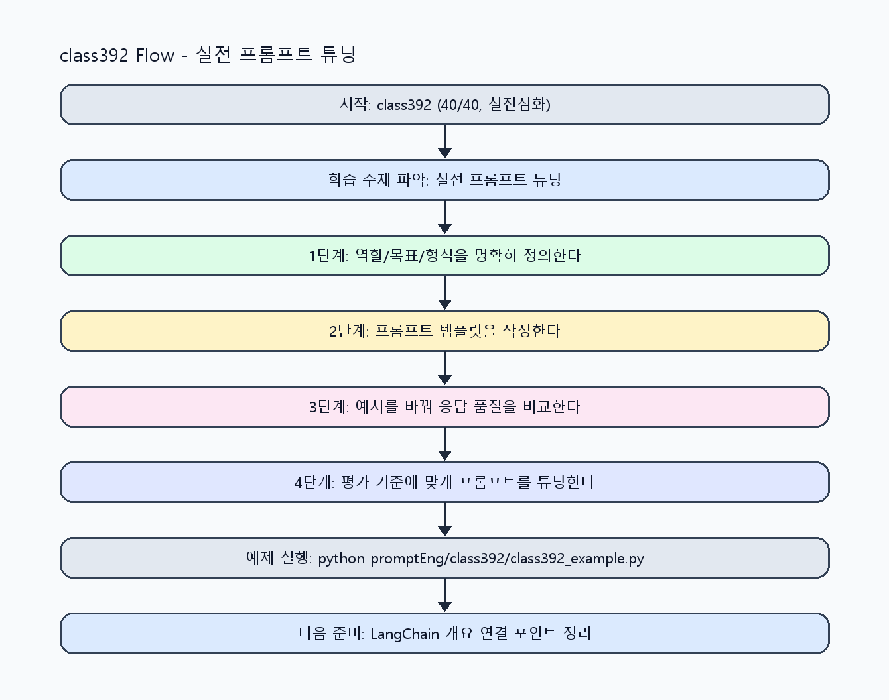

<!-- 이 파일은 www.edumgt.co.kr 의 에듀엠지티에 저작권이 있습니다 -->
# class392 자기주도 학습 가이드

## 1) 오늘의 학습 정보
- 교과목: **프롬프트 엔지니어링**
- 학습 주제: **실전 프롬프트 튜닝 · 단계 4/4 운영 최적화 [class392]**
- 세부 시퀀스: **40/40**
- 일정: **Day 49 / 8교시**
- 난이도: **실전심화**

### 교과목·학습주제 어휘 해설 (IT 강사 스타일)
#### 교과목 표현 분석: `프롬프트 엔지니어링`
- 문법 포인트: 핵심 개념 명사를 중심으로 한 명사구 구조입니다.
- 기술 포인트: 프롬프트 설계로 모델 응답 품질을 제어하는 생성형 AI 교과목입니다.
| 용어 | 문법/품사 | 한글·한자 | 영어 | 기술 설명 |
| --- | --- | --- | --- | --- |
| `프롬프트` | 명사(외래어) | 프롬프트 (한자 없음) | prompt | 모델의 응답 방향을 결정하는 입력 지시문입니다. |
| `엔지니어링` | 명사(외래어) | 엔지니어링 (한자 없음) | engineering | 재현 가능한 품질을 목표로 설계·검증하는 공학적 접근입니다. |

#### 학습주제 표현 분석: `실전 프롬프트 튜닝 · 단계 4/4 운영 최적화 [class392]`
- 문법 포인트: 핵심 개념 명사를 중심으로 한 명사구 구조입니다.
- 기술 포인트: 이번 차시는 `실전 프롬프트 튜닝` 핵심 개념을 코드 구현, 결과 해석, 점검 기준으로 연결합니다.
| 용어 | 문법/품사 | 한글·한자 | 영어 | 기술 설명 |
| --- | --- | --- | --- | --- |
| `프롬프트` | 명사(외래어) | 프롬프트 (한자 없음) | prompt | 모델의 응답 방향을 결정하는 입력 지시문입니다. |
| `튜닝` | 명사(외래어) | 튜닝 (한자 없음) | tuning | 파라미터/하이퍼파라미터 조정으로 성능을 개선하는 작업입니다. |
| `비교` | 명사(주제 핵심 용어) | 비교 (한자 없음) | (topic-specific) | 이번 차시 맥락: 동일 작업에 대한 프롬프트 개선 비교, 품질 향상 실험, 구조화 출력 검증으로 실무 적용 역량을 완성하는 차시입니다. 이를 기준으로 `비교`를 코드와 결과 해석에 연결합니다. |
| `구조화` | 명사(주제 핵심 용어) | 구조화 (한자 없음) | (topic-specific) | 이번 차시 맥락: 동일 작업에 대한 프롬프트 개선 비교, 품질 향상 실험, 구조화 출력 검증으로 실무 적용 역량을 완성하는 차시입니다. 이를 기준으로 `구조화`를 코드와 결과 해석에 연결합니다. |
| `오류` | 명사(주제 핵심 용어) | 오류 (한자 없음) | (topic-specific) | 이번 차시 맥락: `구조화 출력`과 `오류 응답 처리`는 서비스 안정성을 높이는 핵심 장치입니다. 이를 기준으로 `오류`를 코드와 결과 해석에 연결합니다. |
| `응답` | 명사 | 응답 (應答) | response | 모델이 입력 프롬프트에 대해 반환하는 출력 텍스트입니다. |

## 2) 이전에 배운 내용 (복습)
- 이전 차시: **class391 / 실전 프롬프트 튜닝 · 단계 3/4 실전 검증 [class391]** (Day 49 / 7교시)
- 복습 연결: 이전에 배운 **실전 프롬프트 튜닝 · 단계 3/4 실전 검증 [class391]** 를 떠올리며, 오늘 **실전 프롬프트 튜닝 · 단계 4/4 운영 최적화 [class392]** 와 어떤 점이 이어지는지 비교해 보세요.

## 3) 주제를 아주 쉽게 이해하기
- 한 줄 설명: 동일 작업에 대한 프롬프트 개선 비교, 품질 향상 실험, 구조화 출력 검증으로 실무 적용 역량을 완성하는 차시입니다.
- 왜 배우나요?: 실무에서는 프롬프트 설계뿐 아니라 버전 운영, 시스템/사용자 분리, 테스트 기반 검증까지 요구됩니다.

### 핵심 개념 3가지
1. `실습 비교`는 같은 작업에서 개선 전/후 차이를 측정하는 방식입니다.
2. `구조화 출력`과 `오류 응답 처리`는 서비스 안정성을 높이는 핵심 장치입니다.
3. `실무 적용`은 프롬프트 버전 관리, 템플릿 재사용, 테스트 케이스 평가를 포함합니다.

### 비유로 이해하기
- 친구에게 길을 물을 때 목적지와 조건을 정확히 말해야 정확한 답을 듣는 것과 같아요.

## 4) 실습 환경 만들기 (항상 먼저)
아래 명령은 **처음 한 번** 준비해 두면 이후 학습이 쉬워집니다.

### Windows PowerShell
```powershell
cd C:\DevOps\Python-AI_Agent-Class
python -m venv .venv
.\.venv\Scripts\Activate.ps1
python -m pip install --upgrade pip
pip install -r requirements.txt
```

### Linux/macOS (bash)
```bash
cd /path/to/Python-AI_Agent-Class
python3 -m venv .venv
source .venv/bin/activate
python -m pip install --upgrade pip
pip install -r requirements.txt
```

## 5) 오늘의 예제 코드
- 예제 파일: `class392_example1.py`
- 실행 명령:
```bash
python promptEng/class392/class392_example1.py
```

### example1~example5 단계별 테스트 확장
1. example1: 동일 작업 프롬프트 개선 비교 실험을 실행한다.
2. example2: 오답 감소 규칙과 품질 향상 실험을 수행한다.
3. example3: JSON 구조화 출력과 오류 응답 처리를 결합한다.
4. example4: system/user 분리와 버전 전략을 검증한다.
5. example5: 테스트 케이스 기반 실무 적용 기준을 확정한다.

<!-- AUTO-GENERATED: TECH_STACK_FLOW START -->
### 기술 스택
- 언어: `Python 3`
- 실행: `CLI` (`python promptEng/class392/class392_example1.py`)
- 주요 문법: `버전 비교 테이블`, `오류 처리 핸들러`, `JSON 출력 검증`, `A/B 평가 리포트`
- 학습 포커스: `실전 프롬프트 튜닝 · 단계 4/4 운영 최적화 [class392]`

### 실습 example1.py 동작 원리 (Mermaid Flowchart)


### Flow PNG 캡처

<!-- AUTO-GENERATED: TECH_STACK_FLOW END -->

### 예제 코드를 볼 때 집중할 포인트
1. 비교 실험이 동일 데이터·동일 조건에서 수행되는지 확인하기
2. 구조화 출력 실패 시 복구 정책이 있는지 점검하기
3. 운영 배포 전 테스트 케이스 통과 기준을 명시했는지 확인하기

## 6) 퀴즈로 복습하기 (10문항)
- 퀴즈 파일: `class392_quiz.html`
- 브라우저에서 열기:
```bash
promptEng/class392/class392_quiz.html
```
- 버튼 설명:
1. `채점하기`: 현재 선택한 답으로 점수를 계산해요.
2. `다시풀기`: 선택을 모두 지우고 처음부터 다시 풀어요.

## 7) 혼자 실습 순서 (초등학생 버전)
1. 코드를 한 번 그대로 실행해요.
2. 숫자/문장 값을 1개 바꿔요.
3. 결과가 왜 바뀌었는지 한 줄로 적어요.
4. 함수를 1개 더 만들어 작은 기능을 추가해요.

### 실습 미션
1. 동일 과업에 대해 최소 3개 프롬프트 버전을 비교하세요.
2. 잘못된 응답을 줄이기 위한 규칙을 추가하고 성능 변화를 측정하세요.
3. JSON 구조화 출력과 오류 처리 규칙을 포함해 최종 템플릿을 확정하세요.

## 8) 스스로 점검 체크리스트
- [ ] 프롬프트 버전별 성능 비교 결과를 제시했다.
- [ ] 오류 응답 감소를 위한 개선 규칙을 적용했다.
- [ ] 시스템/사용자 프롬프트 분리와 테스트 기반 평가를 완료했다.

## 9) 막히면 이렇게 해결해요
1. 에러 메시지 마지막 줄을 먼저 읽어요.
2. 함수 이름과 괄호 짝을 확인해요.
3. `print()`를 넣어 중간 값을 확인해요.
4. 그래도 안 되면 어제 성공한 코드와 한 줄씩 비교해요.

## 10) 학습 후 다음에 배울 내용
- 다음 차시: **class393 / LangChain 개요 · 단계 1/6 입문 이해 [class393]** (Day 50 / 1교시)
- 미리보기: 다음 차시 전에 **실전 프롬프트 튜닝 · 단계 4/4 운영 최적화 [class392]** 핵심 코드 1개를 다시 실행해 두면 LangChain 개요 · 단계 1/6 입문 이해 [class393] 학습이 더 쉬워집니다.

## 11) 다음 차시 연결
- 프롬프트 엔지니어링 과목 전체를 복습하고 도메인별 템플릿 라이브러리를 구축해 보세요.
- 오늘 코드를 복사하지 말고, 직접 다시 작성해 보세요.
