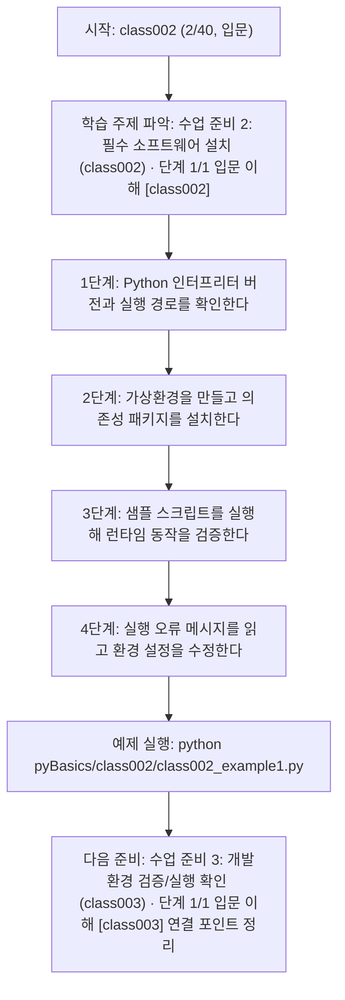
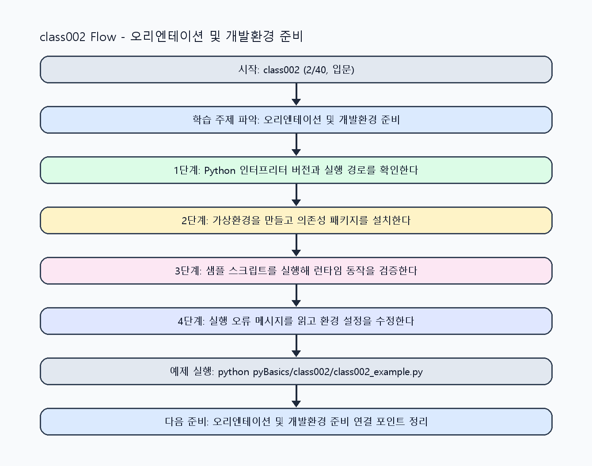

<!-- 이 파일은 www.edumgt.co.kr 의 에듀엠지티에 저작권이 있습니다 -->
# class002 자기주도 학습 가이드

## 1) 오늘의 학습 정보
- 교과목: **Python 프로그래밍**
- 학습 주제: **수업 준비 2: 필수 소프트웨어 설치 (class002) · 단계 1/1 입문 이해 [class002]**
- 세부 시퀀스: **2/40**
- 일정: **Day 01 / 2교시**
- 난이도: **입문**

### 교과목·학습주제 어휘 해설 (IT 강사 스타일)
#### 교과목 표현 분석: `Python 프로그래밍`
- 문법 포인트: 핵심 개념 명사를 중심으로 한 명사구 구조입니다.
- 기술 포인트: 코드 문법을 통해 문제를 절차적으로 해결하는 역량을 기르는 교과목입니다.
| 용어 | 문법/품사 | 한글·한자 | 영어 | 기술 설명 |
| --- | --- | --- | --- | --- |
| `Python` | 고유명사(언어명) | Python (한자 없음) | Python | 데이터 처리와 AI 실습에 널리 쓰이는 범용 프로그래밍 언어입니다. |
| `프로그래밍` | 명사 | 프로그래밍 (한자 없음) | programming | 문제를 알고리즘으로 분해해 코드로 구현하는 활동입니다. |

#### 학습주제 표현 분석: `수업 준비 2: 필수 소프트웨어 설치 (class002) · 단계 1/1 입문 이해 [class002]`
- 문법 포인트: 핵심 개념 명사를 중심으로 한 명사구 구조입니다.
- 기술 포인트: 이번 차시는 `수업 준비 2: 필수 소프트웨어 설치 (class002)` 핵심 개념을 코드 구현, 결과 해석, 점검 기준으로 연결합니다.
| 용어 | 문법/품사 | 한글·한자 | 영어 | 기술 설명 |
| --- | --- | --- | --- | --- |
| `소프트웨어` | 명사(주제 핵심 용어) | 소프트웨어 (한자 없음) | (topic-specific) | `소프트웨어`는 `수업 준비 2: 필수 소프트웨어 설치 (class002)` 실습에서 코드 구조와 실행 결과를 안정적으로 만들기 위한 핵심 용어입니다. |
| `설치` | 명사(주제 핵심 용어) | 설치 (한자 없음) | (topic-specific) | `설치`는 `수업 준비 2: 필수 소프트웨어 설치 (class002)` 실습에서 코드 구조와 실행 결과를 안정적으로 만들기 위한 핵심 용어입니다. |
| `Python` | 고유명사(언어명) | Python (한자 없음) | Python | 데이터 처리와 AI 실습에 널리 쓰이는 범용 프로그래밍 언어입니다. |
| `인터프리터` | 명사(주제 핵심 용어) | 인터프리터 (한자 없음) | (topic-specific) | 이번 차시 맥락: 인터프리터, 가상환경, 패키지 의존성을 이해해야 이후 변수·함수·클래스 실습 결과를 재현할 수 있습니다. 이를 기준으로 `인터프리터`를 코드와 결과 해석에 연결합니다. |
| `파일.py` | 명사(주제 핵심 용어) | 파일.py (한자 없음) | (topic-specific) | 이번 차시 맥락: `인터프리터`는 소스 코드를 해석해 실행하며 `python 파일.py`가 기본 실행 경로입니다. 이를 기준으로 `파일.py`를 코드와 결과 해석에 연결합니다. |
| `VS` | 영문 기술명/약어 | VS (한자 없음) | VS | 이번 차시 맥락: `VS Code + 가상환경(venv) + pip` 조합은 실습 재현성과 패키지 충돌 방지의 기본 개발환경입니다. 이를 기준으로 `VS`를 코드와 결과 해석에 연결합니다. |

## 2) 이전에 배운 내용 (복습)
- 이전 차시: **class001 / 수업 준비 1: 필수 플랫폼 가입/계정 설정 (class001) · 단계 1/1 입문 이해 [class001]** (Day 01 / 1교시)
- 복습 연결: 이전에 배운 **수업 준비 1: 필수 플랫폼 가입/계정 설정 (class001) · 단계 1/1 입문 이해 [class001]** 를 떠올리며, 오늘 **수업 준비 2: 필수 소프트웨어 설치 (class002) · 단계 1/1 입문 이해 [class002]** 와 어떤 점이 이어지는지 비교해 보세요.

## 3) 주제를 아주 쉽게 이해하기
- 한 줄 설명: Python 코드가 어떤 실행환경에서 동작하는지 먼저 맞추는 차시입니다.
- 왜 배우나요?: 인터프리터, 가상환경, 패키지 의존성을 이해해야 이후 변수·함수·클래스 실습 결과를 재현할 수 있습니다.

### 핵심 개념 3가지
1. `Python`은 문법이 간결하고 자동화/데이터/웹/API 등 활용 범위가 넓은 인터프리터 언어입니다.
2. `인터프리터`는 소스 코드를 해석해 실행하며 `python 파일.py`가 기본 실행 경로입니다.
3. `VS Code + 가상환경(venv) + pip` 조합은 실습 재현성과 패키지 충돌 방지의 기본 개발환경입니다.

### 비유로 이해하기
- 실험 전에 실험대와 장비를 먼저 교정하는 준비 단계와 같습니다.

## 4) 실습 환경 만들기 (항상 먼저)
아래 명령은 **처음 한 번** 준비해 두면 이후 학습이 쉬워집니다.

### Windows PowerShell
```powershell
cd C:\DevOps\Python-AI_Agent-Class
python -m venv .venv
.\.venv\Scripts\Activate.ps1
python -m pip install --upgrade pip
pip install -r requirements.txt
```

### Linux/macOS (bash)
```bash
cd /path/to/Python-AI_Agent-Class
python3 -m venv .venv
source .venv/bin/activate
python -m pip install --upgrade pip
pip install -r requirements.txt
```

## 5) 오늘의 예제 코드
- 예제 파일: `class002_example1.py`
- 실행 명령:
```bash
python pyBasics/class002/class002_example1.py
```

### example1~example5 단계별 테스트 확장
1. example1: Python 실행/인터프리터 경로를 확인한다.
2. example2: 가상환경 생성/활성화와 pip 설치를 비교한다.
3. example3: VS Code 인터프리터 설정과 터미널 실행을 검증한다.
4. example4: 패키지 충돌/설치 실패 시나리오를 점검한다.
5. example5: 환경 재현 체크리스트(venv/pip/requirements)를 마무리한다.

<!-- AUTO-GENERATED: TECH_STACK_FLOW START -->
### 기술 스택
- 언어: `Python 3`
- 실행: `CLI` (`python pyBasics/class002/class002_example1.py`)
- 주요 문법: `인터프리터 실행(python 파일.py)`, `가상환경(venv)`, `패키지 설치(pip)`, `실행 진입점(__name__)`
- 학습 포커스: `수업 준비 2: 필수 소프트웨어 설치 (class002) · 단계 1/1 입문 이해 [class002]`

### 실습 example1.py 동작 원리 (Mermaid Flowchart)


### Flow PNG 캡처

<!-- AUTO-GENERATED: TECH_STACK_FLOW END -->

### 예제 코드를 볼 때 집중할 포인트
1. 코드가 `__name__ == "__main__"` 블록에서 시작되는지 확인하기
2. 현재 터미널의 인터프리터가 프로젝트 `.venv`인지 확인하기
3. 필수 패키지 import 테스트로 실행환경을 검증하기

## 6) 퀴즈로 복습하기 (10문항)
- 퀴즈 파일: `class002_quiz.html`
- 브라우저에서 열기:
```bash
pyBasics/class002/class002_quiz.html
```
- 버튼 설명:
1. `채점하기`: 현재 선택한 답으로 점수를 계산해요.
2. `다시풀기`: 선택을 모두 지우고 처음부터 다시 풀어요.

## 7) 혼자 실습 순서 (초등학생 버전)
1. 코드를 한 번 그대로 실행해요.
2. 숫자/문장 값을 1개 바꿔요.
3. 결과가 왜 바뀌었는지 한 줄로 적어요.
4. 함수를 1개 더 만들어 작은 기능을 추가해요.

### 실습 미션
1. `python --version`과 `where python`으로 현재 인터프리터 경로를 확인하세요.
2. `python -m venv .venv` 후 활성화하고 `pip install -r requirements.txt`를 실행하세요.
3. VS Code에서 인터프리터를 `.venv`로 선택하고 동일 스크립트가 터미널/IDE에서 같은 결과인지 확인하세요.

## 8) 스스로 점검 체크리스트
- [ ] 전역 Python과 프로젝트 `.venv`의 차이를 설명할 수 있다.
- [ ] 가상환경 생성/활성화/비활성화 과정을 스스로 재현할 수 있다.
- [ ] VS Code 인터프리터 선택과 실행 환경 일치 여부를 점검할 수 있다.

## 9) 막히면 이렇게 해결해요
1. 에러 메시지 마지막 줄을 먼저 읽어요.
2. 함수 이름과 괄호 짝을 확인해요.
3. `print()`를 넣어 중간 값을 확인해요.
4. 그래도 안 되면 어제 성공한 코드와 한 줄씩 비교해요.

## 10) 학습 후 다음에 배울 내용
- 다음 차시: **class003 / 수업 준비 3: 개발환경 검증/실행 확인 (class003) · 단계 1/1 입문 이해 [class003]** (Day 01 / 3교시)
- 미리보기: 다음 차시 전에 **수업 준비 2: 필수 소프트웨어 설치 (class002) · 단계 1/1 입문 이해 [class002]** 핵심 코드 1개를 다시 실행해 두면 수업 준비 3: 개발환경 검증/실행 확인 (class003) · 단계 1/1 입문 이해 [class003] 학습이 더 쉬워집니다.

## 11) 다음 차시 연결
- 다음 차시에서는 준비된 환경에서 변수·상수·타입을 다루며 PL 기본기를 시작합니다.
- 오늘 코드를 복사하지 말고, 직접 다시 작성해 보세요.
