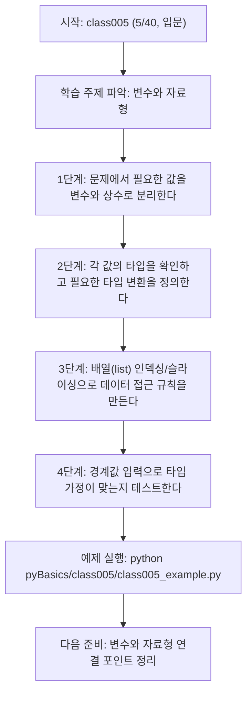
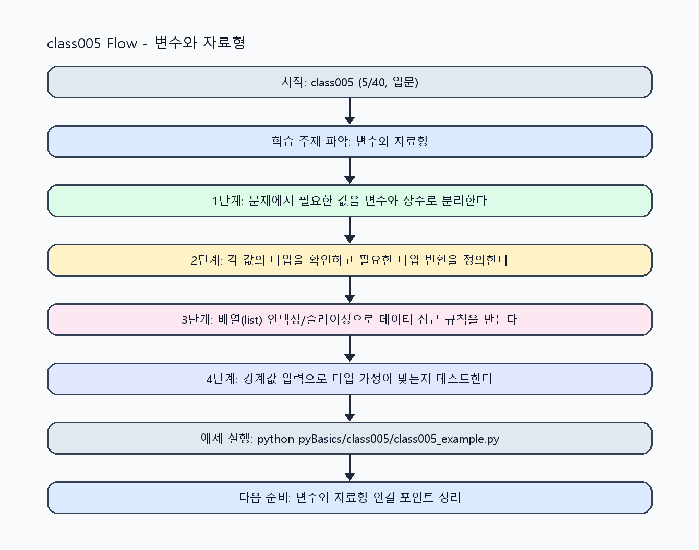

<!-- 이 파일은 www.edumgt.co.kr 의 에듀엠지티에 저작권이 있습니다 -->
# class005 자기주도 학습 가이드

## 1) 오늘의 학습 정보
- 교과목: **Python 프로그래밍**
- 학습 주제: **변수와 자료형**
- 세부 시퀀스: **5/40**
- 일정: **Day 01 / 5교시**
- 난이도: **입문**

### 교과목·학습주제 어휘 해설 (IT 강사 스타일)
#### 교과목 표현 분석: `Python 프로그래밍`
- 문법 포인트: 핵심 개념 명사를 중심으로 한 명사구 구조입니다.
- 기술 포인트: 코드 문법을 통해 문제를 절차적으로 해결하는 역량을 기르는 교과목입니다.
| 용어 | 문법/품사 | 한글·한자 | 영어 | 기술 설명 |
| --- | --- | --- | --- | --- |
| `Python` | 고유명사(언어명) | Python (한자 없음) | Python | 데이터 처리와 AI 실습에 널리 쓰이는 범용 프로그래밍 언어입니다. |
| `프로그래밍` | 명사 | 프로그래밍 (한자 없음) | programming | 문제를 알고리즘으로 분해해 코드로 구현하는 활동입니다. |

#### 학습주제 표현 분석: `변수와 자료형`
- 문법 포인트: 명사와 명사를 대등하게 묶는 병렬 명사구 구조입니다.
- 기술 포인트: 이번 차시는 `변수와 자료형` 용어를 중심으로 문제 정의, 코드 구현, 결과 검증까지 연결합니다.
| 용어 | 문법/품사 | 한글·한자 | 영어 | 기술 설명 |
| --- | --- | --- | --- | --- |
| `변수` | 명사 | 변수 (變數) | variable | 값을 저장하고 재사용하기 위한 이름 붙은 메모리 공간입니다. |
| `자료형` | 명사 | 자료형 (資料型) | data type | 값의 종류와 연산 방식을 정의하는 타입 체계입니다. |

## 2) 이전에 배운 내용 (복습)
- 이전 차시: **class004 / 오리엔테이션 및 개발환경 준비** (Day 01 / 4교시)
- 복습 연결: 이전에 배운 **오리엔테이션 및 개발환경 준비** 를 떠올리며, 오늘 **변수와 자료형** 와 어떤 점이 이어지는지 비교해 보세요.

## 3) 주제를 아주 쉽게 이해하기
- 한 줄 설명: 변수, 상수 관례, 자료형(Type), 배열(List) 등 PL 데이터 모델의 핵심을 다룹니다.
- 왜 배우나요?: 값을 어떤 타입으로 저장하고 변환하는지 이해해야 조건문·함수·클래스를 정확히 설계할 수 있습니다.

### 핵심 개념 3가지
1. `변수(variable)`는 값에 이름을 붙인 바인딩이며 Python은 실행 시 타입이 결정되는 동적 타이핑 언어입니다.
2. `상수(constant)`는 키워드가 아니라 `UPPER_CASE` 네이밍 관례로 변경 금지 의도를 표현합니다.
3. `배열`은 Python에서 보통 `list`로 구현하며 인덱싱/슬라이싱/가변성이 핵심 특성입니다.

### 비유로 이해하기
- 라벨이 붙은 서랍(변수)에 물건(값)을 넣고 종류표(타입)로 분류하는 과정과 같습니다.

## 4) 실습 환경 만들기 (항상 먼저)
아래 명령은 **처음 한 번** 준비해 두면 이후 학습이 쉬워집니다.

### Windows PowerShell
```powershell
cd C:\DevOps\Python-AI_Agent-Class
python -m venv .venv
.\.venv\Scripts\Activate.ps1
python -m pip install --upgrade pip
pip install -r requirements.txt
```

### Linux/macOS (bash)
```bash
cd /path/to/Python-AI_Agent-Class
python3 -m venv .venv
source .venv/bin/activate
python -m pip install --upgrade pip
pip install -r requirements.txt
```

## 5) 오늘의 예제 코드
- 예제 파일: `class005_example.py`
- 실행 명령:
```bash
python pyBasics/class005/class005_example.py
```


<!-- AUTO-GENERATED: OS_COMMANDS START -->
## 5-1) 운영체제별 실행 명령 예시
### PowerShell (Windows)
```powershell
cd C:\DevOps\Python-AI_Agent-Class
python .\pyBasics\class005\class005.py
python .\pyBasics\class005\class005_example.py
python .\pyBasics\class005\class005_assignment.py
start .\pyBasics\class005\class005_quiz.html
```

### WSL Ubuntu (bash)
```bash
cd /mnt/c/DevOps/Python-AI_Agent-Class
python3 pyBasics/class005/class005.py
python3 pyBasics/class005/class005_example.py
python3 pyBasics/class005/class005_assignment.py
explorer.exe "$(wslpath -w 'pyBasics/class005/class005_quiz.html')"
```

### run_class/run_day 스크립트 연동 (WSL bash)
```bash
./run_class.sh class005
./run_day.sh 1 launcher
```
<!-- AUTO-GENERATED: OS_COMMANDS END -->

<!-- AUTO-GENERATED: TECH_STACK_FLOW START -->
### 기술 스택
- 언어: `Python 3`
- 실행: `CLI` (`python pyBasics/class005/class005_example.py`)
- 주요 문법: `변수 할당(=)`, `상수 관례(UPPER_CASE)`, `타입 확인(type, isinstance)`, `배열/리스트(list)`
- 학습 포커스: `변수와 자료형`

### 실습 example.py 동작 원리 (Mermaid Flowchart)


### Flow PNG 캡처

<!-- AUTO-GENERATED: TECH_STACK_FLOW END -->

### 예제 코드를 볼 때 집중할 포인트
1. 변수명만 보고도 의미와 타입이 추론되는지 확인하기
2. `type()`/`isinstance()`로 타입 가정이 실제와 일치하는지 검증하기
3. 리스트 인덱스 접근이 범위를 벗어나지 않는지 점검하기

## 6) 퀴즈로 복습하기 (5문항)
- 퀴즈 파일: `class005_quiz.html`
- 브라우저에서 열기:
```bash
pyBasics/class005/class005_quiz.html
```
- 버튼 설명:
1. `채점하기`: 현재 선택한 답으로 점수를 계산해요.
2. `다시풀기`: 선택을 모두 지우고 처음부터 다시 풀어요.

## 7) 혼자 실습 순서 (초등학생 버전)
1. 코드를 한 번 그대로 실행해요.
2. 숫자/문장 값을 1개 바꿔요.
3. 결과가 왜 바뀌었는지 한 줄로 적어요.
4. 함수를 1개 더 만들어 작은 기능을 추가해요.

### 실습 미션
1. 숫자/문자열/불리언 값을 변수에 저장하고 `type()`으로 자료형을 확인하세요.
2. `MAX_RETRY` 같은 상수 이름을 정의하고 일반 변수와 역할을 구분해 보세요.
3. 리스트를 배열처럼 사용해 인덱싱/슬라이싱/추가·수정 동작을 실험하세요.

## 8) 스스로 점검 체크리스트
- [ ] 변수와 상수 관례의 차이를 예시 코드로 설명할 수 있다.
- [ ] `int`, `float`, `str`, `bool`, `list` 타입을 구분해 설명할 수 있다.
- [ ] 리스트 인덱스 접근 시 범위 오류를 점검하는 습관을 적용했다.

## 9) 막히면 이렇게 해결해요
1. 에러 메시지 마지막 줄을 먼저 읽어요.
2. 함수 이름과 괄호 짝을 확인해요.
3. `print()`를 넣어 중간 값을 확인해요.
4. 그래도 안 되면 어제 성공한 코드와 한 줄씩 비교해요.

## 10) 학습 후 다음에 배울 내용
- 다음 차시: **class006 / 변수와 자료형** (Day 01 / 6교시)
- 미리보기: 다음 차시 전에 **변수와 자료형** 핵심 코드 1개를 다시 실행해 두면 변수와 자료형 학습이 더 쉬워집니다.

## 11) 다음 차시 연결
- 다음 차시에서는 타입 기반 표현식을 연산자와 조건문으로 확장합니다.
- 오늘 코드를 복사하지 말고, 직접 다시 작성해 보세요.
