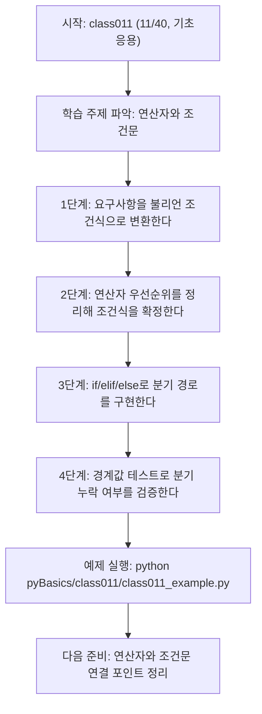
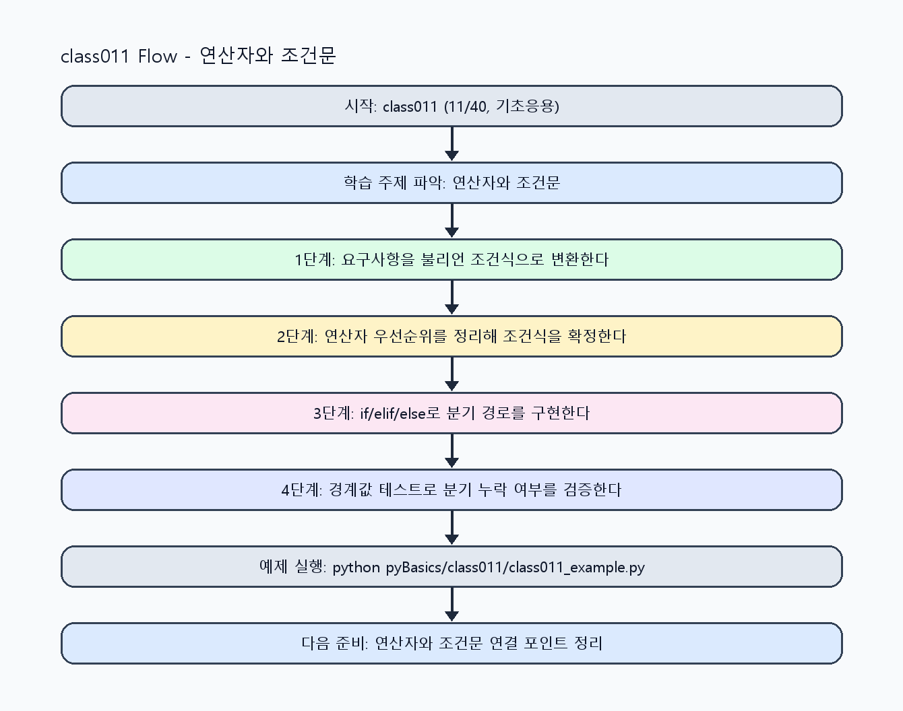

<!-- 이 파일은 www.edumgt.co.kr 의 에듀엠지티에 저작권이 있습니다 -->
# class011 자기주도 학습 가이드

## 1) 오늘의 학습 정보
- 교과목: **Python 프로그래밍**
- 학습 주제: **연산자와 조건문**
- 세부 시퀀스: **11/40**
- 일정: **Day 02 / 3교시**
- 난이도: **기초응용**

### 교과목·학습주제 어휘 해설 (IT 강사 스타일)
#### 교과목 표현 분석: `Python 프로그래밍`
- 문법 포인트: 핵심 개념 명사를 중심으로 한 명사구 구조입니다.
- 기술 포인트: 코드 문법을 통해 문제를 절차적으로 해결하는 역량을 기르는 교과목입니다.
| 용어 | 문법/품사 | 한글·한자 | 영어 | 기술 설명 |
| --- | --- | --- | --- | --- |
| `Python` | 고유명사(언어명) | Python (한자 없음) | Python | 데이터 처리와 AI 실습에 널리 쓰이는 범용 프로그래밍 언어입니다. |
| `프로그래밍` | 명사 | 프로그래밍 (한자 없음) | programming | 문제를 알고리즘으로 분해해 코드로 구현하는 활동입니다. |

#### 학습주제 표현 분석: `연산자와 조건문`
- 문법 포인트: 명사와 명사를 대등하게 묶는 병렬 명사구 구조입니다.
- 기술 포인트: 이번 차시는 `연산자와 조건문` 용어를 중심으로 문제 정의, 코드 구현, 결과 검증까지 연결합니다.
| 용어 | 문법/품사 | 한글·한자 | 영어 | 기술 설명 |
| --- | --- | --- | --- | --- |
| `연산자` | 명사 | 연산자 (演算子) | operator | 피연산자에 연산 규칙을 적용하는 기호/키워드입니다. |
| `조건문` | 명사 | 조건문 (條件文) | conditional statement | 조건 평가 결과에 따라 실행 분기를 선택하는 문법입니다. |

## 2) 이전에 배운 내용 (복습)
- 이전 차시: **class010 / 연산자와 조건문** (Day 02 / 2교시)
- 복습 연결: 이전에 배운 **연산자와 조건문** 를 떠올리며, 오늘 **연산자와 조건문** 와 어떤 점이 이어지는지 비교해 보세요.

## 3) 주제를 아주 쉽게 이해하기
- 한 줄 설명: 연산자와 조건문으로 프로그램의 의사결정 규칙을 코드화하는 차시입니다.
- 왜 배우나요?: PL에서 분기(Branch)를 정확히 다루어야 동일 입력에 항상 동일한 출력을 보장할 수 있습니다.

### 핵심 개념 3가지
1. `산술·비교·논리 연산자`는 표현식(expression)을 만들고 최종적으로 불리언 값으로 귀결됩니다.
2. `if / elif / else`는 조건식 평가 결과에 따라 실행 경로를 분리하는 기본 제어 구조입니다.
3. `단락 평가(short-circuit)`는 `and/or`에서 불필요한 식 평가를 생략해 오류와 비용을 줄입니다.

### 비유로 이해하기
- 체크리스트 조건을 만족한 사람만 다음 단계로 통과시키는 심사 절차와 같습니다.

## 4) 실습 환경 만들기 (항상 먼저)
아래 명령은 **처음 한 번** 준비해 두면 이후 학습이 쉬워집니다.

### Windows PowerShell
```powershell
cd C:\DevOps\Python-AI_Agent-Class
python -m venv .venv
.\.venv\Scripts\Activate.ps1
python -m pip install --upgrade pip
pip install -r requirements.txt
```

### Linux/macOS (bash)
```bash
cd /path/to/Python-AI_Agent-Class
python3 -m venv .venv
source .venv/bin/activate
python -m pip install --upgrade pip
pip install -r requirements.txt
```

## 5) 오늘의 예제 코드
- 예제 파일: `class011_example.py`
- 실행 명령:
```bash
python pyBasics/class011/class011_example.py
```


<!-- AUTO-GENERATED: OS_COMMANDS START -->
## 5-1) 운영체제별 실행 명령 예시
### PowerShell (Windows)
```powershell
cd C:\DevOps\Python-AI_Agent-Class
python .\pyBasics\class011\class011.py
python .\pyBasics\class011\class011_example.py
python .\pyBasics\class011\class011_assignment.py
start .\pyBasics\class011\class011_quiz.html
```

### WSL Ubuntu (bash)
```bash
cd /mnt/c/DevOps/Python-AI_Agent-Class
python3 pyBasics/class011/class011.py
python3 pyBasics/class011/class011_example.py
python3 pyBasics/class011/class011_assignment.py
explorer.exe "$(wslpath -w 'pyBasics/class011/class011_quiz.html')"
```

### run_class/run_day 스크립트 연동 (WSL bash)
```bash
./run_class.sh class011
./run_day.sh 2 launcher
```
<!-- AUTO-GENERATED: OS_COMMANDS END -->

<!-- AUTO-GENERATED: TECH_STACK_FLOW START -->
### 기술 스택
- 언어: `Python 3`
- 실행: `CLI` (`python pyBasics/class011/class011_example.py`)
- 주요 문법: `산술/비교/논리 연산자`, `if / elif / else`, `단락 평가(and, or)`, `멤버십(in, not in)`
- 학습 포커스: `연산자와 조건문`

### 실습 example.py 동작 원리 (Mermaid Flowchart)


### Flow PNG 캡처

<!-- AUTO-GENERATED: TECH_STACK_FLOW END -->

### 예제 코드를 볼 때 집중할 포인트
1. 조건식이 최종적으로 `True/False`로 귀결되는지 확인하기
2. 분기별 출력이 명확하게 구분되는지 확인하기
3. 단락 평가를 활용해 불필요한 계산과 오류를 줄였는지 점검하기

## 6) 퀴즈로 복습하기 (5문항)
- 퀴즈 파일: `class011_quiz.html`
- 브라우저에서 열기:
```bash
pyBasics/class011/class011_quiz.html
```
- 버튼 설명:
1. `채점하기`: 현재 선택한 답으로 점수를 계산해요.
2. `다시풀기`: 선택을 모두 지우고 처음부터 다시 풀어요.

## 7) 혼자 실습 순서 (초등학생 버전)
1. 코드를 한 번 그대로 실행해요.
2. 숫자/문장 값을 1개 바꿔요.
3. 결과가 왜 바뀌었는지 한 줄로 적어요.
4. 함수를 1개 더 만들어 작은 기능을 추가해요.

### 실습 미션
1. 같은 입력에 대해 산술/비교/논리 연산 결과를 표로 정리해 보세요.
2. 경계값(0, 음수, 빈 문자열) 조건을 포함한 `if/elif/else` 분기를 작성하세요.
3. `and/or` 단락 평가로 예외가 줄어드는 케이스를 직접 실행해 확인하세요.

## 8) 스스로 점검 체크리스트
- [ ] 조건식이 어떤 불리언 값으로 평가되는지 설명할 수 있다.
- [ ] 분기 누락 없이 `if/elif/else` 경로를 모두 테스트했다.
- [ ] 연산자 우선순위가 헷갈리는 부분에 괄호를 사용해 의도를 명확히 했다.

## 9) 막히면 이렇게 해결해요
1. 에러 메시지 마지막 줄을 먼저 읽어요.
2. 함수 이름과 괄호 짝을 확인해요.
3. `print()`를 넣어 중간 값을 확인해요.
4. 그래도 안 되면 어제 성공한 코드와 한 줄씩 비교해요.

## 10) 학습 후 다음에 배울 내용
- 다음 차시: **class012 / 연산자와 조건문** (Day 02 / 4교시)
- 미리보기: 다음 차시 전에 **연산자와 조건문** 핵심 코드 1개를 다시 실행해 두면 연산자와 조건문 학습이 더 쉬워집니다.

## 11) 다음 차시 연결
- 다음 차시에서는 조건 분기를 반복문과 결합해 처리량을 늘립니다.
- 오늘 코드를 복사하지 말고, 직접 다시 작성해 보세요.
