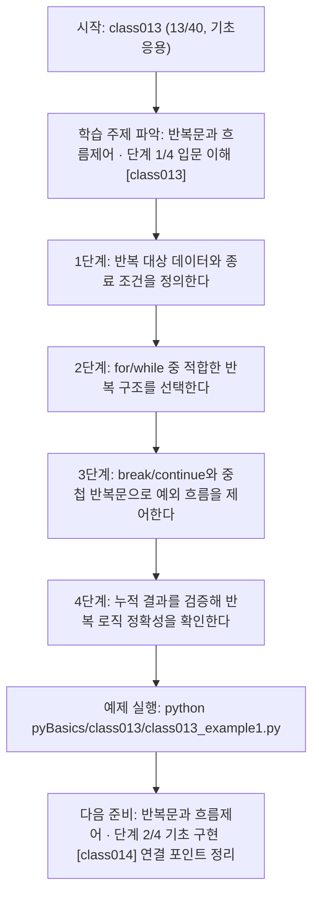
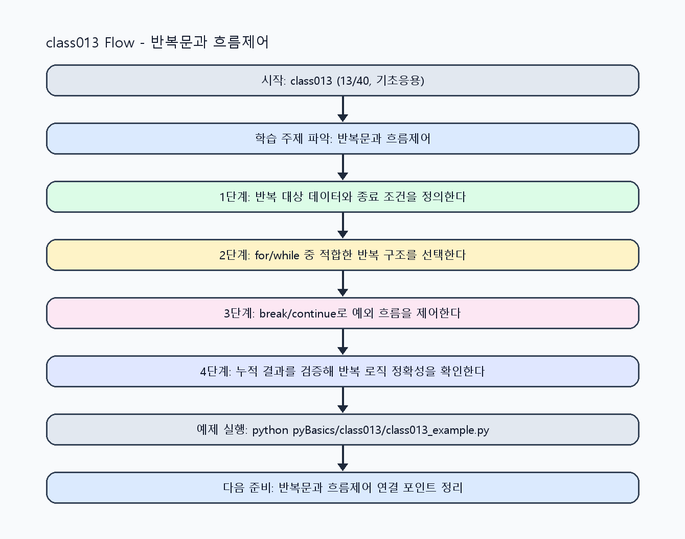

<!-- 이 파일은 www.edumgt.co.kr 의 에듀엠지티에 저작권이 있습니다 -->
# class013 자기주도 학습 가이드

## 1) 오늘의 학습 정보
- 교과목: **Python 프로그래밍**
- 학습 주제: **반복문과 흐름제어 · 단계 1/4 입문 이해 [class013]**
- 세부 시퀀스: **13/40**
- 일정: **Day 02 / 5교시**
- 난이도: **기초응용**

### 교과목·학습주제 어휘 해설 (IT 강사 스타일)
#### 교과목 표현 분석: `Python 프로그래밍`
- 문법 포인트: 핵심 개념 명사를 중심으로 한 명사구 구조입니다.
- 기술 포인트: 코드 문법을 통해 문제를 절차적으로 해결하는 역량을 기르는 교과목입니다.
| 용어 | 문법/품사 | 한글·한자 | 영어 | 기술 설명 |
| --- | --- | --- | --- | --- |
| `Python` | 고유명사(언어명) | Python (한자 없음) | Python | 데이터 처리와 AI 실습에 널리 쓰이는 범용 프로그래밍 언어입니다. |
| `프로그래밍` | 명사 | 프로그래밍 (한자 없음) | programming | 문제를 알고리즘으로 분해해 코드로 구현하는 활동입니다. |

#### 학습주제 표현 분석: `반복문과 흐름제어 · 단계 1/4 입문 이해 [class013]`
- 문법 포인트: 명사와 명사를 대등하게 묶는 병렬 명사구 구조입니다.
- 기술 포인트: 이번 차시는 `반복문과 흐름제어 · 단계 1/4 입문 이해 [class013]` 용어를 중심으로 문제 정의, 코드 구현, 결과 검증까지 연결합니다.
| 용어 | 문법/품사 | 한글·한자 | 영어 | 기술 설명 |
| --- | --- | --- | --- | --- |
| `반복문` | 명사 | 반복문 (反復文) | loop statement | 동일 로직을 조건/횟수 기준으로 반복 실행하는 문법입니다. |
| `흐름제어` | 명사 | 흐름제어 (흐름制御) | flow control | 실행 순서를 분기, 반복, 중단으로 조절하는 기술입니다. |
| `단계` | 명사(기술 개념어) | 단계 (한자 없음) | (context-specific) | 용어 `단계`: 이번 학습주제에서 정의해야 할 핵심 개념 용어입니다. |
| `입문` | 명사(기술 개념어) | 입문 (한자 없음) | (context-specific) | 용어 `입문`: 이번 학습주제에서 정의해야 할 핵심 개념 용어입니다. |
| `이해` | 명사(기술 개념어) | 이해 (한자 없음) | (context-specific) | 용어 `이해`: 이번 학습주제에서 정의해야 할 핵심 개념 용어입니다. |
| `class013` | 영문 기술명/약어 | class013 (한자 없음) | class013 | 용어 `class013`: 이번 차시에서 쓰이는 핵심 기술 용어입니다. |

## 2) 이전에 배운 내용 (복습)
- 이전 차시: **class012 / 연산자와 조건문 · 단계 4/4 운영 최적화 [class012]** (Day 02 / 4교시)
- 복습 연결: 이전에 배운 **연산자와 조건문 · 단계 4/4 운영 최적화 [class012]** 를 떠올리며, 오늘 **반복문과 흐름제어 · 단계 1/4 입문 이해 [class013]** 와 어떤 점이 이어지는지 비교해 보세요.

## 3) 주제를 아주 쉽게 이해하기
- 한 줄 설명: 반복문으로 데이터를 순회하고 흐름제어문으로 실행 경로를 제어합니다.
- 왜 배우나요?: 배열/컬렉션을 반복 처리하는 능력은 실무 코드의 생산성과 정확도를 동시에 높입니다.

### 핵심 개념 3가지
1. `for`는 시퀀스 순회, `while`은 조건 기반 반복으로 반복 패턴이 다릅니다.
2. `break`와 `continue`는 반복 흐름을 조기 종료/건너뛰기 하여 분기 비용을 줄입니다.
3. `중첩 반복문`은 표/격자 데이터 처리에 사용되며 실습형 문제 풀이의 기본 패턴입니다.

### 비유로 이해하기
- 출석부를 한 줄씩 읽으며 조건에 맞는 학생만 체크하는 과정과 같습니다.

## 4) 실습 환경 만들기 (항상 먼저)
아래 명령은 **처음 한 번** 준비해 두면 이후 학습이 쉬워집니다.

### Windows PowerShell
```powershell
cd C:\DevOps\Python-AI_Agent-Class
python -m venv .venv
.\.venv\Scripts\Activate.ps1
python -m pip install --upgrade pip
pip install -r requirements.txt
```

### Linux/macOS (bash)
```bash
cd /path/to/Python-AI_Agent-Class
python3 -m venv .venv
source .venv/bin/activate
python -m pip install --upgrade pip
pip install -r requirements.txt
```

## 5) 오늘의 예제 코드
- 예제 파일: `class013_example1.py`
- 실행 명령:
```bash
python pyBasics/class013/class013_example1.py
```

### example1~example5 단계별 테스트 확장
1. example1: for/while 반복 기본 케이스를 실행한다.
2. example2: break/continue 사용 전후 차이를 비교한다.
3. example3: 중첩 반복문으로 표/격자 문제를 풀이한다.
4. example4: 누적 집계(합계/평균/카운트)를 확장한다.
5. example5: 반복문 경계/무한루프 방지 체크를 정리한다.

<!-- AUTO-GENERATED: TECH_STACK_FLOW START -->
### 기술 스택
- 언어: `Python 3`
- 실행: `CLI` (`python pyBasics/class013/class013_example1.py`)
- 주요 문법: `for/while`, `break/continue`, `중첩 반복문`, `누적 변수 패턴`
- 학습 포커스: `반복문과 흐름제어 · 단계 1/4 입문 이해 [class013]`

### 실습 example1.py 동작 원리 (Mermaid Flowchart)


### Flow PNG 캡처

<!-- AUTO-GENERATED: TECH_STACK_FLOW END -->

### 예제 코드를 볼 때 집중할 포인트
1. 반복 대상(iterable)과 종료 조건이 명확한지 확인하기
2. 반복문 내부 상태값이 의도대로 갱신되는지 추적하기
3. break/continue 사용이 누락 케이스를 만들지 점검하기

## 6) 퀴즈로 복습하기 (10문항)
- 퀴즈 파일: `class013_quiz.html`
- 브라우저에서 열기:
```bash
pyBasics/class013/class013_quiz.html
```
- 버튼 설명:
1. `채점하기`: 현재 선택한 답으로 점수를 계산해요.
2. `다시풀기`: 선택을 모두 지우고 처음부터 다시 풀어요.

## 7) 혼자 실습 순서 (초등학생 버전)
1. 코드를 한 번 그대로 실행해요.
2. 숫자/문장 값을 1개 바꿔요.
3. 결과가 왜 바뀌었는지 한 줄로 적어요.
4. 함수를 1개 더 만들어 작은 기능을 추가해요.

### 실습 미션
1. `for`와 `while`로 같은 문제를 풀어 반복 패턴 차이를 비교하세요.
2. 리스트 순회 중 `break/continue`를 넣어 흐름이 어떻게 바뀌는지 확인하세요.
3. 중첩 반복문으로 구구단/격자 탐색 같은 실습형 문제를 풀이하세요.

## 8) 스스로 점검 체크리스트
- [ ] 반복문 종료 조건을 명확히 설명할 수 있다.
- [ ] 무한 루프 가능성을 사전에 점검했다.
- [ ] 누적 변수 초기값과 갱신 규칙을 정확히 설정했다.

## 9) 막히면 이렇게 해결해요
1. 에러 메시지 마지막 줄을 먼저 읽어요.
2. 함수 이름과 괄호 짝을 확인해요.
3. `print()`를 넣어 중간 값을 확인해요.
4. 그래도 안 되면 어제 성공한 코드와 한 줄씩 비교해요.

## 10) 학습 후 다음에 배울 내용
- 다음 차시: **class014 / 반복문과 흐름제어 · 단계 2/4 기초 구현 [class014]** (Day 02 / 6교시)
- 미리보기: 다음 차시 전에 **반복문과 흐름제어 · 단계 1/4 입문 이해 [class013]** 핵심 코드 1개를 다시 실행해 두면 반복문과 흐름제어 · 단계 2/4 기초 구현 [class014] 학습이 더 쉬워집니다.

## 11) 다음 차시 연결
- 다음 차시에서는 반복 로직을 함수로 추상화해 재사용 구조로 바꿉니다.
- 오늘 코드를 복사하지 말고, 직접 다시 작성해 보세요.
