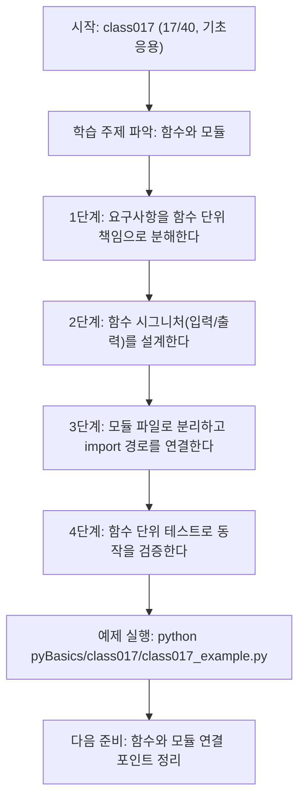
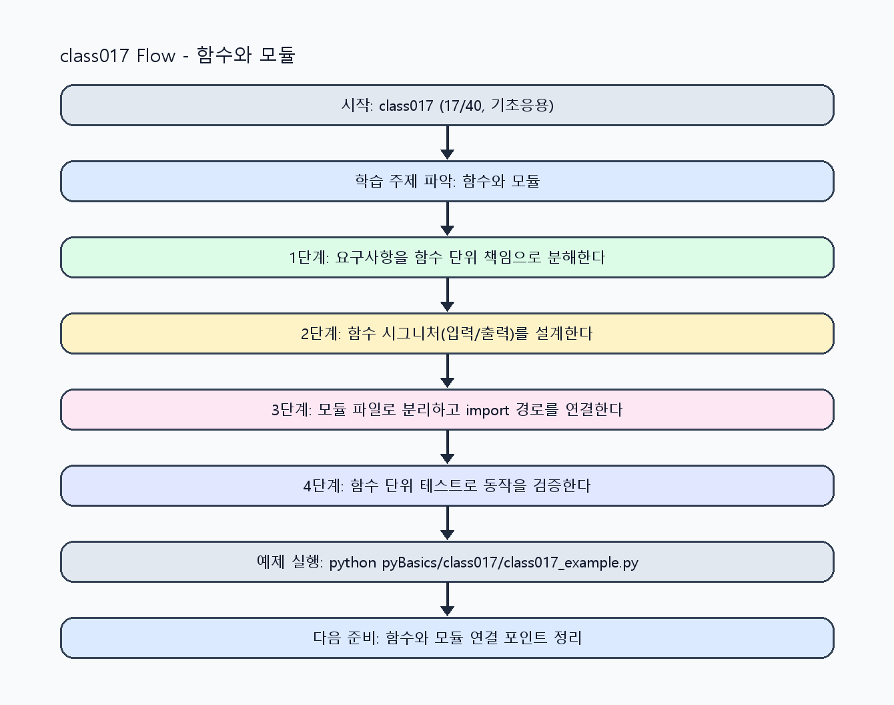

<!-- 이 파일은 www.edumgt.co.kr 의 에듀엠지티에 저작권이 있습니다 -->
# class017 자기주도 학습 가이드

## 1) 오늘의 학습 정보
- 교과목: **Python 프로그래밍**
- 학습 주제: **함수와 모듈**
- 세부 시퀀스: **17/40**
- 일정: **Day 03 / 1교시**
- 난이도: **기초응용**

### 교과목·학습주제 어휘 해설 (IT 강사 스타일)
#### 교과목 표현 분석: `Python 프로그래밍`
- 문법 포인트: 핵심 개념 명사를 중심으로 한 명사구 구조입니다.
- 기술 포인트: 코드 문법을 통해 문제를 절차적으로 해결하는 역량을 기르는 교과목입니다.
| 용어 | 문법/품사 | 한글·한자 | 영어 | 기술 설명 |
| --- | --- | --- | --- | --- |
| `Python` | 고유명사(언어명) | Python (한자 없음) | Python | 데이터 처리와 AI 실습에 널리 쓰이는 범용 프로그래밍 언어입니다. |
| `프로그래밍` | 명사 | 프로그래밍 (한자 없음) | programming | 문제를 알고리즘으로 분해해 코드로 구현하는 활동입니다. |

#### 학습주제 표현 분석: `함수와 모듈`
- 문법 포인트: 명사와 명사를 대등하게 묶는 병렬 명사구 구조입니다.
- 기술 포인트: 이번 차시는 `함수와 모듈` 용어를 중심으로 문제 정의, 코드 구현, 결과 검증까지 연결합니다.
| 용어 | 문법/품사 | 한글·한자 | 영어 | 기술 설명 |
| --- | --- | --- | --- | --- |
| `함수` | 명사 | 함수 (函數) | function | 입력을 받아 결과를 반환하는 재사용 가능한 코드 블록입니다. |
| `모듈` | 명사(외래어) | 모듈 (한자 없음) | module | 관련 함수/클래스를 묶은 코드 파일 단위입니다. |

## 2) 이전에 배운 내용 (복습)
- 이전 차시: **class016 / 반복문과 흐름제어** (Day 02 / 8교시)
- 복습 연결: 이전에 배운 **반복문과 흐름제어** 를 떠올리며, 오늘 **함수와 모듈** 와 어떤 점이 이어지는지 비교해 보세요.

## 3) 주제를 아주 쉽게 이해하기
- 한 줄 설명: 함수 추상화와 모듈 분리를 통해 PL의 재사용 구조를 설계하는 차시입니다.
- 왜 배우나요?: 함수 시그니처와 모듈 경계를 명확히 해야 유지보수성과 테스트 가능성이 올라갑니다.

### 핵심 개념 3가지
1. `함수(function)`는 입력(매개변수)과 출력(반환값)을 명시하는 최소 실행 단위입니다.
2. `스코프(scope)` 규칙은 지역/전역 이름 해석 범위를 정해 사이드이펙트를 제어합니다.
3. `모듈(module)` 분리는 책임을 나눠 코드 결합도를 낮추고 재사용성을 높입니다.

### 비유로 이해하기
- 조립 라인 공정을 파트별 작업자(함수)로 나눠 협업하는 방식과 같습니다.

## 4) 실습 환경 만들기 (항상 먼저)
아래 명령은 **처음 한 번** 준비해 두면 이후 학습이 쉬워집니다.

### Windows PowerShell
```powershell
cd C:\DevOps\Python-AI_Agent-Class
python -m venv .venv
.\.venv\Scripts\Activate.ps1
python -m pip install --upgrade pip
pip install -r requirements.txt
```

### Linux/macOS (bash)
```bash
cd /path/to/Python-AI_Agent-Class
python3 -m venv .venv
source .venv/bin/activate
python -m pip install --upgrade pip
pip install -r requirements.txt
```

## 5) 오늘의 예제 코드
- 예제 파일: `class017_example.py`
- 실행 명령:
```bash
python pyBasics/class017/class017_example.py
```

<!-- AUTO-GENERATED: TECH_STACK_FLOW START -->
### 기술 스택
- 언어: `Python 3`
- 실행: `CLI` (`python pyBasics/class017/class017_example.py`)
- 주요 문법: `def`, `매개변수/반환값`, `스코프(local/global)`, `import/from ... import`
- 학습 포커스: `함수와 모듈`

### 실습 example.py 동작 원리 (Mermaid Flowchart)


### Flow PNG 캡처

<!-- AUTO-GENERATED: TECH_STACK_FLOW END -->

### 예제 코드를 볼 때 집중할 포인트
1. 함수 시그니처가 입력/출력을 명확히 드러내는지 확인하기
2. 전역 변수 의존 없이 함수가 독립적으로 동작하는지 점검하기
3. 모듈 import 경로와 순환 의존 가능성을 점검하기

## 6) 퀴즈로 복습하기 (5문항)
- 퀴즈 파일: `class017_quiz.html`
- 브라우저에서 열기:
```bash
pyBasics/class017/class017_quiz.html
```
- 버튼 설명:
1. `채점하기`: 현재 선택한 답으로 점수를 계산해요.
2. `다시풀기`: 선택을 모두 지우고 처음부터 다시 풀어요.

## 7) 혼자 실습 순서 (초등학생 버전)
1. 코드를 한 번 그대로 실행해요.
2. 숫자/문장 값을 1개 바꿔요.
3. 결과가 왜 바뀌었는지 한 줄로 적어요.
4. 함수를 1개 더 만들어 작은 기능을 추가해요.

### 실습 미션
1. 중복 코드를 함수로 추출하고 매개변수/반환값을 명시하세요.
2. 한 파일의 함수를 다른 파일에서 `import`해 모듈 호출을 실습하세요.
3. 함수 단위 테스트 입력을 3개 이상 만들어 정상/경계 케이스를 검증하세요.

## 8) 스스로 점검 체크리스트
- [ ] 함수 이름만 보고 책임을 설명할 수 있다.
- [ ] 매개변수 타입/의미와 반환값을 문장으로 정리했다.
- [ ] 모듈 분리 후 import 경로 오류 없이 실행했다.

## 9) 막히면 이렇게 해결해요
1. 에러 메시지 마지막 줄을 먼저 읽어요.
2. 함수 이름과 괄호 짝을 확인해요.
3. `print()`를 넣어 중간 값을 확인해요.
4. 그래도 안 되면 어제 성공한 코드와 한 줄씩 비교해요.

## 10) 학습 후 다음에 배울 내용
- 다음 차시: **class018 / 함수와 모듈** (Day 03 / 2교시)
- 미리보기: 다음 차시 전에 **함수와 모듈** 핵심 코드 1개를 다시 실행해 두면 함수와 모듈 학습이 더 쉬워집니다.

## 11) 다음 차시 연결
- 다음 차시에서는 리스트·딕셔너리 같은 컬렉션 자료구조를 함수와 결합합니다.
- 오늘 코드를 복사하지 말고, 직접 다시 작성해 보세요.
