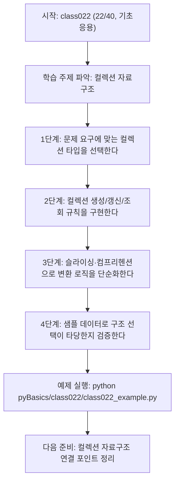
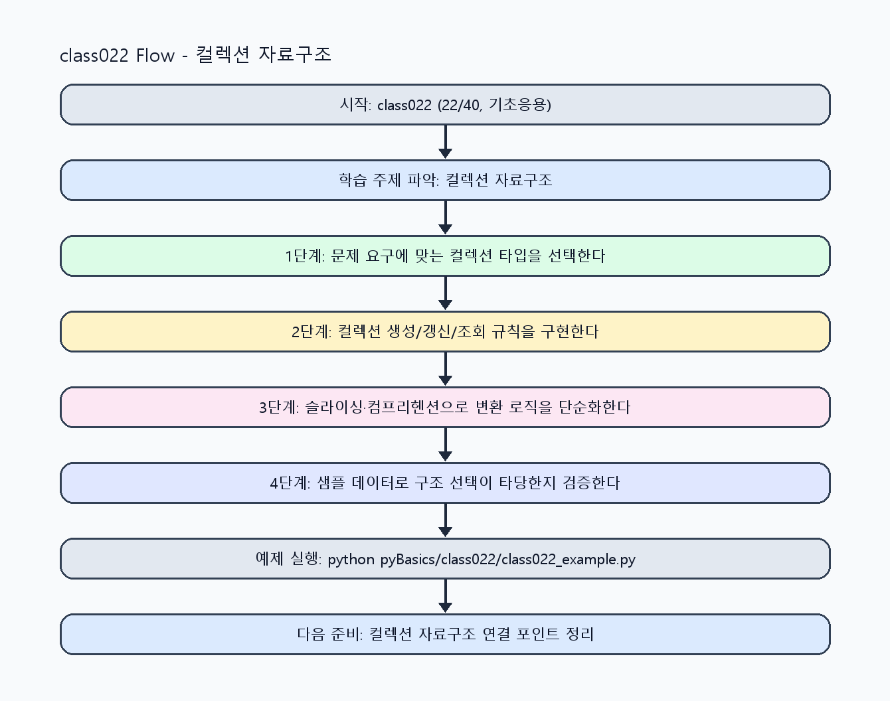

<!-- 이 파일은 www.edumgt.co.kr 의 에듀엠지티에 저작권이 있습니다 -->
# class022 자기주도 학습 가이드

## 1) 오늘의 학습 정보
- 교과목: **Python 프로그래밍**
- 학습 주제: **컬렉션 자료구조**
- 세부 시퀀스: **22/40**
- 일정: **Day 03 / 6교시**
- 난이도: **기초응용**

### 교과목·학습주제 어휘 해설 (IT 강사 스타일)
#### 교과목 표현 분석: `Python 프로그래밍`
- 문법 포인트: 핵심 개념 명사를 중심으로 한 명사구 구조입니다.
- 기술 포인트: 코드 문법을 통해 문제를 절차적으로 해결하는 역량을 기르는 교과목입니다.
| 용어 | 문법/품사 | 한글·한자 | 영어 | 기술 설명 |
| --- | --- | --- | --- | --- |
| `Python` | 고유명사(언어명) | Python (한자 없음) | Python | 데이터 처리와 AI 실습에 널리 쓰이는 범용 프로그래밍 언어입니다. |
| `프로그래밍` | 명사 | 프로그래밍 (한자 없음) | programming | 문제를 알고리즘으로 분해해 코드로 구현하는 활동입니다. |

#### 학습주제 표현 분석: `컬렉션 자료구조`
- 문법 포인트: 핵심 개념 명사를 중심으로 한 명사구 구조입니다.
- 기술 포인트: 이번 차시는 `컬렉션 자료구조` 용어를 중심으로 문제 정의, 코드 구현, 결과 검증까지 연결합니다.
| 용어 | 문법/품사 | 한글·한자 | 영어 | 기술 설명 |
| --- | --- | --- | --- | --- |
| `컬렉션` | 명사(외래어) | 컬렉션 (한자 없음) | collection | 리스트, 딕셔너리 등 여러 데이터를 저장하는 자료구조군입니다. |
| `자료구조` | 명사 | 자료구조 (資料構造) | data structure | 데이터 저장 방식과 접근 효율을 결정하는 구조입니다. |

## 2) 이전에 배운 내용 (복습)
- 이전 차시: **class021 / 컬렉션 자료구조** (Day 03 / 5교시)
- 복습 연결: 이전에 배운 **컬렉션 자료구조** 를 떠올리며, 오늘 **컬렉션 자료구조** 와 어떤 점이 이어지는지 비교해 보세요.

## 3) 주제를 아주 쉽게 이해하기
- 한 줄 설명: 리스트·튜플·딕셔너리·셋을 통해 데이터 구조와 연산 비용 감각을 익히는 차시입니다.
- 왜 배우나요?: 문제 특성에 맞는 자료구조를 고르면 코드 단순성·성능·안정성이 동시에 좋아집니다.

### 핵심 개념 3가지
1. `list`는 순서·가변성을 가지며 배열처럼 인덱스 기반 접근에 강합니다.
2. `tuple`은 불변 시퀀스, `dict`는 키-값 매핑, `set`은 중복 제거·집합 연산에 특화됩니다.
3. `컴프리헨션`은 컬렉션 변환을 선언적으로 표현해 가독성과 생산성을 높입니다.

### 비유로 이해하기
- 자료 종류별로 서랍·파일철·명단통을 다르게 쓰는 정리 방식과 같습니다.

## 4) 실습 환경 만들기 (항상 먼저)
아래 명령은 **처음 한 번** 준비해 두면 이후 학습이 쉬워집니다.

### Windows PowerShell
```powershell
cd C:\DevOps\Python-AI_Agent-Class
python -m venv .venv
.\.venv\Scripts\Activate.ps1
python -m pip install --upgrade pip
pip install -r requirements.txt
```

### Linux/macOS (bash)
```bash
cd /path/to/Python-AI_Agent-Class
python3 -m venv .venv
source .venv/bin/activate
python -m pip install --upgrade pip
pip install -r requirements.txt
```

## 5) 오늘의 예제 코드
- 예제 파일: `class022_example.py`
- 실행 명령:
```bash
python pyBasics/class022/class022_example.py
```


<!-- AUTO-GENERATED: OS_COMMANDS START -->
## 5-1) 운영체제별 실행 명령 예시
### PowerShell (Windows)
```powershell
cd C:\DevOps\Python-AI_Agent-Class
python .\pyBasics\class022\class022.py
python .\pyBasics\class022\class022_example.py
python .\pyBasics\class022\class022_assignment.py
start .\pyBasics\class022\class022_quiz.html
```

### WSL Ubuntu (bash)
```bash
cd /mnt/c/DevOps/Python-AI_Agent-Class
python3 pyBasics/class022/class022.py
python3 pyBasics/class022/class022_example.py
python3 pyBasics/class022/class022_assignment.py
explorer.exe "$(wslpath -w 'pyBasics/class022/class022_quiz.html')"
```

### run_class/run_day 스크립트 연동 (WSL bash)
```bash
./run_class.sh class022
./run_day.sh 3 launcher
```
<!-- AUTO-GENERATED: OS_COMMANDS END -->

<!-- AUTO-GENERATED: TECH_STACK_FLOW START -->
### 기술 스택
- 언어: `Python 3`
- 실행: `CLI` (`python pyBasics/class022/class022_example.py`)
- 주요 문법: `list/tuple`, `dict/set`, `슬라이싱/언패킹`, `컴프리헨션`
- 학습 포커스: `컬렉션 자료구조`

### 실습 example.py 동작 원리 (Mermaid Flowchart)


### Flow PNG 캡처

<!-- AUTO-GENERATED: TECH_STACK_FLOW END -->

### 예제 코드를 볼 때 집중할 포인트
1. 데이터 접근 패턴에 맞는 컬렉션을 선택했는지 확인하기
2. 가변 객체 공유(얕은 복사)로 인한 부작용이 없는지 점검하기
3. 컴프리헨션이 가독성을 해치지 않는 수준으로 작성됐는지 확인하기

## 6) 퀴즈로 복습하기 (5문항)
- 퀴즈 파일: `class022_quiz.html`
- 브라우저에서 열기:
```bash
pyBasics/class022/class022_quiz.html
```
- 버튼 설명:
1. `채점하기`: 현재 선택한 답으로 점수를 계산해요.
2. `다시풀기`: 선택을 모두 지우고 처음부터 다시 풀어요.

## 7) 혼자 실습 순서 (초등학생 버전)
1. 코드를 한 번 그대로 실행해요.
2. 숫자/문장 값을 1개 바꿔요.
3. 결과가 왜 바뀌었는지 한 줄로 적어요.
4. 함수를 1개 더 만들어 작은 기능을 추가해요.

### 실습 미션
1. 동일 데이터를 list/tuple/dict/set으로 각각 표현해 구조 차이를 비교하세요.
2. 리스트 슬라이싱과 딕셔너리 키 조회를 섞어 데이터 추출 코드를 작성하세요.
3. 컴프리헨션으로 필터링·변환 로직을 한 줄로 표현해 보세요.

## 8) 스스로 점검 체크리스트
- [ ] 각 컬렉션의 사용 목적을 예시와 함께 설명할 수 있다.
- [ ] 가변/불변 특성 차이를 코드로 확인했다.
- [ ] 중복 제거, 검색, 순회 목적에 맞는 구조를 선택했다.

## 9) 막히면 이렇게 해결해요
1. 에러 메시지 마지막 줄을 먼저 읽어요.
2. 함수 이름과 괄호 짝을 확인해요.
3. `print()`를 넣어 중간 값을 확인해요.
4. 그래도 안 되면 어제 성공한 코드와 한 줄씩 비교해요.

## 10) 학습 후 다음에 배울 내용
- 다음 차시: **class023 / 컬렉션 자료구조** (Day 03 / 7교시)
- 미리보기: 다음 차시 전에 **컬렉션 자료구조** 핵심 코드 1개를 다시 실행해 두면 컬렉션 자료구조 학습이 더 쉬워집니다.

## 11) 다음 차시 연결
- 다음 차시에서는 컬렉션 데이터를 파일로 저장하고 다시 읽는 입출력을 다룹니다.
- 오늘 코드를 복사하지 말고, 직접 다시 작성해 보세요.
