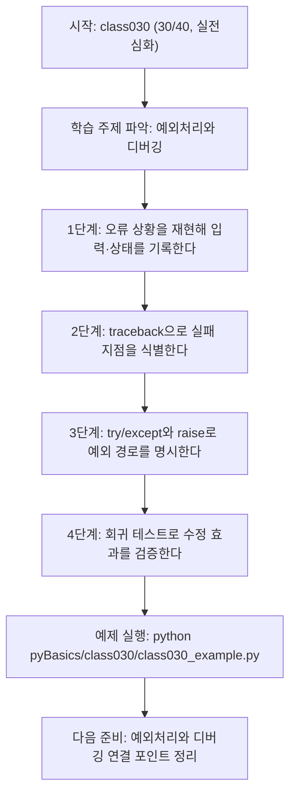
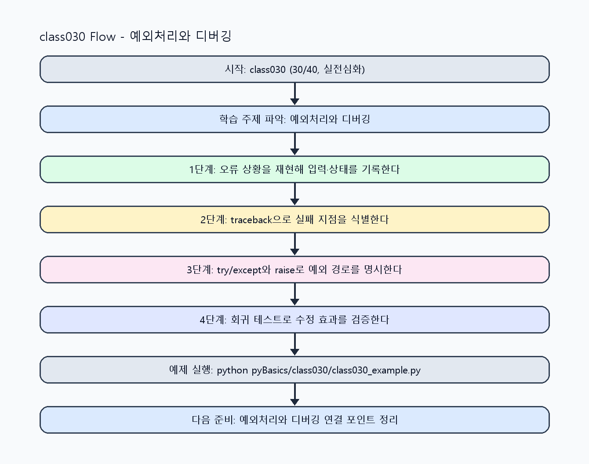

<!-- 이 파일은 www.edumgt.co.kr 의 에듀엠지티에 저작권이 있습니다 -->
# class030 자기주도 학습 가이드

## 1) 오늘의 학습 정보
- 교과목: **Python 프로그래밍**
- 학습 주제: **예외처리와 디버깅**
- 세부 시퀀스: **30/40**
- 일정: **Day 04 / 6교시**
- 난이도: **실전심화**

### 교과목·학습주제 어휘 해설 (IT 강사 스타일)
#### 교과목 표현 분석: `Python 프로그래밍`
- 문법 포인트: 핵심 개념 명사를 중심으로 한 명사구 구조입니다.
- 기술 포인트: 코드 문법을 통해 문제를 절차적으로 해결하는 역량을 기르는 교과목입니다.
| 용어 | 문법/품사 | 한글·한자 | 영어 | 기술 설명 |
| --- | --- | --- | --- | --- |
| `Python` | 고유명사(언어명) | Python (한자 없음) | Python | 데이터 처리와 AI 실습에 널리 쓰이는 범용 프로그래밍 언어입니다. |
| `프로그래밍` | 명사 | 프로그래밍 (한자 없음) | programming | 문제를 알고리즘으로 분해해 코드로 구현하는 활동입니다. |

#### 학습주제 표현 분석: `예외처리와 디버깅`
- 문법 포인트: 명사와 명사를 대등하게 묶는 병렬 명사구 구조입니다.
- 기술 포인트: 이번 차시는 `예외처리와 디버깅` 용어를 중심으로 문제 정의, 코드 구현, 결과 검증까지 연결합니다.
| 용어 | 문법/품사 | 한글·한자 | 영어 | 기술 설명 |
| --- | --- | --- | --- | --- |
| `예외처리` | 명사 | 예외처리 (例外處理) | exception handling | 실행 중 오류 상황을 안전하게 제어하는 기법입니다. |
| `디버깅` | 명사(외래어) | 디버깅 (한자 없음) | debugging | 오류 원인을 추적하고 수정하는 개발 절차입니다. |

## 2) 이전에 배운 내용 (복습)
- 이전 차시: **class029 / 예외처리와 디버깅** (Day 04 / 5교시)
- 복습 연결: 이전에 배운 **예외처리와 디버깅** 를 떠올리며, 오늘 **예외처리와 디버깅** 와 어떤 점이 이어지는지 비교해 보세요.

## 3) 주제를 아주 쉽게 이해하기
- 한 줄 설명: 오류를 재현·분석·수정하는 디버깅 루프와 예외처리 구조를 학습합니다.
- 왜 배우나요?: PL 관점에서 실패 경로를 명시해야 프로그램이 비정상 입력에서도 안정적으로 동작합니다.

### 핵심 개념 3가지
1. `try/except/else/finally`는 정상 경로와 오류 경로를 분리해 제어 흐름을 명확히 합니다.
2. `raise`는 도메인 규칙 위반을 명시적으로 신호해 호출자에게 책임을 전달합니다.
3. `traceback`과 로그는 오류 위치·원인·입력 상태를 추적하는 핵심 디버깅 근거입니다.

### 비유로 이해하기
- 장비 고장 시 원인 로그를 남기고 안전 절차대로 복구하는 운영 프로세스와 같습니다.

## 4) 실습 환경 만들기 (항상 먼저)
아래 명령은 **처음 한 번** 준비해 두면 이후 학습이 쉬워집니다.

### Windows PowerShell
```powershell
cd C:\DevOps\Python-AI_Agent-Class
python -m venv .venv
.\.venv\Scripts\Activate.ps1
python -m pip install --upgrade pip
pip install -r requirements.txt
```

### Linux/macOS (bash)
```bash
cd /path/to/Python-AI_Agent-Class
python3 -m venv .venv
source .venv/bin/activate
python -m pip install --upgrade pip
pip install -r requirements.txt
```

## 5) 오늘의 예제 코드
- 예제 파일: `class030_example.py`
- 실행 명령:
```bash
python pyBasics/class030/class030_example.py
```


<!-- AUTO-GENERATED: OS_COMMANDS START -->
## 5-1) 운영체제별 실행 명령 예시
### PowerShell (Windows)
```powershell
cd C:\DevOps\Python-AI_Agent-Class
python .\pyBasics\class030\class030.py
python .\pyBasics\class030\class030_example.py
python .\pyBasics\class030\class030_assignment.py
start .\pyBasics\class030\class030_quiz.html
```

### WSL Ubuntu (bash)
```bash
cd /mnt/c/DevOps/Python-AI_Agent-Class
python3 pyBasics/class030/class030.py
python3 pyBasics/class030/class030_example.py
python3 pyBasics/class030/class030_assignment.py
explorer.exe "$(wslpath -w 'pyBasics/class030/class030_quiz.html')"
```

### run_class/run_day 스크립트 연동 (WSL bash)
```bash
./run_class.sh class030
./run_day.sh 4 launcher
```
<!-- AUTO-GENERATED: OS_COMMANDS END -->

<!-- AUTO-GENERATED: TECH_STACK_FLOW START -->
### 기술 스택
- 언어: `Python 3`
- 실행: `CLI` (`python pyBasics/class030/class030_example.py`)
- 주요 문법: `try/except/else/finally`, `raise`, `예외 클래스`, `디버깅 로그(print/logging)`
- 학습 포커스: `예외처리와 디버깅`

### 실습 example.py 동작 원리 (Mermaid Flowchart)


### Flow PNG 캡처

<!-- AUTO-GENERATED: TECH_STACK_FLOW END -->

### 예제 코드를 볼 때 집중할 포인트
1. 예외를 포착할 위치와 전파할 위치가 분리됐는지 확인하기
2. 오류 메시지가 원인 파악에 충분한 정보를 제공하는지 점검하기
3. 수정 후 동일 입력에서 정상 동작하는지 재실행으로 확인하기

## 6) 퀴즈로 복습하기 (5문항)
- 퀴즈 파일: `class030_quiz.html`
- 브라우저에서 열기:
```bash
pyBasics/class030/class030_quiz.html
```
- 버튼 설명:
1. `채점하기`: 현재 선택한 답으로 점수를 계산해요.
2. `다시풀기`: 선택을 모두 지우고 처음부터 다시 풀어요.

## 7) 혼자 실습 순서 (초등학생 버전)
1. 코드를 한 번 그대로 실행해요.
2. 숫자/문장 값을 1개 바꿔요.
3. 결과가 왜 바뀌었는지 한 줄로 적어요.
4. 함수를 1개 더 만들어 작은 기능을 추가해요.

### 실습 미션
1. 의도적으로 예외를 발생시켜 traceback의 파일/라인 정보를 읽어 보세요.
2. 입력 검증 실패 시 `raise ValueError`로 도메인 규칙을 명시하세요.
3. 예외 처리 전후 코드를 비교해 사용자 메시지와 로그 품질을 개선하세요.

## 8) 스스로 점검 체크리스트
- [ ] 예외 타입별 처리 정책을 구분해 설명할 수 있다.
- [ ] except에서 오류를 숨기지 않고 원인 정보를 남겼다.
- [ ] 수정 후 동일 오류가 재발하지 않는지 회귀 테스트를 수행했다.

## 9) 막히면 이렇게 해결해요
1. 에러 메시지 마지막 줄을 먼저 읽어요.
2. 함수 이름과 괄호 짝을 확인해요.
3. `print()`를 넣어 중간 값을 확인해요.
4. 그래도 안 되면 어제 성공한 코드와 한 줄씩 비교해요.

## 10) 학습 후 다음에 배울 내용
- 다음 차시: **class031 / 예외처리와 디버깅** (Day 04 / 7교시)
- 미리보기: 다음 차시 전에 **예외처리와 디버깅** 핵심 코드 1개를 다시 실행해 두면 예외처리와 디버깅 학습이 더 쉬워집니다.

## 11) 다음 차시 연결
- 다음 차시에서는 클래스 구조 안에 예외처리 정책을 포함해 객체지향 설계로 확장합니다.
- 오늘 코드를 복사하지 말고, 직접 다시 작성해 보세요.
