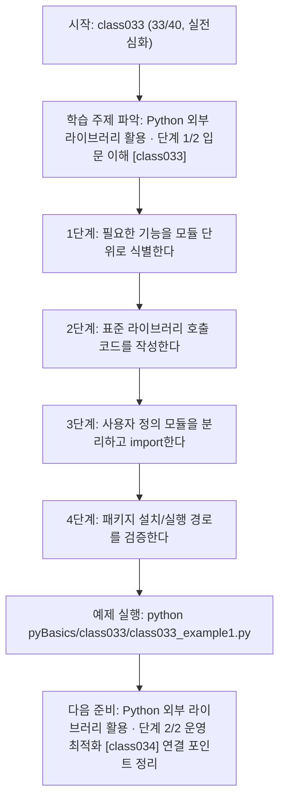
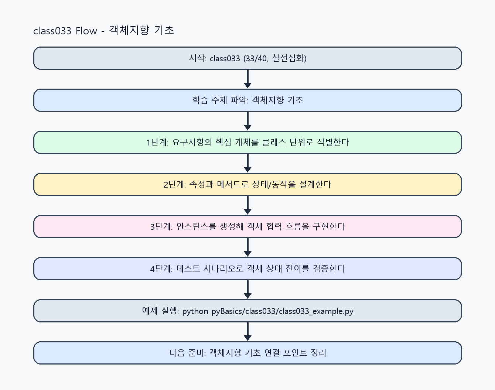

<!-- 이 파일은 www.edumgt.co.kr 의 에듀엠지티에 저작권이 있습니다 -->
# class033 자기주도 학습 가이드

## 1) 오늘의 학습 정보
- 교과목: **Python 프로그래밍**
- 학습 주제: **Python 외부 라이브러리 활용 · 단계 1/2 입문 이해 [class033]**
- 세부 시퀀스: **33/40**
- 일정: **Day 05 / 1교시**
- 난이도: **실전심화**

### 교과목·학습주제 어휘 해설 (IT 강사 스타일)
#### 교과목 표현 분석: `Python 프로그래밍`
- 문법 포인트: 핵심 개념 명사를 중심으로 한 명사구 구조입니다.
- 기술 포인트: 코드 문법을 통해 문제를 절차적으로 해결하는 역량을 기르는 교과목입니다.
| 용어 | 문법/품사 | 한글·한자 | 영어 | 기술 설명 |
| --- | --- | --- | --- | --- |
| `Python` | 고유명사(언어명) | Python (한자 없음) | Python | 데이터 처리와 AI 실습에 널리 쓰이는 범용 프로그래밍 언어입니다. |
| `프로그래밍` | 명사 | 프로그래밍 (한자 없음) | programming | 문제를 알고리즘으로 분해해 코드로 구현하는 활동입니다. |

#### 학습주제 표현 분석: `Python 외부 라이브러리 활용 · 단계 1/2 입문 이해 [class033]`
- 문법 포인트: 핵심 개념 명사를 중심으로 한 명사구 구조입니다.
- 기술 포인트: 이번 차시는 `Python 외부 라이브러리 활용` 핵심 개념을 코드 구현, 결과 해석, 점검 기준으로 연결합니다.
| 용어 | 문법/품사 | 한글·한자 | 영어 | 기술 설명 |
| --- | --- | --- | --- | --- |
| `Python` | 고유명사(언어명) | Python (한자 없음) | Python | 데이터 처리와 AI 실습에 널리 쓰이는 범용 프로그래밍 언어입니다. |
| `외부` | 명사(주제 핵심 용어) | 외부 (한자 없음) | (topic-specific) | `외부`는 `Python 외부 라이브러리 활용` 실습에서 코드 구조와 실행 결과를 안정적으로 만들기 위한 핵심 용어입니다. |
| `라이브러리` | 명사(주제 핵심 용어) | 라이브러리 (한자 없음) | (topic-specific) | 이번 차시 맥락: import와 표준 라이브러리, 사용자 정의 모듈을 묶어 패키지 활용력을 키우는 차시입니다. 이를 기준으로 `라이브러리`를 코드와 결과 해석에 연결합니다. |
| `활용` | 명사/동사 어근 | 활용 (活用) | utilization | 이론이나 도구를 실제 문제 해결 맥락에 적용하는 행위입니다. |
| `import` | 영문 기술명/약어 | import (한자 없음) | import | 이번 차시 맥락: import와 표준 라이브러리, 사용자 정의 모듈을 묶어 패키지 활용력을 키우는 차시입니다. 이를 기준으로 `import`를 코드와 결과 해석에 연결합니다. |
| `from` | 영문 기술명/약어 | from (한자 없음) | from | 이번 차시 맥락: `import`와 `from ... import ...` 문법으로 필요한 기능을 모듈 단위로 가져올 수 있습니다. 이를 기준으로 `from`를 코드와 결과 해석에 연결합니다. |

## 2) 이전에 배운 내용 (복습)
- 이전 차시: **class032 / Tailwind CSS와 UI 컴포넌트 · 단계 2/2 운영 최적화 [class032]** (Day 04 / 8교시)
- 복습 연결: 이전에 배운 **Tailwind CSS와 UI 컴포넌트 · 단계 2/2 운영 최적화 [class032]** 를 떠올리며, 오늘 **Python 외부 라이브러리 활용 · 단계 1/2 입문 이해 [class033]** 와 어떤 점이 이어지는지 비교해 보세요.

## 3) 주제를 아주 쉽게 이해하기
- 한 줄 설명: import와 표준 라이브러리, 사용자 정의 모듈을 묶어 패키지 활용력을 키우는 차시입니다.
- 왜 배우나요?: 모듈/패키지 구조를 이해해야 코드를 분리하고 재사용하며 유지보수 비용을 줄일 수 있습니다.

### 핵심 개념 3가지
1. `import`와 `from ... import ...` 문법으로 필요한 기능을 모듈 단위로 가져올 수 있습니다.
2. `random`, `math`, `datetime`, `os` 같은 표준 라이브러리는 Python 실무 기본 도구입니다.
3. `사용자 정의 모듈`을 파일로 분리하면 기능 재사용과 테스트 범위 관리가 쉬워집니다.

### 비유로 이해하기
- 공구함에서 필요한 공구(모듈)만 꺼내 조합해 작업하는 방식과 같습니다.

## 4) 실습 환경 만들기 (항상 먼저)
아래 명령은 **처음 한 번** 준비해 두면 이후 학습이 쉬워집니다.

### Windows PowerShell
```powershell
cd C:\DevOps\Python-AI_Agent-Class
python -m venv .venv
.\.venv\Scripts\Activate.ps1
python -m pip install --upgrade pip
pip install -r requirements.txt
```

### Linux/macOS (bash)
```bash
cd /path/to/Python-AI_Agent-Class
python3 -m venv .venv
source .venv/bin/activate
python -m pip install --upgrade pip
pip install -r requirements.txt
```

## 5) 오늘의 예제 코드
- 예제 파일: `class033_example1.py`
- 실행 명령:
```bash
python pyBasics/class033/class033_example1.py
```

### example1~example5 단계별 테스트 확장
1. example1: import와 표준 라이브러리(random/math/datetime/os)를 실행한다.
2. example2: 사용자 정의 모듈을 작성하고 import한다.
3. example3: 패키지 설치/미설치 환경을 비교해 점검한다.
4. example4: 모듈 조합 유틸리티를 작성해 자동화한다.
5. example5: 의존성 관리(requirements)와 복구 절차를 정리한다.

<!-- AUTO-GENERATED: TECH_STACK_FLOW START -->
### 기술 스택
- 언어: `Python 3`
- 실행: `CLI` (`python pyBasics/class033/class033_example1.py`)
- 주요 문법: `import`, `from ... import ...`, `표준 라이브러리(random/math/datetime/os)`, `사용자 정의 모듈`
- 학습 포커스: `Python 외부 라이브러리 활용 · 단계 1/2 입문 이해 [class033]`

### 실습 example1.py 동작 원리 (Mermaid Flowchart)


### Flow PNG 캡처

<!-- AUTO-GENERATED: TECH_STACK_FLOW END -->

### 예제 코드를 볼 때 집중할 포인트
1. 모듈 import 경로가 실행 환경(.venv)과 일치하는지 확인하기
2. 표준 라이브러리 호출 결과가 재현 가능한지 점검하기
3. 사용자 정의 모듈 분리 후 순환 의존이 없는지 확인하기

## 6) 퀴즈로 복습하기 (10문항)
- 퀴즈 파일: `class033_quiz.html`
- 브라우저에서 열기:
```bash
pyBasics/class033/class033_quiz.html
```
- 버튼 설명:
1. `채점하기`: 현재 선택한 답으로 점수를 계산해요.
2. `다시풀기`: 선택을 모두 지우고 처음부터 다시 풀어요.

## 7) 혼자 실습 순서 (초등학생 버전)
1. 코드를 한 번 그대로 실행해요.
2. 숫자/문장 값을 1개 바꿔요.
3. 결과가 왜 바뀌었는지 한 줄로 적어요.
4. 함수를 1개 더 만들어 작은 기능을 추가해요.

### 실습 미션
1. `random`, `math`, `datetime`, `os`를 각각 1회 이상 호출해 결과를 출력하세요.
2. 한 파일에 함수 1개를 만든 뒤 다른 파일에서 import해 실행하세요.
3. pip 패키지 설치 전/후 import 성공 여부를 비교해 기록하세요.

## 8) 스스로 점검 체크리스트
- [ ] import 방식 2가지(`import`, `from ... import`)를 구분해 설명할 수 있다.
- [ ] 표준 라이브러리 4종(random/math/datetime/os)을 실습 코드에 적용했다.
- [ ] 사용자 정의 모듈을 분리하고 import 경로 오류 없이 실행했다.

## 9) 막히면 이렇게 해결해요
1. 에러 메시지 마지막 줄을 먼저 읽어요.
2. 함수 이름과 괄호 짝을 확인해요.
3. `print()`를 넣어 중간 값을 확인해요.
4. 그래도 안 되면 어제 성공한 코드와 한 줄씩 비교해요.

## 10) 학습 후 다음에 배울 내용
- 다음 차시: **class034 / Python 외부 라이브러리 활용 · 단계 2/2 운영 최적화 [class034]** (Day 05 / 2교시)
- 미리보기: 다음 차시 전에 **Python 외부 라이브러리 활용 · 단계 1/2 입문 이해 [class033]** 핵심 코드 1개를 다시 실행해 두면 Python 외부 라이브러리 활용 · 단계 2/2 운영 최적화 [class034] 학습이 더 쉬워집니다.

## 11) 다음 차시 연결
- 다음 차시에서는 파일 처리 자동화와 예외 처리로 실행 안정성을 강화합니다.
- 오늘 코드를 복사하지 말고, 직접 다시 작성해 보세요.
