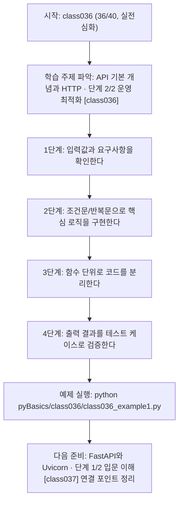
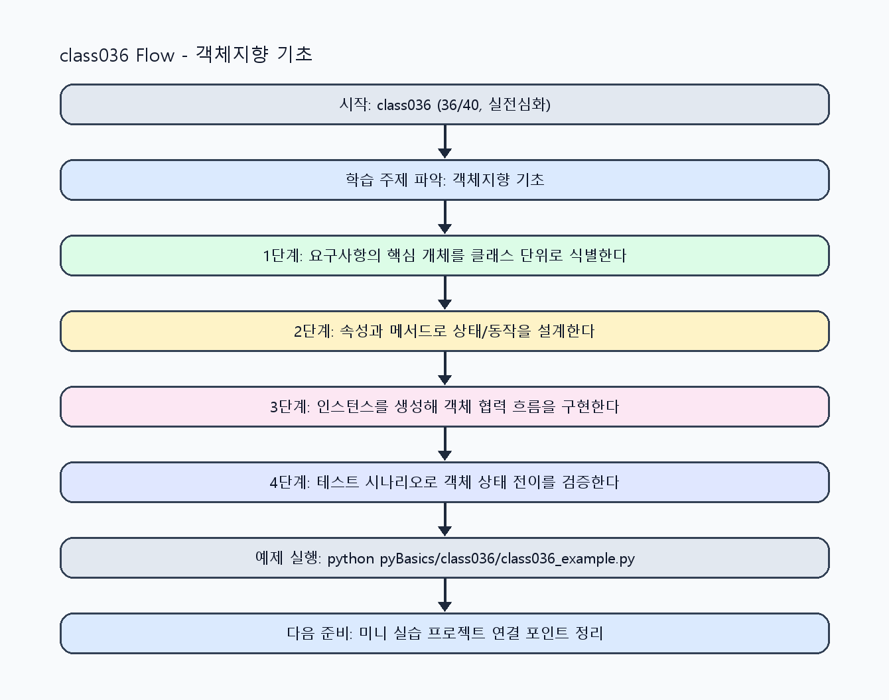

<!-- 이 파일은 www.edumgt.co.kr 의 에듀엠지티에 저작권이 있습니다 -->
# class036 자기주도 학습 가이드

## 1) 오늘의 학습 정보
- 교과목: **Python 프로그래밍**
- 학습 주제: **API 기본 개념과 HTTP · 단계 2/2 운영 최적화 [class036]**
- 세부 시퀀스: **36/40**
- 일정: **Day 05 / 4교시**
- 난이도: **실전심화**

### 교과목·학습주제 어휘 해설 (IT 강사 스타일)
#### 교과목 표현 분석: `Python 프로그래밍`
- 문법 포인트: 핵심 개념 명사를 중심으로 한 명사구 구조입니다.
- 기술 포인트: 코드 문법을 통해 문제를 절차적으로 해결하는 역량을 기르는 교과목입니다.
| 용어 | 문법/품사 | 한글·한자 | 영어 | 기술 설명 |
| --- | --- | --- | --- | --- |
| `Python` | 고유명사(언어명) | Python (한자 없음) | Python | 데이터 처리와 AI 실습에 널리 쓰이는 범용 프로그래밍 언어입니다. |
| `프로그래밍` | 명사 | 프로그래밍 (한자 없음) | programming | 문제를 알고리즘으로 분해해 코드로 구현하는 활동입니다. |

#### 학습주제 표현 분석: `API 기본 개념과 HTTP · 단계 2/2 운영 최적화 [class036]`
- 문법 포인트: 명사와 명사를 대등하게 묶는 병렬 명사구 구조입니다.
- 기술 포인트: 이번 차시는 `API 기본 개념과 HTTP` 핵심 개념을 코드 구현, 결과 해석, 점검 기준으로 연결합니다.
| 용어 | 문법/품사 | 한글·한자 | 영어 | 기술 설명 |
| --- | --- | --- | --- | --- |
| `API` | 약어명사 | API (한자 없음) | Application Programming Interface | 서비스 간 기능을 호출하기 위한 표준 인터페이스입니다. |
| `개념` | 명사(주제 핵심 용어) | 개념 (한자 없음) | (topic-specific) | `개념`는 `API 기본 개념과 HTTP` 실습에서 코드 구조와 실행 결과를 안정적으로 만들기 위한 핵심 용어입니다. |
| `HTTP` | 영문 기술명/약어 | HTTP (한자 없음) | HTTP | `HTTP`는 `API 기본 개념과 HTTP` 실습에서 코드 구조와 실행 결과를 안정적으로 만들기 위한 핵심 용어입니다. |

## 2) 이전에 배운 내용 (복습)
- 이전 차시: **class035 / API 기본 개념과 HTTP · 단계 1/2 입문 이해 [class035]** (Day 05 / 3교시)
- 복습 연결: 이전에 배운 **API 기본 개념과 HTTP · 단계 1/2 입문 이해 [class035]** 를 떠올리며, 오늘 **API 기본 개념과 HTTP · 단계 2/2 운영 최적화 [class036]** 와 어떤 점이 이어지는지 비교해 보세요.

## 3) 주제를 아주 쉽게 이해하기
- 한 줄 설명: 코드를 작은 블록처럼 조립하면서 문제를 해결하는 방법을 배워요.
- 왜 배우나요?: 컴퓨터에게 순서대로 일을 시키는 힘을 키우면, 복잡한 문제도 차근차근 풀 수 있어요.

### 핵심 개념 3가지
1. 입력값을 받아서 규칙대로 처리한 뒤 결과를 출력해요.
2. 조건문과 반복문으로 '언제/몇 번' 실행할지 정해요.
3. 함수로 코드를 나누면 읽기 쉽고 재사용하기 쉬워요.

### 비유로 이해하기
- 레고를 만들 때 설명서 순서대로 블록을 끼우는 것과 같아요.

## 4) 실습 환경 만들기 (항상 먼저)
아래 명령은 **처음 한 번** 준비해 두면 이후 학습이 쉬워집니다.

### Windows PowerShell
```powershell
cd C:\DevOps\Python-AI_Agent-Class
python -m venv .venv
.\.venv\Scripts\Activate.ps1
python -m pip install --upgrade pip
pip install -r requirements.txt
```

### Linux/macOS (bash)
```bash
cd /path/to/Python-AI_Agent-Class
python3 -m venv .venv
source .venv/bin/activate
python -m pip install --upgrade pip
pip install -r requirements.txt
```

## 5) 오늘의 예제 코드
- 예제 파일: `class036_example1.py`
- 실행 명령:
```bash
python pyBasics/class036/class036_example1.py
```

### example1~example5 단계별 테스트 확장
1. example1: 정상 입력 1세트로 기본 동작을 확인한다.
2. example2: 입력값 범위를 늘려 조건 분기 동작을 확인한다.
3. example3: 경계값/예외값을 넣어 실패 경로를 재현한다.
4. example4: 여러 테스트 케이스 결과를 비교하고 개선안을 반영한다.
5. example5: 운영 관점 체크리스트(로그/알림/롤백)까지 점검한다.

<!-- AUTO-GENERATED: TECH_STACK_FLOW START -->
### 기술 스택
- 언어: `Python 3`
- 실행: `CLI` (`python pyBasics/class036/class036_example1.py`)
- 주요 문법: `함수`, `조건문`, `반복문`, `출력(print)`
- 학습 포커스: `API 기본 개념과 HTTP · 단계 2/2 운영 최적화 [class036]`

### 실습 example1.py 동작 원리 (Mermaid Flowchart)


### Flow PNG 캡처

<!-- AUTO-GENERATED: TECH_STACK_FLOW END -->

### 예제 코드를 볼 때 집중할 포인트
1. 변수/상수/타입 정의가 요구사항과 일치하는지 확인하기
2. 배열(list)·조건·반복이 데이터 흐름을 올바르게 반영하는지 확인하기
3. 함수/클래스 경계가 명확하고 테스트 가능한 구조인지 점검하기

## 6) 퀴즈로 복습하기 (10문항)
- 퀴즈 파일: `class036_quiz.html`
- 브라우저에서 열기:
```bash
pyBasics/class036/class036_quiz.html
```
- 버튼 설명:
1. `채점하기`: 현재 선택한 답으로 점수를 계산해요.
2. `다시풀기`: 선택을 모두 지우고 처음부터 다시 풀어요.

## 7) 혼자 실습 순서 (초등학생 버전)
1. 코드를 한 번 그대로 실행해요.
2. 숫자/문장 값을 1개 바꿔요.
3. 결과가 왜 바뀌었는지 한 줄로 적어요.
4. 함수를 1개 더 만들어 작은 기능을 추가해요.

### 실습 미션
1. 예제 파일을 실행해서 결과 문장을 먼저 확인해요.
2. 숫자나 문자열 값을 바꿔 보며 결과가 어떻게 달라지는지 관찰해요.
3. 비슷한 기능을 함수 하나 더 만들어 스스로 확장해 봐요.

## 8) 스스로 점검 체크리스트
- [ ] 코드가 오류 없이 끝까지 실행된다.
- [ ] 변수 이름만 보고도 역할을 설명할 수 있다.
- [ ] 같은 기능을 다른 입력으로 다시 테스트했다.

## 9) 막히면 이렇게 해결해요
1. 에러 메시지 마지막 줄을 먼저 읽어요.
2. 함수 이름과 괄호 짝을 확인해요.
3. `print()`를 넣어 중간 값을 확인해요.
4. 그래도 안 되면 어제 성공한 코드와 한 줄씩 비교해요.

## 10) 학습 후 다음에 배울 내용
- 다음 차시: **class037 / FastAPI와 Uvicorn · 단계 1/2 입문 이해 [class037]** (Day 05 / 5교시)
- 미리보기: 다음 차시 전에 **API 기본 개념과 HTTP · 단계 2/2 운영 최적화 [class036]** 핵심 코드 1개를 다시 실행해 두면 FastAPI와 Uvicorn · 단계 1/2 입문 이해 [class037] 학습이 더 쉬워집니다.

## 11) 다음 차시 연결
- 다음 차시에서는 오늘 만든 규칙을 더 큰 문제에 연결해 볼 거예요.
- 오늘 코드를 복사하지 말고, 직접 다시 작성해 보세요.
