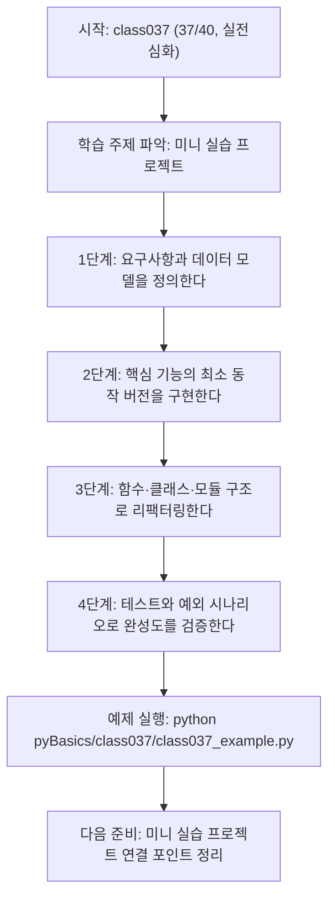
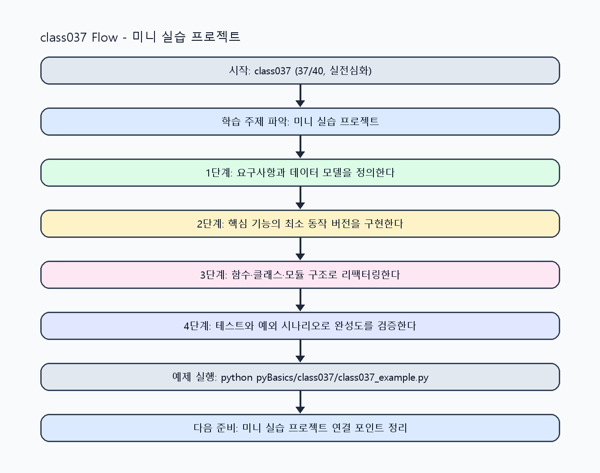

<!-- 이 파일은 www.edumgt.co.kr 의 에듀엠지티에 저작권이 있습니다 -->
# class037 자기주도 학습 가이드

## 1) 오늘의 학습 정보
- 교과목: **Python 프로그래밍**
- 학습 주제: **미니 실습 프로젝트**
- 세부 시퀀스: **37/40**
- 일정: **Day 05 / 5교시**
- 난이도: **실전심화**

### 교과목·학습주제 어휘 해설 (IT 강사 스타일)
#### 교과목 표현 분석: `Python 프로그래밍`
- 문법 포인트: 핵심 개념 명사를 중심으로 한 명사구 구조입니다.
- 기술 포인트: 코드 문법을 통해 문제를 절차적으로 해결하는 역량을 기르는 교과목입니다.
| 용어 | 문법/품사 | 한글·한자 | 영어 | 기술 설명 |
| --- | --- | --- | --- | --- |
| `Python` | 고유명사(언어명) | Python (한자 없음) | Python | 데이터 처리와 AI 실습에 널리 쓰이는 범용 프로그래밍 언어입니다. |
| `프로그래밍` | 명사 | 프로그래밍 (한자 없음) | programming | 문제를 알고리즘으로 분해해 코드로 구현하는 활동입니다. |

#### 학습주제 표현 분석: `미니 실습 프로젝트`
- 문법 포인트: 핵심 개념 명사를 중심으로 한 명사구 구조입니다.
- 기술 포인트: 이번 차시는 `미니 실습 프로젝트` 용어를 중심으로 문제 정의, 코드 구현, 결과 검증까지 연결합니다.
| 용어 | 문법/품사 | 한글·한자 | 영어 | 기술 설명 |
| --- | --- | --- | --- | --- |
| `미니` | 명사(기술 개념어) | 미니 (한자 없음) | (context-specific) | 용어 `미니`: 이번 학습주제에서 정의해야 할 핵심 개념 용어입니다. |
| `실습` | 명사(기술 개념어) | 실습 (한자 없음) | (context-specific) | 용어 `실습`: 이번 학습주제에서 정의해야 할 핵심 개념 용어입니다. |
| `프로젝트` | 명사(기술 개념어) | 프로젝트 (한자 없음) | (context-specific) | 용어 `프로젝트`: 이번 학습주제에서 정의해야 할 핵심 개념 용어입니다. |

## 2) 이전에 배운 내용 (복습)
- 이전 차시: **class036 / 객체지향 기초** (Day 05 / 4교시)
- 복습 연결: 이전에 배운 **객체지향 기초** 를 떠올리며, 오늘 **미니 실습 프로젝트** 와 어떤 점이 이어지는지 비교해 보세요.

## 3) 주제를 아주 쉽게 이해하기
- 한 줄 설명: 변수·타입·함수·클래스·예외처리를 통합해 작은 프로그램을 완성하는 차시입니다.
- 왜 배우나요?: PL 기본 요소를 통합 적용해야 실제 문제를 구조화하고 유지보수 가능한 코드로 완성할 수 있습니다.

### 핵심 개념 3가지
1. `요구사항 분해`는 입력/처리/출력과 예외 경로를 먼저 모델링하는 설계 활동입니다.
2. `아키텍처 분리`는 함수·클래스·모듈 경계를 정해 변경 영향 범위를 줄입니다.
3. `테스트/리팩터링` 루프는 동작 보존을 확인하며 코드 품질을 높이는 핵심 절차입니다.

### 비유로 이해하기
- 작은 서비스 프로토타입을 만들며 설계도, 구현, 검수 단계를 반복하는 프로젝트와 같습니다.

## 4) 실습 환경 만들기 (항상 먼저)
아래 명령은 **처음 한 번** 준비해 두면 이후 학습이 쉬워집니다.

### Windows PowerShell
```powershell
cd C:\DevOps\Python-AI_Agent-Class
python -m venv .venv
.\.venv\Scripts\Activate.ps1
python -m pip install --upgrade pip
pip install -r requirements.txt
```

### Linux/macOS (bash)
```bash
cd /path/to/Python-AI_Agent-Class
python3 -m venv .venv
source .venv/bin/activate
python -m pip install --upgrade pip
pip install -r requirements.txt
```

## 5) 오늘의 예제 코드
- 예제 파일: `class037_example.py`
- 실행 명령:
```bash
python pyBasics/class037/class037_example.py
```


<!-- AUTO-GENERATED: OS_COMMANDS START -->
## 5-1) 운영체제별 실행 명령 예시
### PowerShell (Windows)
```powershell
cd C:\DevOps\Python-AI_Agent-Class
python .\pyBasics\class037\class037.py
python .\pyBasics\class037\class037_example.py
python .\pyBasics\class037\class037_assignment.py
start .\pyBasics\class037\class037_quiz.html
```

### WSL Ubuntu (bash)
```bash
cd /mnt/c/DevOps/Python-AI_Agent-Class
python3 pyBasics/class037/class037.py
python3 pyBasics/class037/class037_example.py
python3 pyBasics/class037/class037_assignment.py
explorer.exe "$(wslpath -w 'pyBasics/class037/class037_quiz.html')"
```

### run_class/run_day 스크립트 연동 (WSL bash)
```bash
./run_class.sh class037
./run_day.sh 5 launcher
```
<!-- AUTO-GENERATED: OS_COMMANDS END -->

<!-- AUTO-GENERATED: TECH_STACK_FLOW START -->
### 기술 스택
- 언어: `Python 3`
- 실행: `CLI` (`python pyBasics/class037/class037_example.py`)
- 주요 문법: `요구사항 분해`, `함수·클래스 조합`, `모듈 분리(import)`, `테스트/리팩터링`
- 학습 포커스: `미니 실습 프로젝트`

### 실습 example.py 동작 원리 (Mermaid Flowchart)


### Flow PNG 캡처

<!-- AUTO-GENERATED: TECH_STACK_FLOW END -->

### 예제 코드를 볼 때 집중할 포인트
1. 기능 단위와 코드 구조(함수/클래스/모듈)가 1:1로 대응되는지 확인하기
2. 정상 경로뿐 아니라 실패 경로(예외)까지 테스트하는지 점검하기
3. 리팩터링 후에도 기존 동작이 유지되는지 회귀 테스트로 검증하기

## 6) 퀴즈로 복습하기 (5문항)
- 퀴즈 파일: `class037_quiz.html`
- 브라우저에서 열기:
```bash
pyBasics/class037/class037_quiz.html
```
- 버튼 설명:
1. `채점하기`: 현재 선택한 답으로 점수를 계산해요.
2. `다시풀기`: 선택을 모두 지우고 처음부터 다시 풀어요.

## 7) 혼자 실습 순서 (초등학생 버전)
1. 코드를 한 번 그대로 실행해요.
2. 숫자/문장 값을 1개 바꿔요.
3. 결과가 왜 바뀌었는지 한 줄로 적어요.
4. 함수를 1개 더 만들어 작은 기능을 추가해요.

### 실습 미션
1. 프로젝트 요구사항을 기능 목록(TODO)과 데이터 모델로 분해하세요.
2. 핵심 기능을 먼저 동작시키고 함수/클래스로 구조를 정리하세요.
3. 예외 케이스 테스트를 추가하고 리팩터링 전후 결과를 비교하세요.

## 8) 스스로 점검 체크리스트
- [ ] 입력·처리·출력·예외 흐름이 문서와 코드에 일치한다.
- [ ] 함수/클래스 분리가 중복을 줄이고 책임을 명확히 했다.
- [ ] 핵심 기능에 대해 최소 테스트 시나리오를 통과했다.

## 9) 막히면 이렇게 해결해요
1. 에러 메시지 마지막 줄을 먼저 읽어요.
2. 함수 이름과 괄호 짝을 확인해요.
3. `print()`를 넣어 중간 값을 확인해요.
4. 그래도 안 되면 어제 성공한 코드와 한 줄씩 비교해요.

## 10) 학습 후 다음에 배울 내용
- 다음 차시: **class038 / 미니 실습 프로젝트** (Day 05 / 6교시)
- 미리보기: 다음 차시 전에 **미니 실습 프로젝트** 핵심 코드 1개를 다시 실행해 두면 미니 실습 프로젝트 학습이 더 쉬워집니다.

## 11) 다음 차시 연결
- Python PL 기초 사이클을 완료했으니, 이후 교과목에서 동일한 설계 원칙을 확장 적용하세요.
- 오늘 코드를 복사하지 말고, 직접 다시 작성해 보세요.
