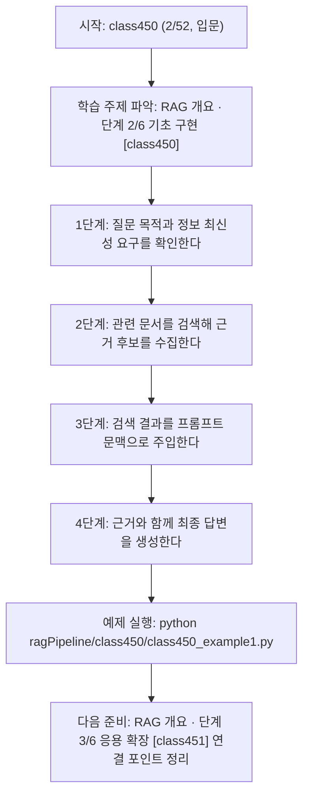
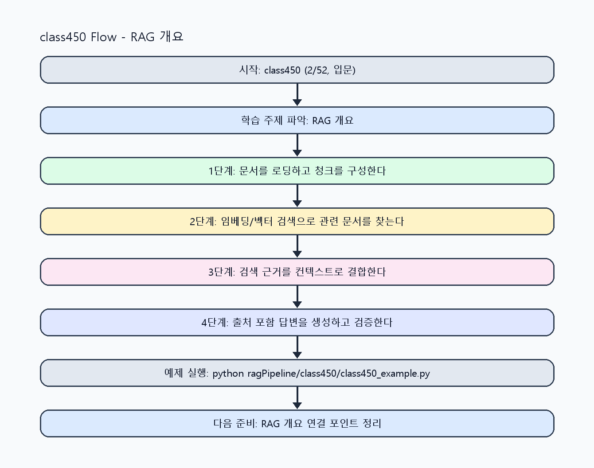

<!-- 이 파일은 www.edumgt.co.kr 의 에듀엠지티에 저작권이 있습니다 -->
# class450 자기주도 학습 가이드

## 1) 오늘의 학습 정보
- 교과목: **RAG(Retrieval-Augmented Generation)**
- 학습 주제: **RAG 개요 · 단계 2/6 기초 구현 [class450]**
- 세부 시퀀스: **2/52**
- 일정: **Day 57 / 2교시**
- 난이도: **입문**

### 교과목·학습주제 어휘 해설 (IT 강사 스타일)
#### 교과목 표현 분석: `RAG(Retrieval-Augmented Generation)`
- 문법 포인트: 핵심 개념 명사를 중심으로 한 명사구 구조입니다.
- 기술 포인트: 검색 근거를 결합해 신뢰도 높은 답변을 만드는 RAG 교과목입니다.
| 용어 | 문법/품사 | 한글·한자 | 영어 | 기술 설명 |
| --- | --- | --- | --- | --- |
| `RAG` | 약어명사 | RAG (한자 없음) | Retrieval-Augmented Generation | 검색 결과를 근거로 생성 품질과 신뢰도를 높이는 구조입니다. |
| `Retrieval-Augmented` | 복합 형용어 | Retrieval-Augmented (한자 없음) | retrieval-augmented | 검색 결과를 생성 과정에 보강한다는 RAG 핵심 속성입니다. |
| `Generation` | 명사(영어) | Generation (한자 없음) | generation | 모델이 새 출력 텍스트를 만들어내는 단계입니다. |

#### 학습주제 표현 분석: `RAG 개요 · 단계 2/6 기초 구현 [class450]`
- 문법 포인트: 핵심 개념 명사를 중심으로 한 명사구 구조입니다.
- 기술 포인트: 이번 차시는 `RAG 개요` 핵심 개념을 코드 구현, 결과 해석, 점검 기준으로 연결합니다.
| 용어 | 문법/품사 | 한글·한자 | 영어 | 기술 설명 |
| --- | --- | --- | --- | --- |
| `RAG` | 약어명사 | RAG (한자 없음) | Retrieval-Augmented Generation | 검색 결과를 근거로 생성 품질과 신뢰도를 높이는 구조입니다. |
| `필요성` | 명사(주제 핵심 용어) | 필요성 (한자 없음) | (topic-specific) | 이번 차시 맥락: `RAG 필요성`은 최신 정보/사내 정보/근거 기반 답변을 안정적으로 반영하기 위함입니다. 이를 기준으로 `필요성`를 코드와 결과 해석에 연결합니다. |
| `LLM` | 약어명사 | LLM (한자 없음) | Large Language Model | 대규모 텍스트로 사전학습된 생성형 언어 모델입니다. |
| `단독` | 명사(주제 핵심 용어) | 단독 (한자 없음) | (topic-specific) | 이번 차시 맥락: RAG가 왜 필요한지, LLM 단독 사용 한계와 검색+생성 결합 구조를 이해하는 시작 차시입니다. 이를 기준으로 `단독`를 코드와 결과 해석에 연결합니다. |
| `한계` | 명사(주제 핵심 용어) | 한계 (한자 없음) | (topic-specific) | 이번 차시 맥락: RAG가 왜 필요한지, LLM 단독 사용 한계와 검색+생성 결합 구조를 이해하는 시작 차시입니다. 이를 기준으로 `한계`를 코드와 결과 해석에 연결합니다. |
| `검색` | 명사 | 검색 (搜索) | retrieval/search | 질문과 유사한 문서를 찾는 단계로 RAG 품질을 좌우합니다. |

## 2) 이전에 배운 내용 (복습)
- 이전 차시: **class449 / RAG 개요 · 단계 1/6 입문 이해 [class449]** (Day 57 / 1교시)
- 복습 연결: 이전에 배운 **RAG 개요 · 단계 1/6 입문 이해 [class449]** 를 떠올리며, 오늘 **RAG 개요 · 단계 2/6 기초 구현 [class450]** 와 어떤 점이 이어지는지 비교해 보세요.

## 3) 주제를 아주 쉽게 이해하기
- 한 줄 설명: RAG가 왜 필요한지, LLM 단독 사용 한계와 검색+생성 결합 구조를 이해하는 시작 차시입니다.
- 왜 배우나요?: LLM 단독 답변은 최신 정보와 사내 문서 반영이 어렵고 근거 없는 환각이 발생할 수 있어 검색 결합이 필요합니다.

### 핵심 개념 3가지
1. `RAG 필요성`은 최신 정보/사내 정보/근거 기반 답변을 안정적으로 반영하기 위함입니다.
2. `LLM 단독 한계`는 학습 시점 이후 정보 공백, 출처 부재, 환각 위험으로 나타납니다.
3. `검색+생성 구조`는 검색기로 문서를 찾고 생성 모델에 문맥을 주입해 답변 품질을 높입니다.

### 비유로 이해하기
- 시험 문제를 풀 때 교과서 해당 페이지를 먼저 찾고 답을 쓰는 방식과 같아요.

## 4) 실습 환경 만들기 (항상 먼저)
아래 명령은 **처음 한 번** 준비해 두면 이후 학습이 쉬워집니다.

### Windows PowerShell
```powershell
cd C:\DevOps\Python-AI_Agent-Class
python -m venv .venv
.\.venv\Scripts\Activate.ps1
python -m pip install --upgrade pip
pip install -r requirements.txt
```

### Linux/macOS (bash)
```bash
cd /path/to/Python-AI_Agent-Class
python3 -m venv .venv
source .venv/bin/activate
python -m pip install --upgrade pip
pip install -r requirements.txt
```

## 5) 오늘의 예제 코드
- 예제 파일: `class450_example1.py`
- 실행 명령:
```bash
python ragPipeline/class450/class450_example1.py
```

### example1~example5 단계별 테스트 확장
1. example1: LLM 단독 답변과 RAG 답변을 비교한다.
2. example2: 최신 정보/사내 정보 질문으로 성능 차이를 확인한다.
3. example3: 근거 없는 답변(환각) 케이스를 재현해 점검한다.
4. example4: 검색+생성 결합 구조 개선 전후를 비교한다.
5. example5: RAG 적용 기준과 운영 체크리스트를 정리한다.

<!-- AUTO-GENERATED: TECH_STACK_FLOW START -->
### 기술 스택
- 언어: `Python 3`
- 실행: `CLI` (`python ragPipeline/class450/class450_example1.py`)
- 주요 문법: `질문 정규화`, `retriever 호출`, `컨텍스트 주입 프롬프트`, `출처 포함 응답`
- 학습 포커스: `RAG 개요 · 단계 2/6 기초 구현 [class450]`

### 실습 example1.py 동작 원리 (Mermaid Flowchart)


### Flow PNG 캡처

<!-- AUTO-GENERATED: TECH_STACK_FLOW END -->

### 예제 코드를 볼 때 집중할 포인트
1. LLM 단독과 RAG 결과 비교가 동일 조건에서 수행되는지 확인하기
2. 근거 없는 문장을 탐지/표시하는 규칙이 있는지 점검하기
3. 사내 문서 접근 범위와 보안 조건이 명시됐는지 확인하기

## 6) 퀴즈로 복습하기 (10문항)
- 퀴즈 파일: `class450_quiz.html`
- 브라우저에서 열기:
```bash
ragPipeline/class450/class450_quiz.html
```
- 버튼 설명:
1. `채점하기`: 현재 선택한 답으로 점수를 계산해요.
2. `다시풀기`: 선택을 모두 지우고 처음부터 다시 풀어요.

## 7) 혼자 실습 순서 (초등학생 버전)
1. 코드를 한 번 그대로 실행해요.
2. 숫자/문장 값을 1개 바꿔요.
3. 결과가 왜 바뀌었는지 한 줄로 적어요.
4. 함수를 1개 더 만들어 작은 기능을 추가해요.

### 실습 미션
1. 같은 질문을 LLM 단독 방식과 RAG 방식으로 각각 실행해 차이를 비교하세요.
2. 최신 정보 질문과 사내 정책 질문을 분리해 실패/성공 패턴을 기록하세요.
3. RAG 아키텍처(검색-주입-생성-출처반환)를 다이어그램으로 정리하세요.

## 8) 스스로 점검 체크리스트
- [ ] RAG가 필요한 이유를 LLM 단독 한계와 연결해 설명할 수 있다.
- [ ] 최신 정보/사내 정보 활용 문제를 사례로 설명할 수 있다.
- [ ] 검색+생성 결합 구조를 단계별로 설명할 수 있다.

## 9) 막히면 이렇게 해결해요
1. 에러 메시지 마지막 줄을 먼저 읽어요.
2. 함수 이름과 괄호 짝을 확인해요.
3. `print()`를 넣어 중간 값을 확인해요.
4. 그래도 안 되면 어제 성공한 코드와 한 줄씩 비교해요.

## 10) 학습 후 다음에 배울 내용
- 다음 차시: **class451 / RAG 개요 · 단계 3/6 응용 확장 [class451]** (Day 57 / 3교시)
- 미리보기: 다음 차시 전에 **RAG 개요 · 단계 2/6 기초 구현 [class450]** 핵심 코드 1개를 다시 실행해 두면 RAG 개요 · 단계 3/6 응용 확장 [class451] 학습이 더 쉬워집니다.

## 11) 다음 차시 연결
- 다음 차시에서는 문서 수집부터 답변 생성까지 RAG 전체 구조를 파이프라인으로 구현합니다.
- 오늘 코드를 복사하지 말고, 직접 다시 작성해 보세요.
