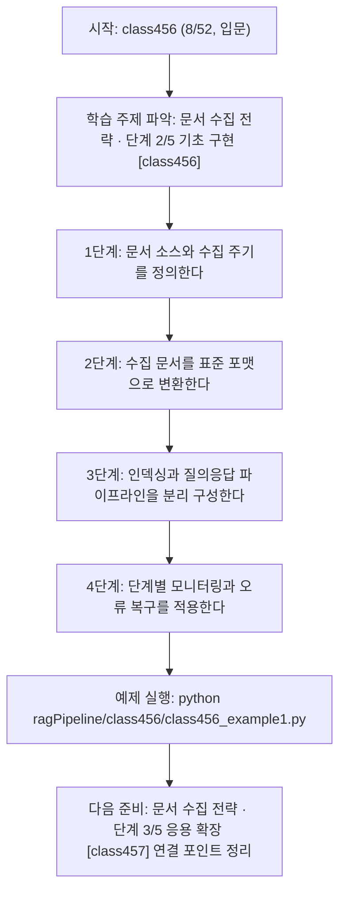
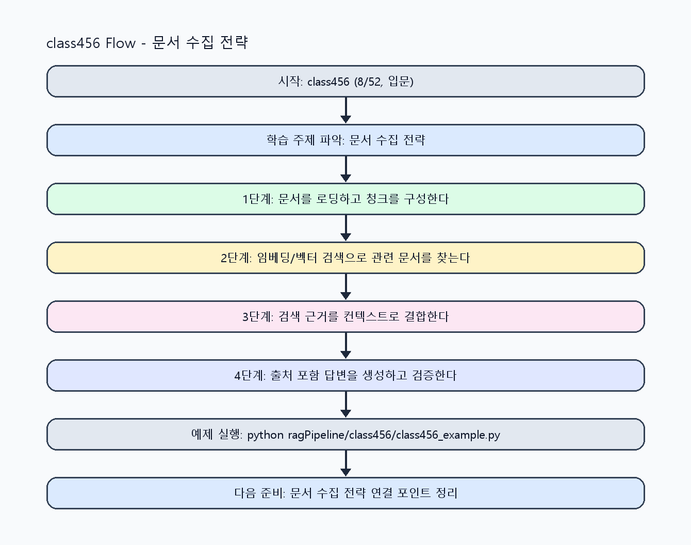

<!-- 이 파일은 www.edumgt.co.kr 의 에듀엠지티에 저작권이 있습니다 -->
# class456 자기주도 학습 가이드

## 1) 오늘의 학습 정보
- 교과목: **RAG(Retrieval-Augmented Generation)**
- 학습 주제: **문서 수집 전략 · 단계 2/5 기초 구현 [class456]**
- 세부 시퀀스: **8/52**
- 일정: **Day 57 / 8교시**
- 난이도: **입문**

### 교과목·학습주제 어휘 해설 (IT 강사 스타일)
#### 교과목 표현 분석: `RAG(Retrieval-Augmented Generation)`
- 문법 포인트: 핵심 개념 명사를 중심으로 한 명사구 구조입니다.
- 기술 포인트: 검색 근거를 결합해 신뢰도 높은 답변을 만드는 RAG 교과목입니다.
| 용어 | 문법/품사 | 한글·한자 | 영어 | 기술 설명 |
| --- | --- | --- | --- | --- |
| `RAG` | 약어명사 | RAG (한자 없음) | Retrieval-Augmented Generation | 검색 결과를 근거로 생성 품질과 신뢰도를 높이는 구조입니다. |
| `Retrieval-Augmented` | 복합 형용어 | Retrieval-Augmented (한자 없음) | retrieval-augmented | 검색 결과를 생성 과정에 보강한다는 RAG 핵심 속성입니다. |
| `Generation` | 명사(영어) | Generation (한자 없음) | generation | 모델이 새 출력 텍스트를 만들어내는 단계입니다. |

#### 학습주제 표현 분석: `문서 수집 전략 · 단계 2/5 기초 구현 [class456]`
- 문법 포인트: 핵심 개념 명사를 중심으로 한 명사구 구조입니다.
- 기술 포인트: 이번 차시는 `문서 수집 전략 · 단계 2/5 기초 구현 [class456]` 용어를 중심으로 문제 정의, 코드 구현, 결과 검증까지 연결합니다.
| 용어 | 문법/품사 | 한글·한자 | 영어 | 기술 설명 |
| --- | --- | --- | --- | --- |
| `문서` | 명사 | 문서 (文書) | document | RAG 검색과 근거 생성에 사용하는 텍스트 단위 데이터입니다. |
| `수집` | 명사(기술 개념어) | 수집 (한자 없음) | (context-specific) | 용어 `수집`: 이번 학습주제에서 정의해야 할 핵심 개념 용어입니다. |
| `전략` | 명사(기술 개념어) | 전략 (한자 없음) | (context-specific) | 용어 `전략`: 이번 학습주제에서 정의해야 할 핵심 개념 용어입니다. |
| `단계` | 명사(기술 개념어) | 단계 (한자 없음) | (context-specific) | 용어 `단계`: 이번 학습주제에서 정의해야 할 핵심 개념 용어입니다. |
| `기초` | 명사(기술 개념어) | 기초 (한자 없음) | (context-specific) | 용어 `기초`: 이번 학습주제에서 정의해야 할 핵심 개념 용어입니다. |
| `구현` | 명사 | 구현 (具現) | implementation | 설계를 실제 코드와 시스템 동작으로 구체화하는 과정입니다. |

## 2) 이전에 배운 내용 (복습)
- 이전 차시: **class455 / 문서 수집 전략 · 단계 1/5 입문 이해 [class455]** (Day 57 / 7교시)
- 복습 연결: 이전에 배운 **문서 수집 전략 · 단계 1/5 입문 이해 [class455]** 를 떠올리며, 오늘 **문서 수집 전략 · 단계 2/5 기초 구현 [class456]** 와 어떤 점이 이어지는지 비교해 보세요.

## 3) 주제를 아주 쉽게 이해하기
- 한 줄 설명: 문서 수집, 청크, 임베딩, 벡터 저장, 검색, 프롬프트 주입, 답변 생성으로 이어지는 전체 파이프라인을 다룹니다.
- 왜 배우나요?: RAG 품질은 모델 자체보다 데이터 파이프라인 설계 품질에 더 크게 좌우됩니다.

### 핵심 개념 3가지
1. `RAG 전체 구조`는 문서 수집 -> 문서 분할 -> 임베딩 -> 벡터 저장 -> 검색 -> 프롬프트 주입 -> 답변 생성 단계입니다.
2. `수집 전략`은 문서 최신성, 접근 권한, 메타데이터 일관성을 함께 관리해야 합니다.
3. `파이프라인 분리`는 수집/인덱싱/질의응답 단계를 분리해 장애 복구와 운영을 쉽게 만듭니다.

### 비유로 이해하기
- 시험 문제를 풀 때 교과서 해당 페이지를 먼저 찾고 답을 쓰는 방식과 같아요.

## 4) 실습 환경 만들기 (항상 먼저)
아래 명령은 **처음 한 번** 준비해 두면 이후 학습이 쉬워집니다.

### Windows PowerShell
```powershell
cd C:\DevOps\Python-AI_Agent-Class
python -m venv .venv
.\.venv\Scripts\Activate.ps1
python -m pip install --upgrade pip
pip install -r requirements.txt
```

### Linux/macOS (bash)
```bash
cd /path/to/Python-AI_Agent-Class
python3 -m venv .venv
source .venv/bin/activate
python -m pip install --upgrade pip
pip install -r requirements.txt
```

## 5) 오늘의 예제 코드
- 예제 파일: `class456_example1.py`
- 실행 명령:
```bash
python ragPipeline/class456/class456_example1.py
```

### example1~example5 단계별 테스트 확장
1. example1: 문서 수집→검색→생성 기본 파이프라인을 실행한다.
2. example2: 문서 소스별(위키/FAQ/PDF) 수집 규칙을 확장한다.
3. example3: 수집 누락/중복 케이스를 점검한다.
4. example4: 단계별 장애(수집/인덱싱/검색) 복구를 비교한다.
5. example5: 파이프라인 운영 정책(주기/권한/재시도)을 정리한다.

<!-- AUTO-GENERATED: TECH_STACK_FLOW START -->
### 기술 스택
- 언어: `Python 3`
- 실행: `CLI` (`python ragPipeline/class456/class456_example1.py`)
- 주요 문법: `loader 인터페이스`, `pipeline stage 함수`, `단계별 로그`, `실패 재시도`
- 학습 포커스: `문서 수집 전략 · 단계 2/5 기초 구현 [class456]`

### 실습 example1.py 동작 원리 (Mermaid Flowchart)


### Flow PNG 캡처

<!-- AUTO-GENERATED: TECH_STACK_FLOW END -->

### 예제 코드를 볼 때 집중할 포인트
1. 수집 단계에서 문서 중복/누락을 탐지하는지 확인하기
2. 단계 간 입력 스키마가 일관적인지 점검하기
3. 재색인 주기와 운영 비용 균형을 확인하기

## 6) 퀴즈로 복습하기 (10문항)
- 퀴즈 파일: `class456_quiz.html`
- 브라우저에서 열기:
```bash
ragPipeline/class456/class456_quiz.html
```
- 버튼 설명:
1. `채점하기`: 현재 선택한 답으로 점수를 계산해요.
2. `다시풀기`: 선택을 모두 지우고 처음부터 다시 풀어요.

## 7) 혼자 실습 순서 (초등학생 버전)
1. 코드를 한 번 그대로 실행해요.
2. 숫자/문장 값을 1개 바꿔요.
3. 결과가 왜 바뀌었는지 한 줄로 적어요.
4. 함수를 1개 더 만들어 작은 기능을 추가해요.

### 실습 미션
1. 문서 수집부터 답변 생성까지 단계별 입출력 스키마를 정의하세요.
2. 사내 위키/FAQ/PDF 같은 소스별 수집 규칙을 구분해 작성하세요.
3. 단계별 실패 지점(수집 실패, 임베딩 실패, 검색 실패)을 로그로 점검하세요.

## 8) 스스로 점검 체크리스트
- [ ] RAG 전체 파이프라인 7단계를 순서대로 설명할 수 있다.
- [ ] 문서 수집 정책(최신성/권한/메타데이터)을 정의했다.
- [ ] 파이프라인 단계별 장애 대응 포인트를 정리했다.

## 9) 막히면 이렇게 해결해요
1. 에러 메시지 마지막 줄을 먼저 읽어요.
2. 함수 이름과 괄호 짝을 확인해요.
3. `print()`를 넣어 중간 값을 확인해요.
4. 그래도 안 되면 어제 성공한 코드와 한 줄씩 비교해요.

## 10) 학습 후 다음에 배울 내용
- 다음 차시: **class457 / 문서 수집 전략 · 단계 3/5 응용 확장 [class457]** (Day 58 / 1교시)
- 미리보기: 다음 차시 전에 **문서 수집 전략 · 단계 2/5 기초 구현 [class456]** 핵심 코드 1개를 다시 실행해 두면 문서 수집 전략 · 단계 3/5 응용 확장 [class457] 학습이 더 쉬워집니다.

## 11) 다음 차시 연결
- 다음 차시에서는 문서 전처리와 chunking 전략으로 검색 품질 기반을 다집니다.
- 오늘 코드를 복사하지 말고, 직접 다시 작성해 보세요.
