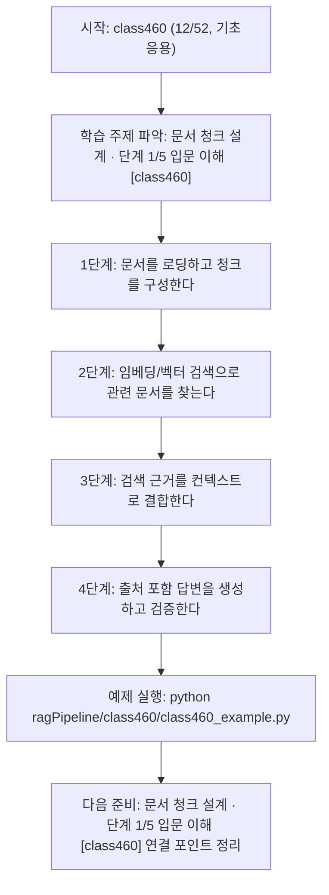
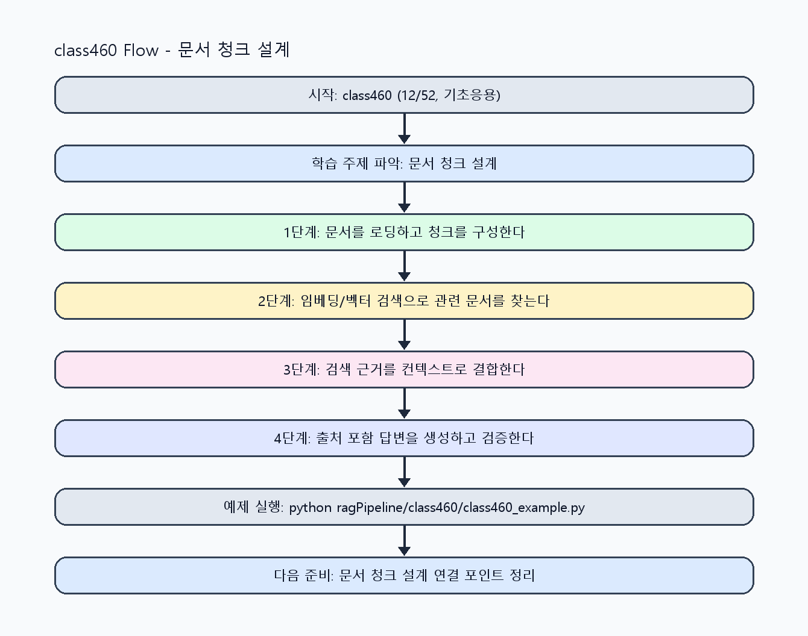

<!-- 이 파일은 www.edumgt.co.kr 의 에듀엠지티에 저작권이 있습니다 -->
# class460 자기주도 학습 가이드

## 1) 오늘의 학습 정보
- 교과목: **RAG(Retrieval-Augmented Generation)**
- 학습 주제: **문서 청크 설계 · 단계 1/5 입문 이해 [class460]**
- 학습 주제 진행: **문서 청크 설계 · 단계 1/5 입문 이해 [class460] (총 5시간 중 1시간차)**
- 세부 시퀀스: **12/52**
- 일정: **Day 58 / 4교시**
- 최종 목표: **Agent 폴더의 실제 시스템 구성요소를 구현·연동·운영할 수 있는 개발자 역량 확보**
- 난이도: **기초응용**

### 교과목·학습주제 어휘 해설 (IT 강사 스타일)
#### 교과목 표현 분석: `RAG(Retrieval-Augmented Generation)`
- 문법 포인트: 핵심 개념 명사를 중심으로 한 명사구 구조입니다.
- 기술 포인트: 검색 근거를 결합해 신뢰도 높은 답변을 만드는 RAG 교과목입니다.
| 용어 | 문법/품사 | 한글·한자 | 영어 | 기술 설명 |
| --- | --- | --- | --- | --- |
| `RAG` | 약어명사 | RAG (한자 없음) | Retrieval-Augmented Generation | 검색 결과를 근거로 생성 품질과 신뢰도를 높이는 구조입니다. |
| `Retrieval-Augmented` | 복합 형용어 | Retrieval-Augmented (한자 없음) | retrieval-augmented | 검색 결과를 생성 과정에 보강한다는 RAG 핵심 속성입니다. |
| `Generation` | 명사(영어) | Generation (한자 없음) | generation | 모델이 새 출력 텍스트를 만들어내는 단계입니다. |

#### 학습주제 표현 분석: `문서 청크 설계 · 단계 1/5 입문 이해 [class460]`
- 문법 포인트: 핵심 개념 명사를 중심으로 한 명사구 구조입니다.
- 기술 포인트: 이번 차시는 `문서 청크 설계 · 단계 1/5 입문 이해 [class460]`를 중심으로 같은 주제 내에서 단계적으로 고도화된 구현을 수행합니다.
| 용어 | 문법/품사 | 한글·한자 | 영어 | 기술 설명 |
| --- | --- | --- | --- | --- |
| `문서` | 명사 | 문서 (文書) | document | RAG 검색과 근거 생성에 사용하는 텍스트 단위 데이터입니다. |
| `청크` | 명사(기술 개념어) | 청크 (한자 없음) | (context-specific) | 용어 `청크`: 이번 학습주제에서 정의해야 할 핵심 개념 용어입니다. |
| `설계` | 명사(기술 개념어) | 설계 (한자 없음) | (context-specific) | 용어 `설계`: 이번 학습주제에서 정의해야 할 핵심 개념 용어입니다. |

## 2) 이전에 배운 내용 (복습)
- 이전 차시: **class459 / 문서 수집 전략 · 단계 5/5 운영 최적화 [class459]** (Day 58 / 3교시)
- 복습 연결: 이전에 배운 **문서 수집 전략 · 단계 5/5 운영 최적화 [class459]** 를 떠올리며, 오늘 **문서 청크 설계 · 핵심 구현 캐시 전략 적용 (차시 12) [class460]** 와 어떤 점이 이어지는지 비교해 보세요.

## 3) 주제를 아주 쉽게 이해하기
- 한 줄 설명: 문서 청크 설계를 단계 1/5(입문 이해) 수준으로 고도화해 구현하는 차시입니다.
- 왜 배우나요?: 동일 주제를 반복하더라도 단계별 난이도를 높여 실무 수준의 문제 해결력을 만들기 위해서입니다.

### 핵심 개념 3가지
1. `문서 청크 설계`의 핵심 입력/출력 구조를 단계 1/5 기준으로 명확히 정의합니다.
2. `입문 이해` 수준에서 필요한 구현 패턴(검증, 예외, 로깅, 성능)을 코드에 반영합니다.
3. 이전 단계 결과를 재사용해 다음 단계로 확장 가능한 구조로 리팩터링합니다.

### 비유로 이해하기
- 기초 공정에서 시작해 품질검사와 운영튜닝까지 단계적으로 완성도를 올리는 제조 라인과 같습니다.
## 4) 실습 환경 만들기 (항상 먼저)
아래 명령은 **처음 한 번** 준비해 두면 이후 학습이 쉬워집니다.

### Windows PowerShell
```powershell
cd C:\DevOps\Python-AI_Agent-Class
python -m venv .venv
.\.venv\Scripts\Activate.ps1
python -m pip install --upgrade pip
pip install -r requirements.txt
```

### Linux/macOS (bash)
```bash
cd /path/to/Python-AI_Agent-Class
python3 -m venv .venv
source .venv/bin/activate
python -m pip install --upgrade pip
pip install -r requirements.txt
```

## 5) 오늘의 예제 코드
- 예제 파일: `class460_example.py`
- 실행 명령:
```bash
python ragPipeline/class460/class460_example.py
```


<!-- AUTO-GENERATED: OS_COMMANDS START -->
## 5-1) 운영체제별 실행 명령 예시
### PowerShell (Windows)
```powershell
cd C:\DevOps\Python-AI_Agent-Class
python .\ragPipeline\class460\class460.py
python .\ragPipeline\class460\class460_example.py
python .\ragPipeline\class460\class460_assignment.py
start .\ragPipeline\class460\class460_quiz.html
```

### WSL Ubuntu (bash)
```bash
cd /mnt/c/DevOps/Python-AI_Agent-Class
python3 ragPipeline/class460/class460.py
python3 ragPipeline/class460/class460_example.py
python3 ragPipeline/class460/class460_assignment.py
explorer.exe "$(wslpath -w 'ragPipeline/class460/class460_quiz.html')"
```

### run_class/run_day 스크립트 연동 (WSL bash)
```bash
./run_class.sh class460
./run_day.sh 58 launcher
```
<!-- AUTO-GENERATED: OS_COMMANDS END -->

<!-- AUTO-GENERATED: TECH_STACK_FLOW START -->
### 기술 스택
- 언어: `Python 3`
- 실행: `CLI` (`python ragPipeline/class460/class460_example.py`)
- 주요 문법: `검색 함수`, `유사도 계산`, `근거 결합`, `출력(print)`
- 학습 포커스: `문서 청크 설계 · 단계 1/5 입문 이해 [class460]`

### 실습 example.py 동작 원리 (Mermaid Flowchart)


### Flow PNG 캡처

<!-- AUTO-GENERATED: TECH_STACK_FLOW END -->

### 예제 코드를 볼 때 집중할 포인트
1. 입력이 무엇인지 먼저 찾기
2. 처리 규칙(함수/조건/반복) 확인하기
3. 출력 결과가 목표와 맞는지 점검하기

## 6) 퀴즈로 복습하기 (5문항)
- 퀴즈 파일: `class460_quiz.html`
- 브라우저에서 열기:
```bash
ragPipeline/class460/class460_quiz.html
```
- 버튼 설명:
1. `채점하기`: 현재 선택한 답으로 점수를 계산해요.
2. `다시풀기`: 선택을 모두 지우고 처음부터 다시 풀어요.

## 7) 혼자 실습 순서 (초등학생 버전)
1. 코드를 한 번 그대로 실행해요.
2. 숫자/문장 값을 1개 바꿔요.
3. 결과가 왜 바뀌었는지 한 줄로 적어요.
4. 함수를 1개 더 만들어 작은 기능을 추가해요.

### 실습 미션
1. `문서 청크 설계` 단계 1/5 목표 기능을 코드로 구현하고 실행 로그를 남기세요.
2. `입문 이해` 관점에서 실패 케이스 1개 이상을 재현하고 대응 코드를 추가하세요.
3. 이전 단계 코드와 비교해 변경점(입력/처리/출력)을 3줄로 정리하세요.

## 8) 스스로 점검 체크리스트
- [ ] 질문과 문서의 연결 기준을 설명할 수 있다.
- [ ] 검색 결과와 최종 답변을 구분해서 출력했다.
- [ ] 근거(출처)를 답변에 포함했다.

## 9) 막히면 이렇게 해결해요
1. 에러 메시지 마지막 줄을 먼저 읽어요.
2. 함수 이름과 괄호 짝을 확인해요.
3. `print()`를 넣어 중간 값을 확인해요.
4. 그래도 안 되면 어제 성공한 코드와 한 줄씩 비교해요.

## 10) 학습 후 다음에 배울 내용
- 다음 차시: **class461 / 문서 청크 설계 · 단계 2/5 기초 구현 [class461]** (Day 58 / 5교시)
- 미리보기: 다음 차시 전에 **문서 청크 설계 · 단계 1/5 입문 이해 [class460]** 핵심 코드 1개를 다시 실행해 두면 문서 청크 설계 · 단계 2/5 기초 구현 [class461] 학습이 더 쉬워집니다.

## 11) 다음 차시 연결
- 다음 차시에서는 검색 품질을 높이는 인덱싱 전략을 배워요.
- 오늘 코드를 복사하지 말고, 직접 다시 작성해 보세요.
