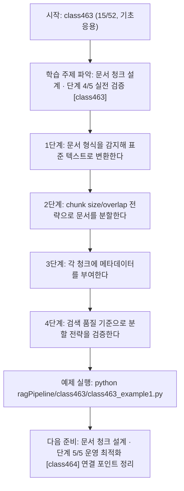
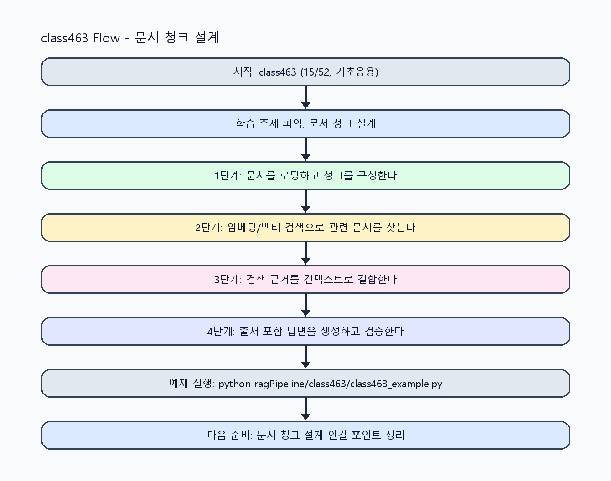

<!-- 이 파일은 www.edumgt.co.kr 의 에듀엠지티에 저작권이 있습니다 -->
# class463 자기주도 학습 가이드

## 1) 오늘의 학습 정보
- 교과목: **RAG(Retrieval-Augmented Generation)**
- 학습 주제: **문서 청크 설계 · 단계 4/5 실전 검증 [class463]**
- 세부 시퀀스: **15/52**
- 일정: **Day 58 / 7교시**
- 난이도: **기초응용**

### 교과목·학습주제 어휘 해설 (IT 강사 스타일)
#### 교과목 표현 분석: `RAG(Retrieval-Augmented Generation)`
- 문법 포인트: 핵심 개념 명사를 중심으로 한 명사구 구조입니다.
- 기술 포인트: 검색 근거를 결합해 신뢰도 높은 답변을 만드는 RAG 교과목입니다.
| 용어 | 문법/품사 | 한글·한자 | 영어 | 기술 설명 |
| --- | --- | --- | --- | --- |
| `RAG` | 약어명사 | RAG (한자 없음) | Retrieval-Augmented Generation | 검색 결과를 근거로 생성 품질과 신뢰도를 높이는 구조입니다. |
| `Retrieval-Augmented` | 복합 형용어 | Retrieval-Augmented (한자 없음) | retrieval-augmented | 검색 결과를 생성 과정에 보강한다는 RAG 핵심 속성입니다. |
| `Generation` | 명사(영어) | Generation (한자 없음) | generation | 모델이 새 출력 텍스트를 만들어내는 단계입니다. |

#### 학습주제 표현 분석: `문서 청크 설계 · 단계 4/5 실전 검증 [class463]`
- 문법 포인트: 핵심 개념 명사를 중심으로 한 명사구 구조입니다.
- 기술 포인트: 이번 차시는 `문서 청크 설계` 핵심 개념을 코드 구현, 결과 해석, 점검 기준으로 연결합니다.
| 용어 | 문법/품사 | 한글·한자 | 영어 | 기술 설명 |
| --- | --- | --- | --- | --- |
| `문서` | 명사 | 문서 (文書) | document | RAG 검색과 근거 생성에 사용하는 텍스트 단위 데이터입니다. |
| `청크` | 명사(외래어) | 청크 (한자 없음) | chunk | 긴 문서를 검색/생성에 맞게 분할한 단위로, 크기와 겹침이 검색 정확도에 직접 영향합니다. |
| `설계` | 명사 | 설계 (設計) | design | 요구사항을 만족하도록 데이터 흐름, 함수/모듈 경계, 평가 기준을 구조화하는 작업입니다. |
| `전처리` | 명사 | 전처리 (前處理) | preprocessing | 원시 데이터를 모델이 다루기 쉬운 형태로 정리하는 단계입니다. |
| `chunk` | 영문 기술명/약어 | chunk (한자 없음) | chunk | 이번 차시 맥락: PDF/TXT/HTML/CSV 문서를 처리하고 chunk 크기/overlap/메타데이터 설계를 통해 검색 정확도를 높이는 차시입니다. 이를 기준으로 `chunk`를 코드와 결과 해석에 연결합니다. |
| `크기` | 명사(주제 핵심 용어) | 크기 (한자 없음) | (topic-specific) | 이번 차시 맥락: PDF/TXT/HTML/CSV 문서를 처리하고 chunk 크기/overlap/메타데이터 설계를 통해 검색 정확도를 높이는 차시입니다. 이를 기준으로 `크기`를 코드와 결과 해석에 연결합니다. |

## 2) 이전에 배운 내용 (복습)
- 이전 차시: **class462 / 문서 청크 설계 · 단계 3/5 응용 확장 [class462]** (Day 58 / 6교시)
- 복습 연결: 이전에 배운 **문서 청크 설계 · 단계 3/5 응용 확장 [class462]** 를 떠올리며, 오늘 **문서 청크 설계 · 단계 4/5 실전 검증 [class463]** 와 어떤 점이 이어지는지 비교해 보세요.

## 3) 주제를 아주 쉽게 이해하기
- 한 줄 설명: PDF/TXT/HTML/CSV 문서를 처리하고 chunk 크기/overlap/메타데이터 설계를 통해 검색 정확도를 높이는 차시입니다.
- 왜 배우나요?: 문서 구조를 보존하지 않고 무작위로 분할하면 검색 적중률과 답변 근거성이 크게 떨어집니다.

### 핵심 개념 3가지
1. `문서 전처리`는 PDF, TXT, HTML, CSV 형식을 공통 텍스트+메타데이터 구조로 정규화하는 작업입니다.
2. `chunk 크기/overlap`은 검색 정밀도와 문맥 보존 사이의 균형을 결정합니다.
3. `메타데이터 관리`(문서ID, 페이지, 섹션, 작성일)는 source 반환과 품질 평가에 필수입니다.

### 비유로 이해하기
- 시험 문제를 풀 때 교과서 해당 페이지를 먼저 찾고 답을 쓰는 방식과 같아요.

## 4) 실습 환경 만들기 (항상 먼저)
아래 명령은 **처음 한 번** 준비해 두면 이후 학습이 쉬워집니다.

### Windows PowerShell
```powershell
cd C:\DevOps\Python-AI_Agent-Class
python -m venv .venv
.\.venv\Scripts\Activate.ps1
python -m pip install --upgrade pip
pip install -r requirements.txt
```

### Linux/macOS (bash)
```bash
cd /path/to/Python-AI_Agent-Class
python3 -m venv .venv
source .venv/bin/activate
python -m pip install --upgrade pip
pip install -r requirements.txt
```

## 5) 오늘의 예제 코드
- 예제 파일: `class463_example1.py`
- 실행 명령:
```bash
python ragPipeline/class463/class463_example1.py
```

### example1~example5 단계별 테스트 확장
1. example1: PDF/TXT/HTML/CSV 문서를 청크로 분할한다.
2. example2: chunk size/overlap 조합별 검색 품질을 비교한다.
3. example3: 메타데이터 누락/오류 케이스를 점검한다.
4. example4: 문서 구조 보존 전략 전후를 비교한다.
5. example5: 청크 설계 운영 기준을 문서화한다.

<!-- AUTO-GENERATED: TECH_STACK_FLOW START -->
### 기술 스택
- 언어: `Python 3`
- 실행: `CLI` (`python ragPipeline/class463/class463_example1.py`)
- 주요 문법: `문서 로더`, `chunk splitter`, `overlap 설정`, `메타데이터 dict`
- 학습 포커스: `문서 청크 설계 · 단계 4/5 실전 검증 [class463]`

### 실습 example1.py 동작 원리 (Mermaid Flowchart)


### Flow PNG 캡처

<!-- AUTO-GENERATED: TECH_STACK_FLOW END -->

### 예제 코드를 볼 때 집중할 포인트
1. 문장/문단 경계가 과도하게 깨지지 않는지 확인하기
2. 메타데이터(출처/페이지/버전) 누락이 없는지 점검하기
3. 분할 전략 변경 시 품질 지표 재측정을 수행하는지 확인하기

## 6) 퀴즈로 복습하기 (10문항)
- 퀴즈 파일: `class463_quiz.html`
- 브라우저에서 열기:
```bash
ragPipeline/class463/class463_quiz.html
```
- 버튼 설명:
1. `채점하기`: 현재 선택한 답으로 점수를 계산해요.
2. `다시풀기`: 선택을 모두 지우고 처음부터 다시 풀어요.

## 7) 혼자 실습 순서 (초등학생 버전)
1. 코드를 한 번 그대로 실행해요.
2. 숫자/문장 값을 1개 바꿔요.
3. 결과가 왜 바뀌었는지 한 줄로 적어요.
4. 함수를 1개 더 만들어 작은 기능을 추가해요.

### 실습 미션
1. 형식별 문서(PDF/TXT/HTML/CSV)를 같은 스키마로 변환해 보세요.
2. chunk size와 overlap 조합을 바꿔 검색 품질 변화를 비교하세요.
3. 메타데이터 누락/오류가 source 반환에 미치는 영향을 점검하세요.

## 8) 스스로 점검 체크리스트
- [ ] 문서 형식별 전처리 규칙을 구현했다.
- [ ] chunk size/overlap별 검색 품질 비교 결과를 기록했다.
- [ ] 메타데이터를 활용해 출처 추적이 가능하도록 구성했다.

## 9) 막히면 이렇게 해결해요
1. 에러 메시지 마지막 줄을 먼저 읽어요.
2. 함수 이름과 괄호 짝을 확인해요.
3. `print()`를 넣어 중간 값을 확인해요.
4. 그래도 안 되면 어제 성공한 코드와 한 줄씩 비교해요.

## 10) 학습 후 다음에 배울 내용
- 다음 차시: **class464 / 문서 청크 설계 · 단계 5/5 운영 최적화 [class464]** (Day 58 / 8교시)
- 미리보기: 다음 차시 전에 **문서 청크 설계 · 단계 4/5 실전 검증 [class463]** 핵심 코드 1개를 다시 실행해 두면 문서 청크 설계 · 단계 5/5 운영 최적화 [class464] 학습이 더 쉬워집니다.

## 11) 다음 차시 연결
- 다음 차시에서는 임베딩 개념과 코사인 유사도를 기반으로 의미 검색을 구현합니다.
- 오늘 코드를 복사하지 말고, 직접 다시 작성해 보세요.
