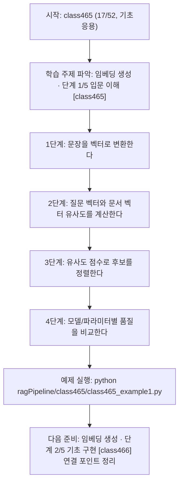
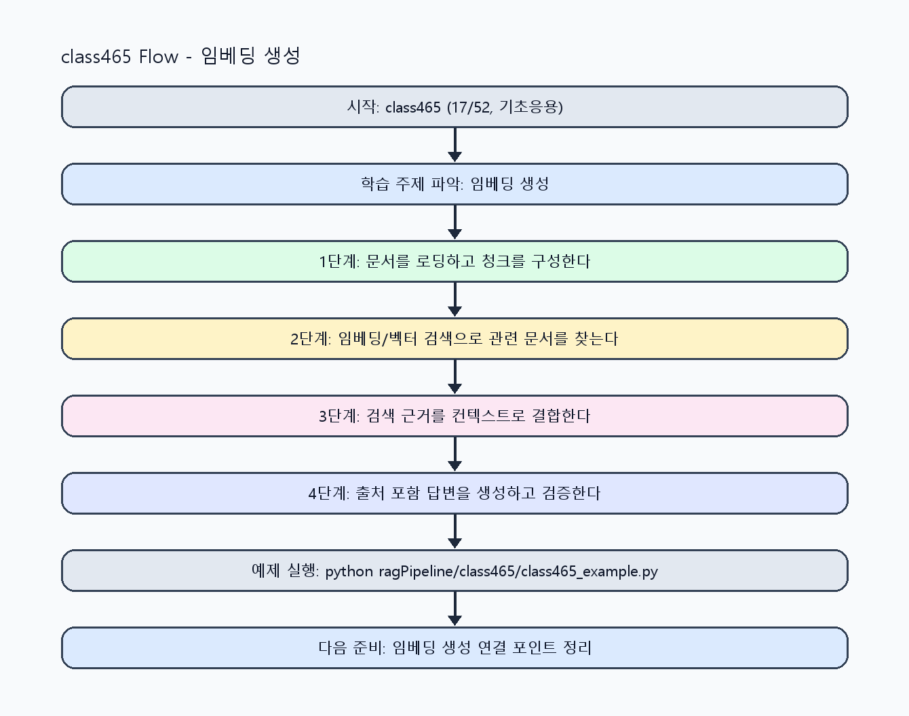

<!-- 이 파일은 www.edumgt.co.kr 의 에듀엠지티에 저작권이 있습니다 -->
# class465 자기주도 학습 가이드

## 1) 오늘의 학습 정보
- 교과목: **RAG(Retrieval-Augmented Generation)**
- 학습 주제: **임베딩 생성 · 단계 1/5 입문 이해 [class465]**
- 세부 시퀀스: **17/52**
- 일정: **Day 59 / 1교시**
- 난이도: **기초응용**

### 교과목·학습주제 어휘 해설 (IT 강사 스타일)
#### 교과목 표현 분석: `RAG(Retrieval-Augmented Generation)`
- 문법 포인트: 핵심 개념 명사를 중심으로 한 명사구 구조입니다.
- 기술 포인트: 검색 근거를 결합해 신뢰도 높은 답변을 만드는 RAG 교과목입니다.
| 용어 | 문법/품사 | 한글·한자 | 영어 | 기술 설명 |
| --- | --- | --- | --- | --- |
| `RAG` | 약어명사 | RAG (한자 없음) | Retrieval-Augmented Generation | 검색 결과를 근거로 생성 품질과 신뢰도를 높이는 구조입니다. |
| `Retrieval-Augmented` | 복합 형용어 | Retrieval-Augmented (한자 없음) | retrieval-augmented | 검색 결과를 생성 과정에 보강한다는 RAG 핵심 속성입니다. |
| `Generation` | 명사(영어) | Generation (한자 없음) | generation | 모델이 새 출력 텍스트를 만들어내는 단계입니다. |

#### 학습주제 표현 분석: `임베딩 생성 · 단계 1/5 입문 이해 [class465]`
- 문법 포인트: 핵심 개념 명사를 중심으로 한 명사구 구조입니다.
- 기술 포인트: 이번 차시는 `임베딩 생성 · 단계 1/5 입문 이해 [class465]` 용어를 중심으로 문제 정의, 코드 구현, 결과 검증까지 연결합니다.
| 용어 | 문법/품사 | 한글·한자 | 영어 | 기술 설명 |
| --- | --- | --- | --- | --- |
| `임베딩` | 명사(외래어) | 임베딩 (한자 없음) | embedding | 텍스트/신호를 벡터 공간에 사상해 의미 유사도를 계산하는 표현입니다. |
| `생성` | 명사 | 생성 (生成) | generation | 모델이 새 텍스트/응답/콘텐츠를 출력하는 과정입니다. |
| `단계` | 명사(기술 개념어) | 단계 (한자 없음) | (context-specific) | 용어 `단계`: 이번 학습주제에서 정의해야 할 핵심 개념 용어입니다. |
| `입문` | 명사(기술 개념어) | 입문 (한자 없음) | (context-specific) | 용어 `입문`: 이번 학습주제에서 정의해야 할 핵심 개념 용어입니다. |
| `이해` | 명사(기술 개념어) | 이해 (한자 없음) | (context-specific) | 용어 `이해`: 이번 학습주제에서 정의해야 할 핵심 개념 용어입니다. |
| `class465` | 영문 기술명/약어 | class465 (한자 없음) | class465 | 용어 `class465`: 이번 차시에서 쓰이는 핵심 기술 용어입니다. |

## 2) 이전에 배운 내용 (복습)
- 이전 차시: **class464 / 문서 청크 설계 · 단계 5/5 운영 최적화 [class464]** (Day 58 / 8교시)
- 복습 연결: 이전에 배운 **문서 청크 설계 · 단계 5/5 운영 최적화 [class464]** 를 떠올리며, 오늘 **임베딩 생성 · 단계 1/5 입문 이해 [class465]** 와 어떤 점이 이어지는지 비교해 보세요.

## 3) 주제를 아주 쉽게 이해하기
- 한 줄 설명: 임베딩 개념, 문장 의미 벡터, cosine similarity, 임베딩 모델 선택 기준을 학습하는 차시입니다.
- 왜 배우나요?: 검색 정확도는 키워드 매칭보다 의미 벡터 품질에 크게 좌우되므로 임베딩 이해가 핵심입니다.

### 핵심 개념 3가지
1. `임베딩`은 텍스트 의미를 고정 길이 벡터로 변환해 유사도 계산을 가능하게 합니다.
2. `코사인 유사도`는 벡터 방향 유사성을 측정해 의미 기반 검색 순위를 만듭니다.
3. `모델 선택 기준`은 언어 지원, 도메인 적합성, 비용, 지연시간, 차원 수를 함께 봐야 합니다.

### 비유로 이해하기
- 시험 문제를 풀 때 교과서 해당 페이지를 먼저 찾고 답을 쓰는 방식과 같아요.

## 4) 실습 환경 만들기 (항상 먼저)
아래 명령은 **처음 한 번** 준비해 두면 이후 학습이 쉬워집니다.

### Windows PowerShell
```powershell
cd C:\DevOps\Python-AI_Agent-Class
python -m venv .venv
.\.venv\Scripts\Activate.ps1
python -m pip install --upgrade pip
pip install -r requirements.txt
```

### Linux/macOS (bash)
```bash
cd /path/to/Python-AI_Agent-Class
python3 -m venv .venv
source .venv/bin/activate
python -m pip install --upgrade pip
pip install -r requirements.txt
```

## 5) 오늘의 예제 코드
- 예제 파일: `class465_example1.py`
- 실행 명령:
```bash
python ragPipeline/class465/class465_example1.py
```

### example1~example5 단계별 테스트 확장
1. example1: 문장 임베딩과 cosine similarity를 계산한다.
2. example2: 임베딩 모델 선택 기준(품질/비용/지연)을 비교한다.
3. example3: 임베딩 품질 저하 케이스를 재현해 점검한다.
4. example4: 모델/차원 변경 전후 검색 성능을 비교한다.
5. example5: 임베딩 운영 점검 기준을 정리한다.

<!-- AUTO-GENERATED: TECH_STACK_FLOW START -->
### 기술 스택
- 언어: `Python 3`
- 실행: `CLI` (`python ragPipeline/class465/class465_example1.py`)
- 주요 문법: `embedding 함수`, `cosine similarity`, `벡터 정규화`, `모델 선택표`
- 학습 포커스: `임베딩 생성 · 단계 1/5 입문 이해 [class465]`

### 실습 example1.py 동작 원리 (Mermaid Flowchart)


### Flow PNG 캡처

<!-- AUTO-GENERATED: TECH_STACK_FLOW END -->

### 예제 코드를 볼 때 집중할 포인트
1. 임베딩 전처리(소문자화/기호 처리)가 일관적인지 확인하기
2. 코사인 계산에서 0벡터 예외 처리가 있는지 점검하기
3. 모델 변경 시 품질과 비용을 함께 비교하는지 확인하기

## 6) 퀴즈로 복습하기 (10문항)
- 퀴즈 파일: `class465_quiz.html`
- 브라우저에서 열기:
```bash
ragPipeline/class465/class465_quiz.html
```
- 버튼 설명:
1. `채점하기`: 현재 선택한 답으로 점수를 계산해요.
2. `다시풀기`: 선택을 모두 지우고 처음부터 다시 풀어요.

## 7) 혼자 실습 순서 (초등학생 버전)
1. 코드를 한 번 그대로 실행해요.
2. 숫자/문장 값을 1개 바꿔요.
3. 결과가 왜 바뀌었는지 한 줄로 적어요.
4. 함수를 1개 더 만들어 작은 기능을 추가해요.

### 실습 미션
1. 문장 임베딩을 생성하고 코사인 유사도로 상위 유사 문장을 찾으세요.
2. 두 개 이상 임베딩 모델을 가정해 검색 결과 차이를 비교하세요.
3. 차원 수/정규화 설정이 검색 점수에 주는 영향을 점검하세요.

## 8) 스스로 점검 체크리스트
- [ ] 임베딩과 키워드 검색의 차이를 설명할 수 있다.
- [ ] 코사인 유사도 계산 흐름을 구현했다.
- [ ] 모델 선택 기준(품질/비용/지연)을 정리했다.

## 9) 막히면 이렇게 해결해요
1. 에러 메시지 마지막 줄을 먼저 읽어요.
2. 함수 이름과 괄호 짝을 확인해요.
3. `print()`를 넣어 중간 값을 확인해요.
4. 그래도 안 되면 어제 성공한 코드와 한 줄씩 비교해요.

## 10) 학습 후 다음에 배울 내용
- 다음 차시: **class466 / 임베딩 생성 · 단계 2/5 기초 구현 [class466]** (Day 59 / 2교시)
- 미리보기: 다음 차시 전에 **임베딩 생성 · 단계 1/5 입문 이해 [class465]** 핵심 코드 1개를 다시 실행해 두면 임베딩 생성 · 단계 2/5 기초 구현 [class466] 학습이 더 쉬워집니다.

## 11) 다음 차시 연결
- 다음 차시에서는 벡터DB 인덱싱과 Top-K 검색, reranking 기초를 연결합니다.
- 오늘 코드를 복사하지 말고, 직접 다시 작성해 보세요.
