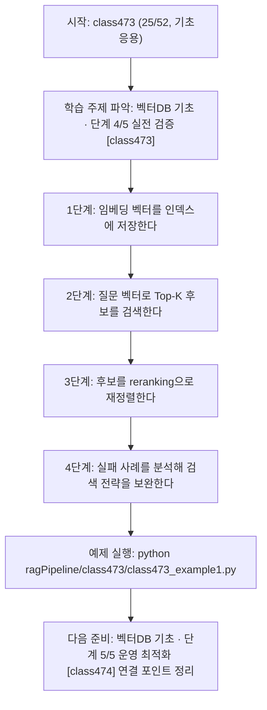
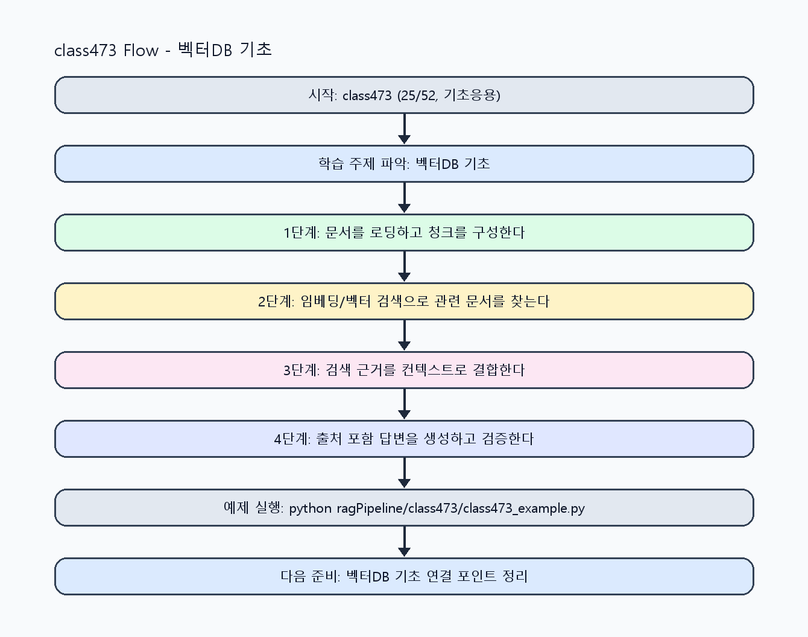

<!-- 이 파일은 www.edumgt.co.kr 의 에듀엠지티에 저작권이 있습니다 -->
# class473 자기주도 학습 가이드

## 1) 오늘의 학습 정보
- 교과목: **RAG(Retrieval-Augmented Generation)**
- 학습 주제: **벡터DB 기초 · 단계 4/5 실전 검증 [class473]**
- 세부 시퀀스: **25/52**
- 일정: **Day 60 / 1교시**
- 난이도: **기초응용**

### 교과목·학습주제 어휘 해설 (IT 강사 스타일)
#### 교과목 표현 분석: `RAG(Retrieval-Augmented Generation)`
- 문법 포인트: 핵심 개념 명사를 중심으로 한 명사구 구조입니다.
- 기술 포인트: 검색 근거를 결합해 신뢰도 높은 답변을 만드는 RAG 교과목입니다.
| 용어 | 문법/품사 | 한글·한자 | 영어 | 기술 설명 |
| --- | --- | --- | --- | --- |
| `RAG` | 약어명사 | RAG (한자 없음) | Retrieval-Augmented Generation | 검색 결과를 근거로 생성 품질과 신뢰도를 높이는 구조입니다. |
| `Retrieval-Augmented` | 복합 형용어 | Retrieval-Augmented (한자 없음) | retrieval-augmented | 검색 결과를 생성 과정에 보강한다는 RAG 핵심 속성입니다. |
| `Generation` | 명사(영어) | Generation (한자 없음) | generation | 모델이 새 출력 텍스트를 만들어내는 단계입니다. |

#### 학습주제 표현 분석: `벡터DB 기초 · 단계 4/5 실전 검증 [class473]`
- 문법 포인트: 핵심 개념 명사를 중심으로 한 명사구 구조입니다.
- 기술 포인트: 이번 차시는 `벡터DB 기초` 핵심 개념을 코드 구현, 결과 해석, 점검 기준으로 연결합니다.
| 용어 | 문법/품사 | 한글·한자 | 영어 | 기술 설명 |
| --- | --- | --- | --- | --- |
| `벡터` | 명사 | 벡터 (vector) | vector | 여러 수치 차원으로 표현된 값 묶음으로, 유사도 계산과 검색 인덱싱의 기본 단위입니다. |
| `DB` | 영문 기술명/약어 | DB (한자 없음) | DB | 이번 차시 맥락: 임베딩만으로는 운영 검색을 할 수 없고, 벡터DB 인덱싱과 검색 전략이 실제 성능을 좌우합니다. 이를 기준으로 `DB`를 코드와 결과 해석에 연결합니다. |
| `벡터DB` | 복합명사 | 벡터DB (한자 없음) | vector database | 고차원 벡터 검색을 최적화한 데이터베이스입니다. |
| `인덱싱` | 명사(주제 핵심 용어) | 인덱싱 (한자 없음) | (topic-specific) | 이번 차시 맥락: Chroma/FAISS/Qdrant 개요와 인덱싱, Top-K 검색, reranking 개념, 검색 실패 분석을 다루는 차시입니다. 이를 기준으로 `인덱싱`를 코드와 결과 해석에 연결합니다. |
| `Top-K` | 영문 기술명/약어 | Top-K (한자 없음) | Top-K | 이번 차시 맥락: Chroma/FAISS/Qdrant 개요와 인덱싱, Top-K 검색, reranking 개념, 검색 실패 분석을 다루는 차시입니다. 이를 기준으로 `Top-K`를 코드와 결과 해석에 연결합니다. |
| `검색` | 명사 | 검색 (搜索) | retrieval/search | 질문과 유사한 문서를 찾는 단계로 RAG 품질을 좌우합니다. |

## 2) 이전에 배운 내용 (복습)
- 이전 차시: **class472 / 벡터DB 기초 · 단계 3/5 응용 확장 [class472]** (Day 59 / 8교시)
- 복습 연결: 이전에 배운 **벡터DB 기초 · 단계 3/5 응용 확장 [class472]** 를 떠올리며, 오늘 **벡터DB 기초 · 단계 4/5 실전 검증 [class473]** 와 어떤 점이 이어지는지 비교해 보세요.

## 3) 주제를 아주 쉽게 이해하기
- 한 줄 설명: Chroma/FAISS/Qdrant 개요와 인덱싱, Top-K 검색, reranking 개념, 검색 실패 분석을 다루는 차시입니다.
- 왜 배우나요?: 임베딩만으로는 운영 검색을 할 수 없고, 벡터DB 인덱싱과 검색 전략이 실제 성능을 좌우합니다.

### 핵심 개념 3가지
1. `벡터DB`는 Chroma(개발 편의), FAISS(로컬 고성능), Qdrant(서비스형 운영)에 강점이 다릅니다.
2. `인덱싱 + Top-K 검색`은 질의 응답 지연과 검색 정확도 균형을 맞추는 기본 구조입니다.
3. `reranking`은 1차 검색 후보를 재정렬해 정답률을 높이고 실패 케이스를 줄이는 방법입니다.

### 비유로 이해하기
- 시험 문제를 풀 때 교과서 해당 페이지를 먼저 찾고 답을 쓰는 방식과 같아요.

## 4) 실습 환경 만들기 (항상 먼저)
아래 명령은 **처음 한 번** 준비해 두면 이후 학습이 쉬워집니다.

### Windows PowerShell
```powershell
cd C:\DevOps\Python-AI_Agent-Class
python -m venv .venv
.\.venv\Scripts\Activate.ps1
python -m pip install --upgrade pip
pip install -r requirements.txt
```

### Linux/macOS (bash)
```bash
cd /path/to/Python-AI_Agent-Class
python3 -m venv .venv
source .venv/bin/activate
python -m pip install --upgrade pip
pip install -r requirements.txt
```

## 5) 오늘의 예제 코드
- 예제 파일: `class473_example1.py`
- 실행 명령:
```bash
python ragPipeline/class473/class473_example1.py
```

### example1~example5 단계별 테스트 확장
1. example1: 벡터 인덱싱과 Top-K 검색을 실행한다.
2. example2: Chroma/FAISS/Qdrant 선택 기준을 비교한다.
3. example3: 검색 실패 케이스를 수집해 원인을 점검한다.
4. example4: reranking 적용 전후 결과를 비교한다.
5. example5: 벡터DB 운영 기준(재색인/지연/비용)을 정리한다.

<!-- AUTO-GENERATED: TECH_STACK_FLOW START -->
### 기술 스택
- 언어: `Python 3`
- 실행: `CLI` (`python ragPipeline/class473/class473_example1.py`)
- 주요 문법: `vector upsert`, `index build`, `top_k query`, `rerank 함수`
- 학습 포커스: `벡터DB 기초 · 단계 4/5 실전 검증 [class473]`

### 실습 example1.py 동작 원리 (Mermaid Flowchart)


### Flow PNG 캡처

<!-- AUTO-GENERATED: TECH_STACK_FLOW END -->

### 예제 코드를 볼 때 집중할 포인트
1. Top-K가 과소/과대 설정되지 않았는지 확인하기
2. reranking 적용 비용 대비 품질 개선 폭을 점검하기
3. 검색 실패 로그를 재학습/재색인에 연결하는지 확인하기

## 6) 퀴즈로 복습하기 (10문항)
- 퀴즈 파일: `class473_quiz.html`
- 브라우저에서 열기:
```bash
ragPipeline/class473/class473_quiz.html
```
- 버튼 설명:
1. `채점하기`: 현재 선택한 답으로 점수를 계산해요.
2. `다시풀기`: 선택을 모두 지우고 처음부터 다시 풀어요.

## 7) 혼자 실습 순서 (초등학생 버전)
1. 코드를 한 번 그대로 실행해요.
2. 숫자/문장 값을 1개 바꿔요.
3. 결과가 왜 바뀌었는지 한 줄로 적어요.
4. 함수를 1개 더 만들어 작은 기능을 추가해요.

### 실습 미션
1. 동일 청크를 가정해 Chroma/FAISS/Qdrant 선택 기준표를 작성하세요.
2. Top-K 값을 바꾸며 검색 결과와 응답 품질을 비교하세요.
3. 검색 실패 사례를 수집해 reranking 적용 전후를 점검하세요.

## 8) 스스로 점검 체크리스트
- [ ] 벡터DB별 특징과 선택 기준을 설명할 수 있다.
- [ ] 인덱싱과 Top-K 검색 흐름을 구현했다.
- [ ] 검색 실패 원인과 reranking 개선 결과를 기록했다.

## 9) 막히면 이렇게 해결해요
1. 에러 메시지 마지막 줄을 먼저 읽어요.
2. 함수 이름과 괄호 짝을 확인해요.
3. `print()`를 넣어 중간 값을 확인해요.
4. 그래도 안 되면 어제 성공한 코드와 한 줄씩 비교해요.

## 10) 학습 후 다음에 배울 내용
- 다음 차시: **class474 / 벡터DB 기초 · 단계 5/5 운영 최적화 [class474]** (Day 60 / 2교시)
- 미리보기: 다음 차시 전에 **벡터DB 기초 · 단계 4/5 실전 검증 [class473]** 핵심 코드 1개를 다시 실행해 두면 벡터DB 기초 · 단계 5/5 운영 최적화 [class474] 학습이 더 쉬워집니다.

## 11) 다음 차시 연결
- 다음 차시에서는 검색 품질 개선과 하이브리드 검색 전략으로 정확도를 높입니다.
- 오늘 코드를 복사하지 말고, 직접 다시 작성해 보세요.
