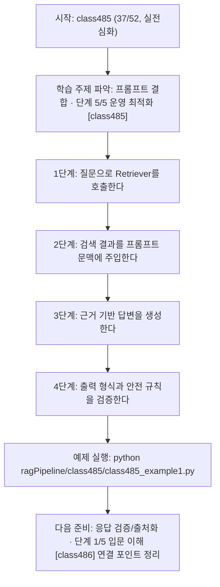
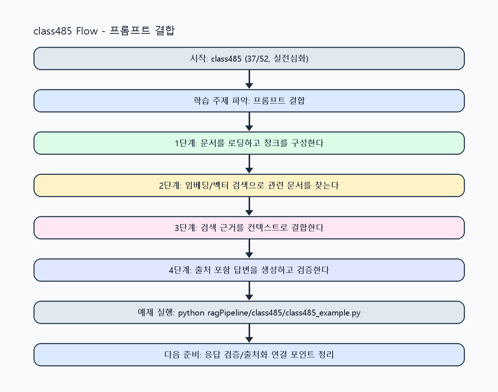

<!-- 이 파일은 www.edumgt.co.kr 의 에듀엠지티에 저작권이 있습니다 -->
# class485 자기주도 학습 가이드

## 1) 오늘의 학습 정보
- 교과목: **RAG(Retrieval-Augmented Generation)**
- 학습 주제: **프롬프트 결합 · 단계 5/5 운영 최적화 [class485]**
- 세부 시퀀스: **37/52**
- 일정: **Day 61 / 5교시**
- 난이도: **실전심화**

### 교과목·학습주제 어휘 해설 (IT 강사 스타일)
#### 교과목 표현 분석: `RAG(Retrieval-Augmented Generation)`
- 문법 포인트: 핵심 개념 명사를 중심으로 한 명사구 구조입니다.
- 기술 포인트: 검색 근거를 결합해 신뢰도 높은 답변을 만드는 RAG 교과목입니다.
| 용어 | 문법/품사 | 한글·한자 | 영어 | 기술 설명 |
| --- | --- | --- | --- | --- |
| `RAG` | 약어명사 | RAG (한자 없음) | Retrieval-Augmented Generation | 검색 결과를 근거로 생성 품질과 신뢰도를 높이는 구조입니다. |
| `Retrieval-Augmented` | 복합 형용어 | Retrieval-Augmented (한자 없음) | retrieval-augmented | 검색 결과를 생성 과정에 보강한다는 RAG 핵심 속성입니다. |
| `Generation` | 명사(영어) | Generation (한자 없음) | generation | 모델이 새 출력 텍스트를 만들어내는 단계입니다. |

#### 학습주제 표현 분석: `프롬프트 결합 · 단계 5/5 운영 최적화 [class485]`
- 문법 포인트: 핵심 개념 명사를 중심으로 한 명사구 구조입니다.
- 기술 포인트: 이번 차시는 `프롬프트 결합` 핵심 개념을 코드 구현, 결과 해석, 점검 기준으로 연결합니다.
| 용어 | 문법/품사 | 한글·한자 | 영어 | 기술 설명 |
| --- | --- | --- | --- | --- |
| `프롬프트` | 명사(외래어) | 프롬프트 (한자 없음) | prompt | 모델의 응답 방향을 결정하는 입력 지시문입니다. |
| `결합` | 명사(주제 핵심 용어) | 결합 (한자 없음) | (topic-specific) | `결합`는 `프롬프트 결합`에서 검색 근거와 생성 답변을 연결해 신뢰도를 높이는 핵심 용어입니다. |
| `Retriever` | 영문 기술명/약어 | Retriever (한자 없음) | Retriever | 이번 차시 맥락: Retriever 결과를 Prompt에 주입해 검색 기반 답변을 생성하고 hallucination을 줄이는 차시입니다. 이를 기준으로 `Retriever`를 코드와 결과 해석에 연결합니다. |
| `문맥` | 명사(주제 핵심 용어) | 문맥 (한자 없음) | (topic-specific) | 이번 차시 맥락: `문맥 주입 프롬프트`는 검색 결과를 출처와 함께 규격화해 답변 품질을 높입니다. 이를 기준으로 `문맥`를 코드와 결과 해석에 연결합니다. |
| `주입` | 명사(주제 핵심 용어) | 주입 (한자 없음) | (topic-specific) | 이번 차시 맥락: Retriever 결과를 Prompt에 주입해 검색 기반 답변을 생성하고 hallucination을 줄이는 차시입니다. 이를 기준으로 `주입`를 코드와 결과 해석에 연결합니다. |
| `hallucination` | 영문 기술명/약어 | hallucination (한자 없음) | hallucination | 이번 차시 맥락: Retriever 결과를 Prompt에 주입해 검색 기반 답변을 생성하고 hallucination을 줄이는 차시입니다. 이를 기준으로 `hallucination`를 코드와 결과 해석에 연결합니다. |

## 2) 이전에 배운 내용 (복습)
- 이전 차시: **class484 / 프롬프트 결합 · 단계 4/5 실전 검증 [class484]** (Day 61 / 4교시)
- 복습 연결: 이전에 배운 **프롬프트 결합 · 단계 4/5 실전 검증 [class484]** 를 떠올리며, 오늘 **프롬프트 결합 · 단계 5/5 운영 최적화 [class485]** 와 어떤 점이 이어지는지 비교해 보세요.

## 3) 주제를 아주 쉽게 이해하기
- 한 줄 설명: Retriever 결과를 Prompt에 주입해 검색 기반 답변을 생성하고 hallucination을 줄이는 차시입니다.
- 왜 배우나요?: 검색 결과를 프롬프트에 구조적으로 넣지 않으면 답변 근거가 약해지고 환각이 증가합니다.

### 핵심 개념 3가지
1. `Retriever 구성`은 검색 후보를 질문 의도에 맞게 안정적으로 반환하는 핵심 장치입니다.
2. `문맥 주입 프롬프트`는 검색 결과를 출처와 함께 규격화해 답변 품질을 높입니다.
3. `hallucination 감소`는 근거 없는 문장 금지 규칙과 source 기반 응답 형식으로 강화할 수 있습니다.

### 비유로 이해하기
- 시험 문제를 풀 때 교과서 해당 페이지를 먼저 찾고 답을 쓰는 방식과 같아요.

## 4) 실습 환경 만들기 (항상 먼저)
아래 명령은 **처음 한 번** 준비해 두면 이후 학습이 쉬워집니다.

### Windows PowerShell
```powershell
cd C:\DevOps\Python-AI_Agent-Class
python -m venv .venv
.\.venv\Scripts\Activate.ps1
python -m pip install --upgrade pip
pip install -r requirements.txt
```

### Linux/macOS (bash)
```bash
cd /path/to/Python-AI_Agent-Class
python3 -m venv .venv
source .venv/bin/activate
python -m pip install --upgrade pip
pip install -r requirements.txt
```

## 5) 오늘의 예제 코드
- 예제 파일: `class485_example1.py`
- 실행 명령:
```bash
python ragPipeline/class485/class485_example1.py
```

### example1~example5 단계별 테스트 확장
1. example1: Retriever 결과를 프롬프트에 주입해 답변을 생성한다.
2. example2: source 포함/미포함 프롬프트를 비교한다.
3. example3: 문맥 누락으로 인한 환각 케이스를 점검한다.
4. example4: 근거 기반 응답 안정화 규칙을 비교한다.
5. example5: RAG 프롬프트 템플릿 운영 기준을 정리한다.

<!-- AUTO-GENERATED: TECH_STACK_FLOW START -->
### 기술 스택
- 언어: `Python 3`
- 실행: `CLI` (`python ragPipeline/class485/class485_example1.py`)
- 주요 문법: `retriever 래퍼`, `context prompt template`, `source 태그`, `안전 규칙`
- 학습 포커스: `프롬프트 결합 · 단계 5/5 운영 최적화 [class485]`

### 실습 example1.py 동작 원리 (Mermaid Flowchart)


### Flow PNG 캡처

<!-- AUTO-GENERATED: TECH_STACK_FLOW END -->

### 예제 코드를 볼 때 집중할 포인트
1. 프롬프트에 근거 문서가 누락되지 않는지 확인하기
2. source 포맷이 후처리 가능한 형태인지 점검하기
3. 근거 부족 응답 정책이 정의됐는지 확인하기

## 6) 퀴즈로 복습하기 (10문항)
- 퀴즈 파일: `class485_quiz.html`
- 브라우저에서 열기:
```bash
ragPipeline/class485/class485_quiz.html
```
- 버튼 설명:
1. `채점하기`: 현재 선택한 답으로 점수를 계산해요.
2. `다시풀기`: 선택을 모두 지우고 처음부터 다시 풀어요.

## 7) 혼자 실습 순서 (초등학생 버전)
1. 코드를 한 번 그대로 실행해요.
2. 숫자/문장 값을 1개 바꿔요.
3. 결과가 왜 바뀌었는지 한 줄로 적어요.
4. 함수를 1개 더 만들어 작은 기능을 추가해요.

### 실습 미션
1. Retriever 검색 결과를 Prompt 템플릿에 삽입해 답변을 생성하세요.
2. source 포함/미포함 프롬프트를 비교해 환각 차이를 확인하세요.
3. 근거 부족 시 '확인 필요'를 반환하는 안전 규칙을 추가하세요.

## 8) 스스로 점검 체크리스트
- [ ] Retriever와 Prompt 주입 흐름을 구현했다.
- [ ] 검색 결과 기반 답변 생성을 확인했다.
- [ ] 환각 감소용 규칙을 프롬프트에 반영했다.

## 9) 막히면 이렇게 해결해요
1. 에러 메시지 마지막 줄을 먼저 읽어요.
2. 함수 이름과 괄호 짝을 확인해요.
3. `print()`를 넣어 중간 값을 확인해요.
4. 그래도 안 되면 어제 성공한 코드와 한 줄씩 비교해요.

## 10) 학습 후 다음에 배울 내용
- 다음 차시: **class486 / 응답 검증/출처화 · 단계 1/5 입문 이해 [class486]** (Day 61 / 6교시)
- 미리보기: 다음 차시 전에 **프롬프트 결합 · 단계 5/5 운영 최적화 [class485]** 핵심 코드 1개를 다시 실행해 두면 응답 검증/출처화 · 단계 1/5 입문 이해 [class486] 학습이 더 쉬워집니다.

## 11) 다음 차시 연결
- 다음 차시에서는 source 반환과 응답 검증으로 신뢰도를 강화합니다.
- 오늘 코드를 복사하지 말고, 직접 다시 작성해 보세요.
