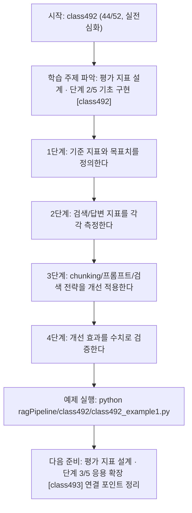
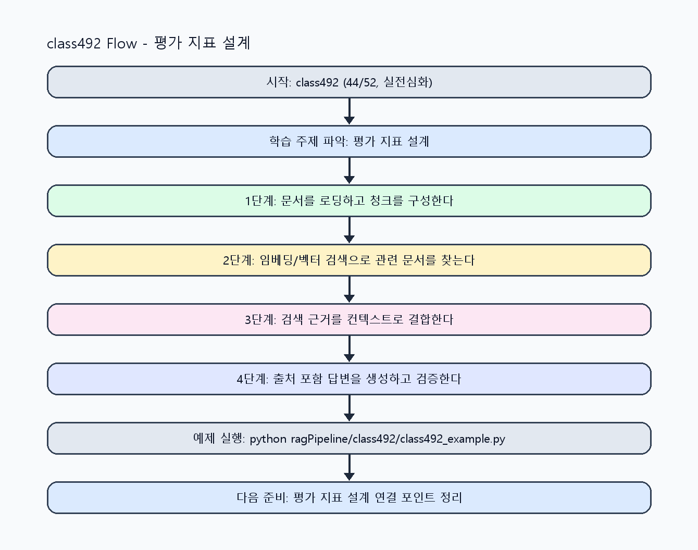

<!-- 이 파일은 www.edumgt.co.kr 의 에듀엠지티에 저작권이 있습니다 -->
# class492 자기주도 학습 가이드

## 1) 오늘의 학습 정보
- 교과목: **RAG(Retrieval-Augmented Generation)**
- 학습 주제: **평가 지표 설계 · 단계 2/5 기초 구현 [class492]**
- 세부 시퀀스: **44/52**
- 일정: **Day 62 / 4교시**
- 난이도: **실전심화**

### 교과목·학습주제 어휘 해설 (IT 강사 스타일)
#### 교과목 표현 분석: `RAG(Retrieval-Augmented Generation)`
- 문법 포인트: 핵심 개념 명사를 중심으로 한 명사구 구조입니다.
- 기술 포인트: 검색 근거를 결합해 신뢰도 높은 답변을 만드는 RAG 교과목입니다.
| 용어 | 문법/품사 | 한글·한자 | 영어 | 기술 설명 |
| --- | --- | --- | --- | --- |
| `RAG` | 약어명사 | RAG (한자 없음) | Retrieval-Augmented Generation | 검색 결과를 근거로 생성 품질과 신뢰도를 높이는 구조입니다. |
| `Retrieval-Augmented` | 복합 형용어 | Retrieval-Augmented (한자 없음) | retrieval-augmented | 검색 결과를 생성 과정에 보강한다는 RAG 핵심 속성입니다. |
| `Generation` | 명사(영어) | Generation (한자 없음) | generation | 모델이 새 출력 텍스트를 만들어내는 단계입니다. |

#### 학습주제 표현 분석: `평가 지표 설계 · 단계 2/5 기초 구현 [class492]`
- 문법 포인트: 핵심 개념 명사를 중심으로 한 명사구 구조입니다.
- 기술 포인트: 이번 차시는 `평가 지표 설계` 핵심 개념을 코드 구현, 결과 해석, 점검 기준으로 연결합니다.
| 용어 | 문법/품사 | 한글·한자 | 영어 | 기술 설명 |
| --- | --- | --- | --- | --- |
| `평가` | 명사 | 평가 (評價) | evaluation | 지표 기반으로 모델이나 결과물 품질을 측정하는 단계입니다. |
| `지표` | 명사 | 지표 (指標) | metric | 정확도, F1, MAE처럼 성능을 수치화하는 기준값입니다. |
| `설계` | 명사 | 설계 (設計) | design | 요구사항을 만족하도록 데이터 흐름, 함수/모듈 경계, 평가 기준을 구조화하는 작업입니다. |
| `검색` | 명사 | 검색 (搜索) | retrieval/search | 질문과 유사한 문서를 찾는 단계로 RAG 품질을 좌우합니다. |
| `정확도` | 명사(주제 핵심 용어) | 정확도 (한자 없음) | (topic-specific) | 이번 차시 맥락: 검색 정확도와 답변 정확도를 측정하고 chunking/프롬프트/검색 전략 개선 루프를 설계하는 차시입니다. 이를 기준으로 `정확도`를 코드와 결과 해석에 연결합니다. |
| `답변` | 명사(주제 핵심 용어) | 답변 (한자 없음) | (topic-specific) | 이번 차시 맥락: 검색 정확도와 답변 정확도를 측정하고 chunking/프롬프트/검색 전략 개선 루프를 설계하는 차시입니다. 이를 기준으로 `답변`를 코드와 결과 해석에 연결합니다. |

## 2) 이전에 배운 내용 (복습)
- 이전 차시: **class491 / 평가 지표 설계 · 단계 1/5 입문 이해 [class491]** (Day 62 / 3교시)
- 복습 연결: 이전에 배운 **평가 지표 설계 · 단계 1/5 입문 이해 [class491]** 를 떠올리며, 오늘 **평가 지표 설계 · 단계 2/5 기초 구현 [class492]** 와 어떤 점이 이어지는지 비교해 보세요.

## 3) 주제를 아주 쉽게 이해하기
- 한 줄 설명: 검색 정확도와 답변 정확도를 측정하고 chunking/프롬프트/검색 전략 개선 루프를 설계하는 차시입니다.
- 왜 배우나요?: 측정 없는 개선은 주관적 판단에 머물러 운영 품질을 안정적으로 높일 수 없습니다.

### 핵심 개념 3가지
1. `검색 정확도 평가`는 정답 문서 포함률, 재현율, 정밀도, MRR 같은 지표로 측정합니다.
2. `답변 정확도 평가`는 근거 일치도, 사실성, 출처 포함률로 확인합니다.
3. `개선 루프`는 chunking 전략, 프롬프트 튜닝, 하이브리드 검색 적용을 반복 검증합니다.

### 비유로 이해하기
- 시험 문제를 풀 때 교과서 해당 페이지를 먼저 찾고 답을 쓰는 방식과 같아요.

## 4) 실습 환경 만들기 (항상 먼저)
아래 명령은 **처음 한 번** 준비해 두면 이후 학습이 쉬워집니다.

### Windows PowerShell
```powershell
cd C:\DevOps\Python-AI_Agent-Class
python -m venv .venv
.\.venv\Scripts\Activate.ps1
python -m pip install --upgrade pip
pip install -r requirements.txt
```

### Linux/macOS (bash)
```bash
cd /path/to/Python-AI_Agent-Class
python3 -m venv .venv
source .venv/bin/activate
python -m pip install --upgrade pip
pip install -r requirements.txt
```

## 5) 오늘의 예제 코드
- 예제 파일: `class492_example1.py`
- 실행 명령:
```bash
python ragPipeline/class492/class492_example1.py
```

### example1~example5 단계별 테스트 확장
1. example1: 검색 정확도 지표를 계산한다.
2. example2: 답변 정확도 지표를 계산한다.
3. example3: chunking 전략 개선 전후를 점검한다.
4. example4: 프롬프트 튜닝/하이브리드 검색 효과를 비교한다.
5. example5: 평가 기반 개선 루프 운영 기준을 정리한다.

<!-- AUTO-GENERATED: TECH_STACK_FLOW START -->
### 기술 스택
- 언어: `Python 3`
- 실행: `CLI` (`python ragPipeline/class492/class492_example1.py`)
- 주요 문법: `precision/recall`, `grounded accuracy`, `A/B 비교 리포트`, `hybrid score`
- 학습 포커스: `평가 지표 설계 · 단계 2/5 기초 구현 [class492]`

### 실습 example1.py 동작 원리 (Mermaid Flowchart)


### Flow PNG 캡처

<!-- AUTO-GENERATED: TECH_STACK_FLOW END -->

### 예제 코드를 볼 때 집중할 포인트
1. 지표 계산 대상 데이터셋이 고정돼 있는지 확인하기
2. 정확도와 지연시간을 함께 비교하는지 점검하기
3. 개선안 채택 기준이 수치로 명시됐는지 확인하기

## 6) 퀴즈로 복습하기 (10문항)
- 퀴즈 파일: `class492_quiz.html`
- 브라우저에서 열기:
```bash
ragPipeline/class492/class492_quiz.html
```
- 버튼 설명:
1. `채점하기`: 현재 선택한 답으로 점수를 계산해요.
2. `다시풀기`: 선택을 모두 지우고 처음부터 다시 풀어요.

## 7) 혼자 실습 순서 (초등학생 버전)
1. 코드를 한 번 그대로 실행해요.
2. 숫자/문장 값을 1개 바꿔요.
3. 결과가 왜 바뀌었는지 한 줄로 적어요.
4. 함수를 1개 더 만들어 작은 기능을 추가해요.

### 실습 미션
1. 검색 정확도와 답변 정확도 지표를 각각 계산하세요.
2. chunking 전략을 바꿔 지표 변화(정확도/지연)를 비교하세요.
3. 프롬프트 튜닝과 하이브리드 검색 적용 전후 결과를 비교하세요.

## 8) 스스로 점검 체크리스트
- [ ] 검색/답변 평가 지표를 구분해 정의했다.
- [ ] 개선 전후 지표 비교표를 작성했다.
- [ ] 하이브리드 검색 적용 기준을 정리했다.

## 9) 막히면 이렇게 해결해요
1. 에러 메시지 마지막 줄을 먼저 읽어요.
2. 함수 이름과 괄호 짝을 확인해요.
3. `print()`를 넣어 중간 값을 확인해요.
4. 그래도 안 되면 어제 성공한 코드와 한 줄씩 비교해요.

## 10) 학습 후 다음에 배울 내용
- 다음 차시: **class493 / 평가 지표 설계 · 단계 3/5 응용 확장 [class493]** (Day 62 / 5교시)
- 미리보기: 다음 차시 전에 **평가 지표 설계 · 단계 2/5 기초 구현 [class492]** 핵심 코드 1개를 다시 실행해 두면 평가 지표 설계 · 단계 3/5 응용 확장 [class493] 학습이 더 쉬워집니다.

## 11) 다음 차시 연결
- 다음 차시에서는 사내 문서 Q&A/FAQ/PDF 검색 통합 실습으로 마무리합니다.
- 오늘 코드를 복사하지 말고, 직접 다시 작성해 보세요.
