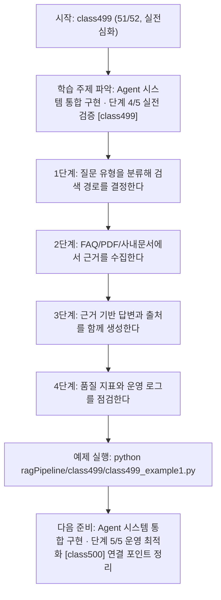
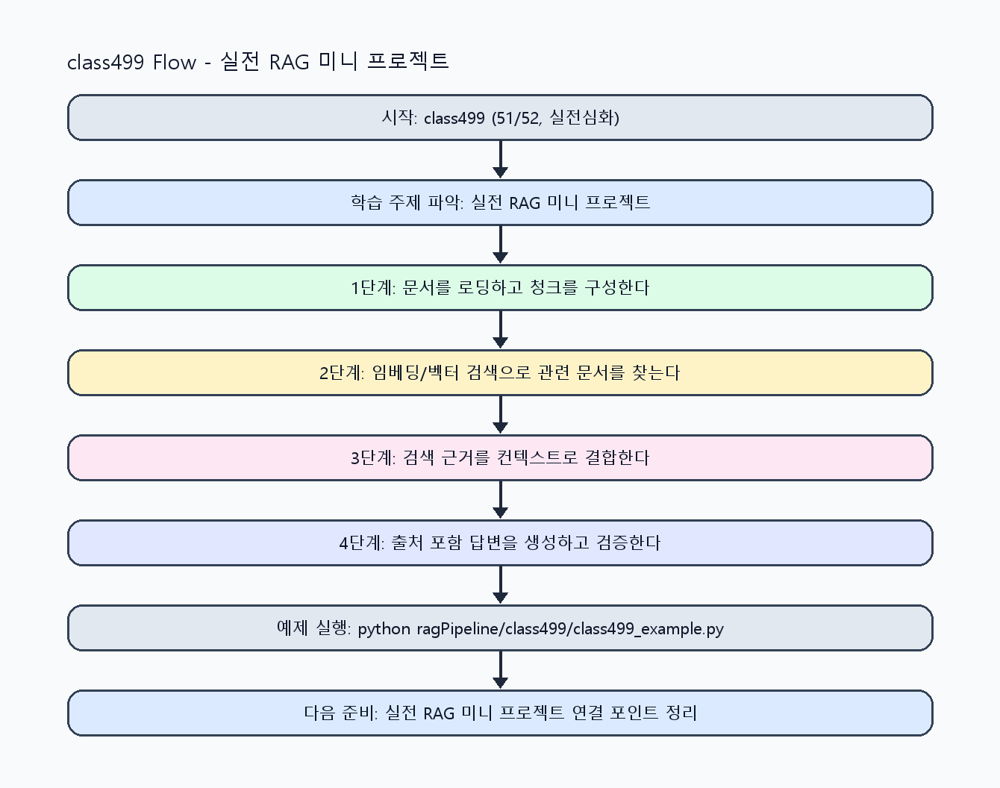

<!-- 이 파일은 www.edumgt.co.kr 의 에듀엠지티에 저작권이 있습니다 -->
# class499 자기주도 학습 가이드

## 1) 오늘의 학습 정보
- 교과목: **RAG(Retrieval-Augmented Generation)**
- 학습 주제: **Agent 시스템 통합 구현 · 단계 4/5 실전 검증 [class499]**
- 세부 시퀀스: **51/52**
- 일정: **Day 63 / 3교시**
- 난이도: **실전심화**

### 교과목·학습주제 어휘 해설 (IT 강사 스타일)
#### 교과목 표현 분석: `RAG(Retrieval-Augmented Generation)`
- 문법 포인트: 핵심 개념 명사를 중심으로 한 명사구 구조입니다.
- 기술 포인트: 검색 근거를 결합해 신뢰도 높은 답변을 만드는 RAG 교과목입니다.
| 용어 | 문법/품사 | 한글·한자 | 영어 | 기술 설명 |
| --- | --- | --- | --- | --- |
| `RAG` | 약어명사 | RAG (한자 없음) | Retrieval-Augmented Generation | 검색 결과를 근거로 생성 품질과 신뢰도를 높이는 구조입니다. |
| `Retrieval-Augmented` | 복합 형용어 | Retrieval-Augmented (한자 없음) | retrieval-augmented | 검색 결과를 생성 과정에 보강한다는 RAG 핵심 속성입니다. |
| `Generation` | 명사(영어) | Generation (한자 없음) | generation | 모델이 새 출력 텍스트를 만들어내는 단계입니다. |

#### 학습주제 표현 분석: `Agent 시스템 통합 구현 · 단계 4/5 실전 검증 [class499]`
- 문법 포인트: 핵심 개념 명사를 중심으로 한 명사구 구조입니다.
- 기술 포인트: 이번 차시는 `Agent 시스템 통합 구현` 핵심 개념을 코드 구현, 결과 해석, 점검 기준으로 연결합니다.
| 용어 | 문법/품사 | 한글·한자 | 영어 | 기술 설명 |
| --- | --- | --- | --- | --- |
| `Agent` | 명사(영어) | Agent (한자 없음) | agent | 목표 달성을 위해 도구 선택과 실행 순서를 스스로 결정하는 실행자입니다. |
| `시스템` | 명사(주제 핵심 용어) | 시스템 (한자 없음) | (topic-specific) | `시스템`는 `Agent 시스템 통합 구현`에서 검색 근거와 생성 답변을 연결해 신뢰도를 높이는 핵심 용어입니다. |
| `통합` | 명사(주제 핵심 용어) | 통합 (한자 없음) | (topic-specific) | 이번 차시 맥락: 사내 문서 Q&A, FAQ 챗봇, PDF 검색, 출처 포함 답변 생성을 통합해 실무형 RAG 서비스를 완성하는 차시입니다. 이를 기준으로 `통합`를 코드와 결과 해석에 연결합니다. |
| `구현` | 명사 | 구현 (具現) | implementation | 설계를 실제 코드와 시스템 동작으로 구체화하는 과정입니다. |
| `사내` | 명사(주제 핵심 용어) | 사내 (한자 없음) | (topic-specific) | 이번 차시 맥락: 사내 문서 Q&A, FAQ 챗봇, PDF 검색, 출처 포함 답변 생성을 통합해 실무형 RAG 서비스를 완성하는 차시입니다. 이를 기준으로 `사내`를 코드와 결과 해석에 연결합니다. |
| `문서` | 명사 | 문서 (文書) | document | RAG 검색과 근거 생성에 사용하는 텍스트 단위 데이터입니다. |

## 2) 이전에 배운 내용 (복습)
- 이전 차시: **class498 / Agent 시스템 통합 구현 · 단계 3/5 응용 확장 [class498]** (Day 63 / 2교시)
- 복습 연결: 이전에 배운 **Agent 시스템 통합 구현 · 단계 3/5 응용 확장 [class498]** 를 떠올리며, 오늘 **Agent 시스템 통합 구현 · 단계 4/5 실전 검증 [class499]** 와 어떤 점이 이어지는지 비교해 보세요.

## 3) 주제를 아주 쉽게 이해하기
- 한 줄 설명: 사내 문서 Q&A, FAQ 챗봇, PDF 검색, 출처 포함 답변 생성을 통합해 실무형 RAG 서비스를 완성하는 차시입니다.
- 왜 배우나요?: 실무에서는 단일 기능보다 검색-생성-검증-출처화를 하나의 서비스로 통합하는 능력이 중요합니다.

### 핵심 개념 3가지
1. `사내 문서 Q&A`는 내부 정책/절차 문서를 근거로 답변하는 대표 RAG 시나리오입니다.
2. `FAQ 챗봇 + PDF 검색`은 정형/비정형 문서를 함께 다루는 통합 검색 패턴입니다.
3. `출처 포함 답변`은 운영 신뢰성과 감사 가능성을 높이는 필수 기능입니다.

### 비유로 이해하기
- 시험 문제를 풀 때 교과서 해당 페이지를 먼저 찾고 답을 쓰는 방식과 같아요.

## 4) 실습 환경 만들기 (항상 먼저)
아래 명령은 **처음 한 번** 준비해 두면 이후 학습이 쉬워집니다.

### Windows PowerShell
```powershell
cd C:\DevOps\Python-AI_Agent-Class
python -m venv .venv
.\.venv\Scripts\Activate.ps1
python -m pip install --upgrade pip
pip install -r requirements.txt
```

### Linux/macOS (bash)
```bash
cd /path/to/Python-AI_Agent-Class
python3 -m venv .venv
source .venv/bin/activate
python -m pip install --upgrade pip
pip install -r requirements.txt
```

## 5) 오늘의 예제 코드
- 예제 파일: `class499_example1.py`
- 실행 명령:
```bash
python ragPipeline/class499/class499_example1.py
```

### example1~example5 단계별 테스트 확장
1. example1: 사내 문서 질의응답 시나리오를 구현한다.
2. example2: FAQ 챗봇과 PDF 검색을 통합한다.
3. example3: source 포함 답변 실패 케이스를 점검한다.
4. example4: 통합 서비스 품질/지연 지표를 비교한다.
5. example5: RAG 운영/복구 체크리스트를 완성한다.

<!-- AUTO-GENERATED: TECH_STACK_FLOW START -->
### 기술 스택
- 언어: `Python 3`
- 실행: `CLI` (`python ragPipeline/class499/class499_example1.py`)
- 주요 문법: `통합 라우터`, `retriever 조합`, `source-aware 응답`, `운영 대시보드 지표`
- 학습 포커스: `Agent 시스템 통합 구현 · 단계 4/5 실전 검증 [class499]`

### 실습 example1.py 동작 원리 (Mermaid Flowchart)


### Flow PNG 캡처

<!-- AUTO-GENERATED: TECH_STACK_FLOW END -->

### 예제 코드를 볼 때 집중할 포인트
1. 질문 유형 라우팅 정확도가 충분한지 확인하기
2. 통합 검색에서 source 누락이 없는지 점검하기
3. 운영 장애(검색 실패/지연) 복구 절차를 점검하기

## 6) 퀴즈로 복습하기 (10문항)
- 퀴즈 파일: `class499_quiz.html`
- 브라우저에서 열기:
```bash
ragPipeline/class499/class499_quiz.html
```
- 버튼 설명:
1. `채점하기`: 현재 선택한 답으로 점수를 계산해요.
2. `다시풀기`: 선택을 모두 지우고 처음부터 다시 풀어요.

## 7) 혼자 실습 순서 (초등학생 버전)
1. 코드를 한 번 그대로 실행해요.
2. 숫자/문장 값을 1개 바꿔요.
3. 결과가 왜 바뀌었는지 한 줄로 적어요.
4. 함수를 1개 더 만들어 작은 기능을 추가해요.

### 실습 미션
1. 사내 문서 Q&A 시나리오를 구현하고 source를 함께 반환하세요.
2. FAQ 데이터와 PDF 문서를 함께 검색하는 통합 흐름을 구성하세요.
3. 운영 체크리스트(재색인, 실패 복구, 지표 모니터링)를 포함해 마무리하세요.

## 8) 스스로 점검 체크리스트
- [ ] 사내 문서 Q&A 시스템을 실행했다.
- [ ] FAQ/PDF 통합 검색 기반 챗봇을 구성했다.
- [ ] 출처 포함 답변과 운영 기준을 함께 검증했다.

## 9) 막히면 이렇게 해결해요
1. 에러 메시지 마지막 줄을 먼저 읽어요.
2. 함수 이름과 괄호 짝을 확인해요.
3. `print()`를 넣어 중간 값을 확인해요.
4. 그래도 안 되면 어제 성공한 코드와 한 줄씩 비교해요.

## 10) 학습 후 다음에 배울 내용
- 다음 차시: **class500 / Agent 시스템 통합 구현 · 단계 5/5 운영 최적화 [class500]** (Day 63 / 4교시)
- 미리보기: 다음 차시 전에 **Agent 시스템 통합 구현 · 단계 4/5 실전 검증 [class499]** 핵심 코드 1개를 다시 실행해 두면 Agent 시스템 통합 구현 · 단계 5/5 운영 최적화 [class500] 학습이 더 쉬워집니다.

## 11) 다음 차시 연결
- 과목 전체를 복습하며 사내 지식 기반 RAG 서비스 포트폴리오를 완성하세요.
- 오늘 코드를 복사하지 말고, 직접 다시 작성해 보세요.
