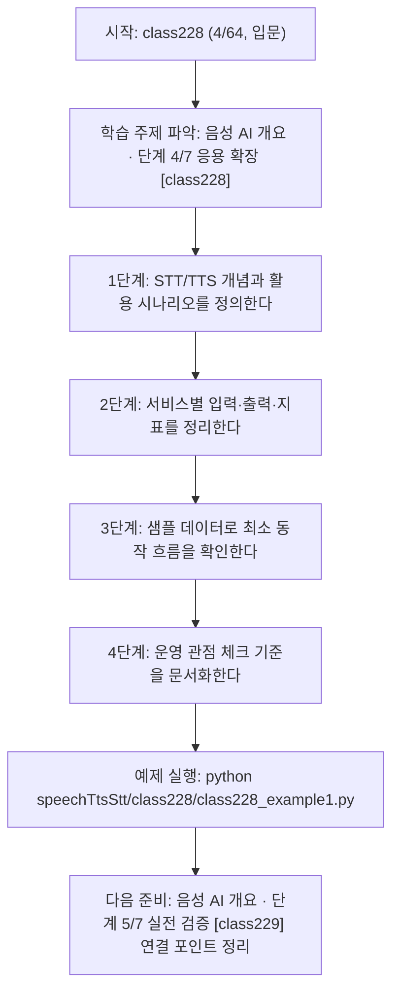
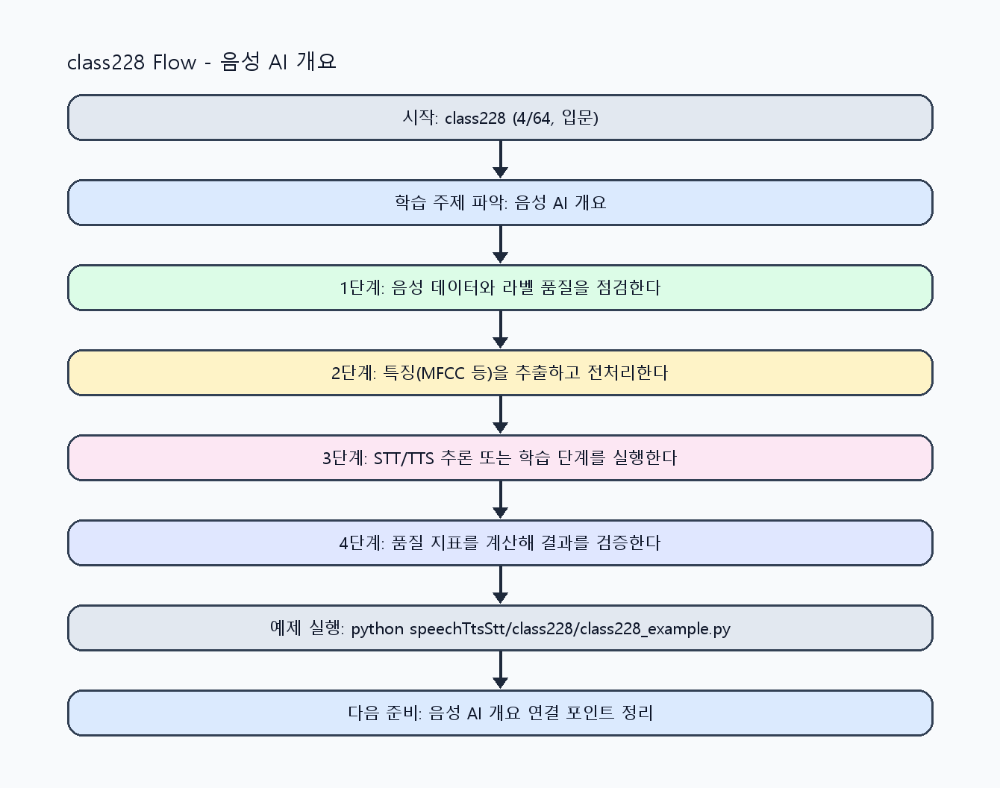

<!-- 이 파일은 www.edumgt.co.kr 의 에듀엠지티에 저작권이 있습니다 -->
# class228 자기주도 학습 가이드

## 1) 오늘의 학습 정보
- 교과목: **음성 데이터 활용한 TTS와 STT 모델 개발**
- 학습 주제: **음성 AI 개요 · 단계 4/7 응용 확장 [class228]**
- 세부 시퀀스: **4/64**
- 일정: **Day 29 / 4교시**
- 난이도: **입문**

### 교과목·학습주제 어휘 해설 (IT 강사 스타일)
#### 교과목 표현 분석: `음성 데이터 활용한 TTS와 STT 모델 개발`
- 문법 포인트: 명사와 명사를 대등하게 묶는 병렬 명사구 구조입니다.
- 기술 포인트: 음성 신호를 정제하고 STT/TTS 모델로 연결하는 음성 AI 교과목입니다.
| 용어 | 문법/품사 | 한글·한자 | 영어 | 기술 설명 |
| --- | --- | --- | --- | --- |
| `음성` | 명사 | 음성 (音聲) | speech/audio | 사람의 발화 신호를 디지털로 표현한 데이터입니다. |
| `데이터` | 명사(외래어) | 데이터 (한자 없음) | data | 분석, 학습, 추론의 입력이 되는 관측값 집합입니다. |
| `활용` | 명사/동사 어근 | 활용 (活用) | utilization | 이론이나 도구를 실제 문제 해결 맥락에 적용하는 행위입니다. |
| `TTS` | 약어명사 | TTS (한자 없음) | Text-to-Speech | 텍스트를 자연스러운 음성으로 합성하는 기술입니다. |
| `STT` | 약어명사 | STT (한자 없음) | Speech-to-Text | 음성 신호를 텍스트로 변환하는 기술입니다. |
| `모델` | 명사(외래어) | 모델 (한자 없음) | model | 입력과 출력 관계를 수학적으로 근사한 계산 구조입니다. |

#### 학습주제 표현 분석: `음성 AI 개요 · 단계 4/7 응용 확장 [class228]`
- 문법 포인트: 핵심 개념 명사를 중심으로 한 명사구 구조입니다.
- 기술 포인트: 이번 차시는 `음성 AI 개요 · 단계 4/7 응용 확장 [class228]` 용어를 중심으로 문제 정의, 코드 구현, 결과 검증까지 연결합니다.
| 용어 | 문법/품사 | 한글·한자 | 영어 | 기술 설명 |
| --- | --- | --- | --- | --- |
| `음성` | 명사 | 음성 (音聲) | speech/audio | 사람의 발화 신호를 디지털로 표현한 데이터입니다. |
| `AI` | 영문 기술명/약어 | AI (한자 없음) | AI | 용어 `AI`: 이번 차시에서 쓰이는 핵심 기술 용어입니다. |
| `개요` | 명사(기술 개념어) | 개요 (한자 없음) | (context-specific) | 용어 `개요`: 이번 학습주제에서 정의해야 할 핵심 개념 용어입니다. |
| `단계` | 명사(기술 개념어) | 단계 (한자 없음) | (context-specific) | 용어 `단계`: 이번 학습주제에서 정의해야 할 핵심 개념 용어입니다. |
| `응용` | 명사(기술 개념어) | 응용 (한자 없음) | (context-specific) | 용어 `응용`: 이번 학습주제에서 정의해야 할 핵심 개념 용어입니다. |
| `확장` | 명사(기술 개념어) | 확장 (한자 없음) | (context-specific) | 용어 `확장`: 이번 학습주제에서 정의해야 할 핵심 개념 용어입니다. |

## 2) 이전에 배운 내용 (복습)
- 이전 차시: **class227 / 음성 AI 개요 · 단계 3/7 기초 구현 [class227]** (Day 29 / 3교시)
- 복습 연결: 이전에 배운 **음성 AI 개요 · 단계 3/7 기초 구현 [class227]** 를 떠올리며, 오늘 **음성 AI 개요 · 단계 4/7 응용 확장 [class228]** 와 어떤 점이 이어지는지 비교해 보세요.

## 3) 주제를 아주 쉽게 이해하기
- 한 줄 설명: STT와 TTS의 차이, 동작 원리, 실제 서비스 사례를 한 번에 이해하는 시작 차시입니다.
- 왜 배우나요?: 음성비서·콜센터·자막·낭독 서비스는 STT/TTS를 다르게 조합하므로 개념 구분이 먼저 필요합니다.

### 핵심 개념 3가지
1. `STT(Speech to Text)`는 음성을 텍스트로 변환해 자막/검색/분석에 활용합니다.
2. `TTS(Text to Speech)`는 텍스트를 음성으로 합성해 낭독/안내/대화형 서비스에 활용합니다.
3. `활용 사례`(음성비서, 콜센터, 자막생성, 낭독 서비스)마다 지연·정확도 요구가 다릅니다.

### 비유로 이해하기
- 노래 경연 점수를 매길 때 음정, 박자, 발음을 항목별로 보는 것과 비슷해요.

## 4) 실습 환경 만들기 (항상 먼저)
아래 명령은 **처음 한 번** 준비해 두면 이후 학습이 쉬워집니다.

### Windows PowerShell
```powershell
cd C:\DevOps\Python-AI_Agent-Class
python -m venv .venv
.\.venv\Scripts\Activate.ps1
python -m pip install --upgrade pip
pip install -r requirements.txt
```

### Linux/macOS (bash)
```bash
cd /path/to/Python-AI_Agent-Class
python3 -m venv .venv
source .venv/bin/activate
python -m pip install --upgrade pip
pip install -r requirements.txt
```

## 5) 오늘의 예제 코드
- 예제 파일: `class228_example1.py`
- 실행 명령:
```bash
python speechTtsStt/class228/class228_example1.py
```

### example1~example5 단계별 테스트 확장
1. example1: STT/TTS 차이와 기본 입출력 흐름을 확인한다.
2. example2: 음성비서/콜센터/자막/낭독 사례를 비교한다.
3. example3: 서비스별 품질 요구사항(정확도/지연)을 점검한다.
4. example4: STT/TTS 통합 아키텍처를 시뮬레이션한다.
5. example5: 음성 AI 서비스 운영 체크리스트를 정리한다.

<!-- AUTO-GENERATED: TECH_STACK_FLOW START -->
### 기술 스택
- 언어: `Python 3`
- 실행: `CLI` (`python speechTtsStt/class228/class228_example1.py`)
- 주요 문법: `STT/TTS 입출력 스키마`, `서비스 시나리오 dict`, `지표 정의 함수`, `리포트 출력(print)`
- 학습 포커스: `음성 AI 개요 · 단계 4/7 응용 확장 [class228]`

### 실습 example1.py 동작 원리 (Mermaid Flowchart)


### Flow PNG 캡처

<!-- AUTO-GENERATED: TECH_STACK_FLOW END -->

### 예제 코드를 볼 때 집중할 포인트
1. STT와 TTS 과업이 혼동 없이 분리되어 있는지 확인하기
2. 사례별 지표가 기능 목적과 일치하는지 점검하기
3. 서비스 구조에서 실시간/배치 처리 경계가 명확한지 확인하기

## 6) 퀴즈로 복습하기 (10문항)
- 퀴즈 파일: `class228_quiz.html`
- 브라우저에서 열기:
```bash
speechTtsStt/class228/class228_quiz.html
```
- 버튼 설명:
1. `채점하기`: 현재 선택한 답으로 점수를 계산해요.
2. `다시풀기`: 선택을 모두 지우고 처음부터 다시 풀어요.

## 7) 혼자 실습 순서 (초등학생 버전)
1. 코드를 한 번 그대로 실행해요.
2. 숫자/문장 값을 1개 바꿔요.
3. 결과가 왜 바뀌었는지 한 줄로 적어요.
4. 함수를 1개 더 만들어 작은 기능을 추가해요.

### 실습 미션
1. STT와 TTS 입력/출력 구조를 표로 비교하세요.
2. 음성비서/콜센터/자막/낭독 시나리오를 기능별로 매핑하세요.
3. 서비스별 핵심 지표(정확도/지연/자연스러움)를 정의하세요.

## 8) 스스로 점검 체크리스트
- [ ] STT와 TTS의 차이와 연결 지점을 설명할 수 있다.
- [ ] 활용 사례별 요구사항 차이를 설명할 수 있다.
- [ ] 음성 AI 서비스의 기본 구성 요소를 제시할 수 있다.

## 9) 막히면 이렇게 해결해요
1. 에러 메시지 마지막 줄을 먼저 읽어요.
2. 함수 이름과 괄호 짝을 확인해요.
3. `print()`를 넣어 중간 값을 확인해요.
4. 그래도 안 되면 어제 성공한 코드와 한 줄씩 비교해요.

## 10) 학습 후 다음에 배울 내용
- 다음 차시: **class229 / 음성 AI 개요 · 단계 5/7 실전 검증 [class229]** (Day 29 / 5교시)
- 미리보기: 다음 차시 전에 **음성 AI 개요 · 단계 4/7 응용 확장 [class228]** 핵심 코드 1개를 다시 실행해 두면 음성 AI 개요 · 단계 5/7 실전 검증 [class229] 학습이 더 쉬워집니다.

## 11) 다음 차시 연결
- 다음 차시에서는 음성 수집·스크립트 정렬·화자 관리 등 데이터 준비를 본격적으로 다룹니다.
- 오늘 코드를 복사하지 말고, 직접 다시 작성해 보세요.
