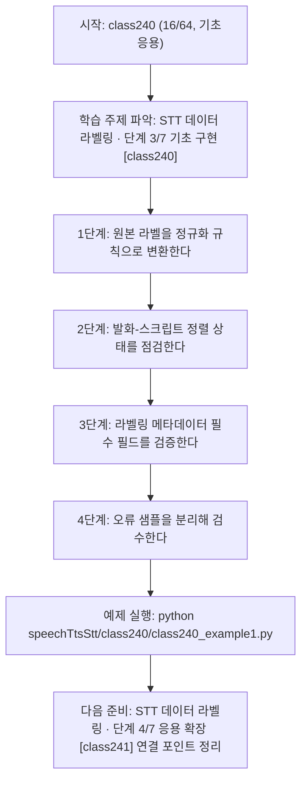
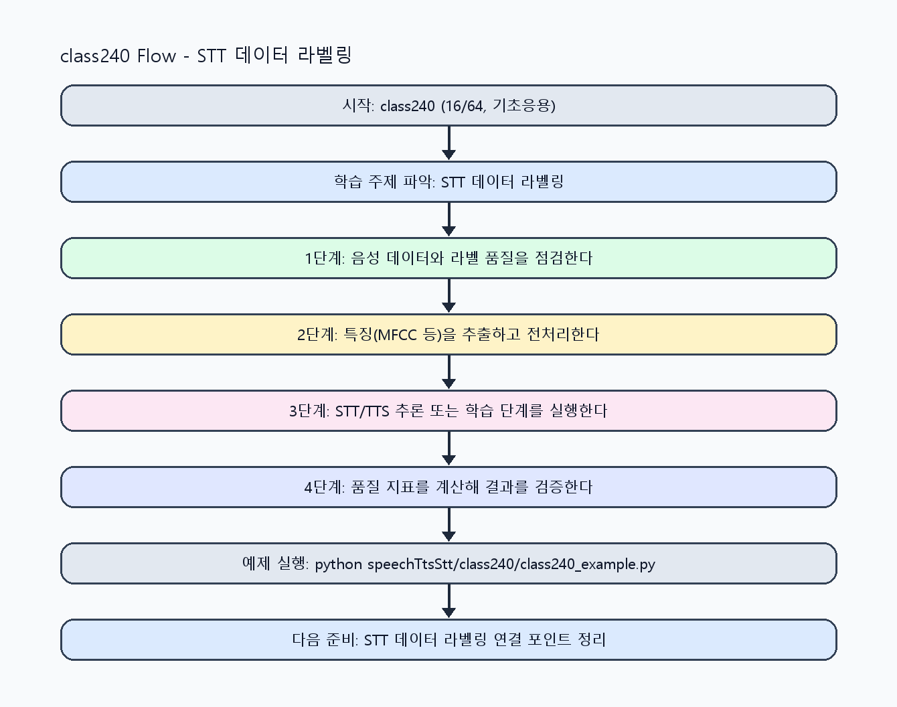

<!-- 이 파일은 www.edumgt.co.kr 의 에듀엠지티에 저작권이 있습니다 -->
# class240 자기주도 학습 가이드

## 1) 오늘의 학습 정보
- 교과목: **음성 데이터 활용한 TTS와 STT 모델 개발**
- 학습 주제: **STT 데이터 라벨링 · 단계 3/7 기초 구현 [class240]**
- 세부 시퀀스: **16/64**
- 일정: **Day 30 / 8교시**
- 난이도: **기초응용**

### 교과목·학습주제 어휘 해설 (IT 강사 스타일)
#### 교과목 표현 분석: `음성 데이터 활용한 TTS와 STT 모델 개발`
- 문법 포인트: 명사와 명사를 대등하게 묶는 병렬 명사구 구조입니다.
- 기술 포인트: 음성 신호를 정제하고 STT/TTS 모델로 연결하는 음성 AI 교과목입니다.
| 용어 | 문법/품사 | 한글·한자 | 영어 | 기술 설명 |
| --- | --- | --- | --- | --- |
| `음성` | 명사 | 음성 (音聲) | speech/audio | 사람의 발화 신호를 디지털로 표현한 데이터입니다. |
| `데이터` | 명사(외래어) | 데이터 (한자 없음) | data | 분석, 학습, 추론의 입력이 되는 관측값 집합입니다. |
| `활용` | 명사/동사 어근 | 활용 (活用) | utilization | 이론이나 도구를 실제 문제 해결 맥락에 적용하는 행위입니다. |
| `TTS` | 약어명사 | TTS (한자 없음) | Text-to-Speech | 텍스트를 자연스러운 음성으로 합성하는 기술입니다. |
| `STT` | 약어명사 | STT (한자 없음) | Speech-to-Text | 음성 신호를 텍스트로 변환하는 기술입니다. |
| `모델` | 명사(외래어) | 모델 (한자 없음) | model | 입력과 출력 관계를 수학적으로 근사한 계산 구조입니다. |

#### 학습주제 표현 분석: `STT 데이터 라벨링 · 단계 3/7 기초 구현 [class240]`
- 문법 포인트: 핵심 개념 명사를 중심으로 한 명사구 구조입니다.
- 기술 포인트: 이번 차시는 `STT 데이터 라벨링` 핵심 개념을 코드 구현, 결과 해석, 점검 기준으로 연결합니다.
| 용어 | 문법/품사 | 한글·한자 | 영어 | 기술 설명 |
| --- | --- | --- | --- | --- |
| `STT` | 약어명사 | STT (한자 없음) | Speech-to-Text | 음성 신호를 텍스트로 변환하는 기술입니다. |
| `데이터` | 명사(외래어) | 데이터 (한자 없음) | data | 분석, 학습, 추론의 입력이 되는 관측값 집합입니다. |
| `라벨링` | 명사(주제 핵심 용어) | 라벨링 (한자 없음) | (topic-specific) | 이번 차시 맥락: `라벨링 메타데이터`(발화ID, 시작/종료 시점, 화자, 텍스트 버전)는 추적 가능한 학습 데이터셋 운영의 핵심입니다. 이를 기준으로 `라벨링`를 코드와 결과 해석에 연결합니다. |
| `라벨` | 명사(주제 핵심 용어) | 라벨 (한자 없음) | (topic-specific) | 이번 차시 맥락: STT 학습용 라벨 품질과 메타데이터 구조를 함께 관리하는 정렬·정규화·검증 차시입니다. 이를 기준으로 `라벨`를 코드와 결과 해석에 연결합니다. |
| `정규화` | 명사(주제 핵심 용어) | 정규화 (한자 없음) | (topic-specific) | 이번 차시 맥락: STT 학습용 라벨 품질과 메타데이터 구조를 함께 관리하는 정렬·정규화·검증 차시입니다. 이를 기준으로 `정규화`를 코드와 결과 해석에 연결합니다. |
| `구간` | 명사(주제 핵심 용어) | 구간 (한자 없음) | (topic-specific) | 이번 차시 맥락: `구간 정렬` 정확도는 CTC 기반 학습과 자막 생성 품질에 직접 영향을 줍니다. 이를 기준으로 `구간`를 코드와 결과 해석에 연결합니다. |

## 2) 이전에 배운 내용 (복습)
- 이전 차시: **class239 / STT 데이터 라벨링 · 단계 2/7 기초 구현 [class239]** (Day 30 / 7교시)
- 복습 연결: 이전에 배운 **STT 데이터 라벨링 · 단계 2/7 기초 구현 [class239]** 를 떠올리며, 오늘 **STT 데이터 라벨링 · 단계 3/7 기초 구현 [class240]** 와 어떤 점이 이어지는지 비교해 보세요.

## 3) 주제를 아주 쉽게 이해하기
- 한 줄 설명: STT 학습용 라벨 품질과 메타데이터 구조를 함께 관리하는 정렬·정규화·검증 차시입니다.
- 왜 배우나요?: 라벨 품질이 낮으면 모델이 잘못된 패턴을 학습해 추론 오류가 반복됩니다.

### 핵심 개념 3가지
1. `라벨 정규화`는 숫자/기호/띄어쓰기 규칙을 통일해 학습 잡음을 줄입니다.
2. `구간 정렬` 정확도는 CTC 기반 학습과 자막 생성 품질에 직접 영향을 줍니다.
3. `라벨링 메타데이터`(발화ID, 시작/종료 시점, 화자, 텍스트 버전)는 추적 가능한 학습 데이터셋 운영의 핵심입니다.

### 비유로 이해하기
- 노래 경연 점수를 매길 때 음정, 박자, 발음을 항목별로 보는 것과 비슷해요.

## 4) 실습 환경 만들기 (항상 먼저)
아래 명령은 **처음 한 번** 준비해 두면 이후 학습이 쉬워집니다.

### Windows PowerShell
```powershell
cd C:\DevOps\Python-AI_Agent-Class
python -m venv .venv
.\.venv\Scripts\Activate.ps1
python -m pip install --upgrade pip
pip install -r requirements.txt
```

### Linux/macOS (bash)
```bash
cd /path/to/Python-AI_Agent-Class
python3 -m venv .venv
source .venv/bin/activate
python -m pip install --upgrade pip
pip install -r requirements.txt
```

## 5) 오늘의 예제 코드
- 예제 파일: `class240_example1.py`
- 실행 명령:
```bash
python speechTtsStt/class240/class240_example1.py
```

### example1~example5 단계별 테스트 확장
1. example1: STT 라벨 정규화 기본 규칙을 적용한다.
2. example2: 발화-스크립트 정렬과 라벨링 메타데이터 검증 케이스를 확장한다.
3. example3: 라벨 오류(오타/누락/시간 불일치) 시나리오를 점검한다.
4. example4: 라벨 검수 루프와 품질 리포트를 비교한다.
5. example5: 라벨 품질 운영 체크리스트를 문서화한다.

<!-- AUTO-GENERATED: TECH_STACK_FLOW START -->
### 기술 스택
- 언어: `Python 3`
- 실행: `CLI` (`python speechTtsStt/class240/class240_example1.py`)
- 주요 문법: `라벨 정규화 함수`, `정렬 오차 계산`, `메타데이터 스키마 검증`, `검수 로그`, `품질 플래그`
- 학습 포커스: `STT 데이터 라벨링 · 단계 3/7 기초 구현 [class240]`

### 실습 example1.py 동작 원리 (Mermaid Flowchart)


### Flow PNG 캡처

<!-- AUTO-GENERATED: TECH_STACK_FLOW END -->

### 예제 코드를 볼 때 집중할 포인트
1. 라벨 정규화로 의미 손실이 생기지 않는지 확인하기
2. 정렬 오차 임계치 기준이 명확한지 점검하기
3. 메타데이터 스키마와 버전 관리 규칙이 일관적인지 확인하기

## 6) 퀴즈로 복습하기 (10문항)
- 퀴즈 파일: `class240_quiz.html`
- 브라우저에서 열기:
```bash
speechTtsStt/class240/class240_quiz.html
```
- 버튼 설명:
1. `채점하기`: 현재 선택한 답으로 점수를 계산해요.
2. `다시풀기`: 선택을 모두 지우고 처음부터 다시 풀어요.

## 7) 혼자 실습 순서 (초등학생 버전)
1. 코드를 한 번 그대로 실행해요.
2. 숫자/문장 값을 1개 바꿔요.
3. 결과가 왜 바뀌었는지 한 줄로 적어요.
4. 함수를 1개 더 만들어 작은 기능을 추가해요.

### 실습 미션
1. 라벨 정규화 규칙을 적용해 전/후 차이를 기록하세요.
2. 발화-라벨 정렬 오차가 큰 샘플을 탐지하고 메타데이터와 함께 기록하세요.
3. 메타데이터 필드 누락/중복(utterance_id, speaker, start/end)을 자동 점검하세요.

## 8) 스스로 점검 체크리스트
- [ ] 라벨 정규화 규칙을 코드로 재현했다.
- [ ] 정렬 오류를 자동으로 탐지하는 기준을 적용했다.
- [ ] 라벨링 메타데이터 필수 필드와 버전 정보를 검증했다.

## 9) 막히면 이렇게 해결해요
1. 에러 메시지 마지막 줄을 먼저 읽어요.
2. 함수 이름과 괄호 짝을 확인해요.
3. `print()`를 넣어 중간 값을 확인해요.
4. 그래도 안 되면 어제 성공한 코드와 한 줄씩 비교해요.

## 10) 학습 후 다음에 배울 내용
- 다음 차시: **class241 / STT 데이터 라벨링 · 단계 4/7 응용 확장 [class241]** (Day 31 / 1교시)
- 미리보기: 다음 차시 전에 **STT 데이터 라벨링 · 단계 3/7 기초 구현 [class240]** 핵심 코드 1개를 다시 실행해 두면 STT 데이터 라벨링 · 단계 4/7 응용 확장 [class241] 학습이 더 쉬워집니다.

## 11) 다음 차시 연결
- 다음 차시에서는 STFT/Mel/MFCC 특징과 음향 특징 관계를 실습합니다.
- 오늘 코드를 복사하지 말고, 직접 다시 작성해 보세요.
