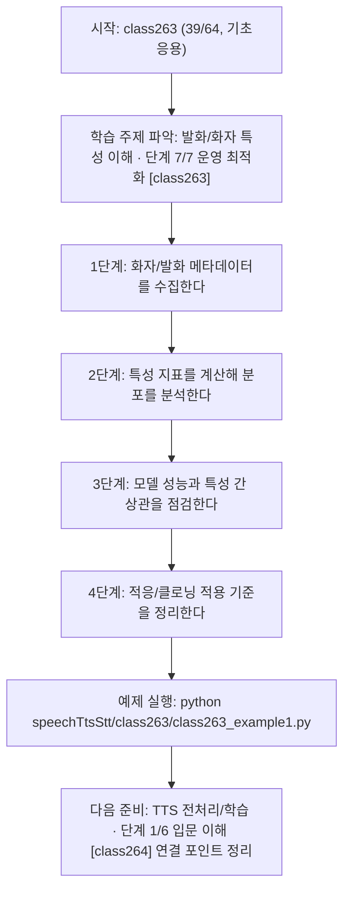
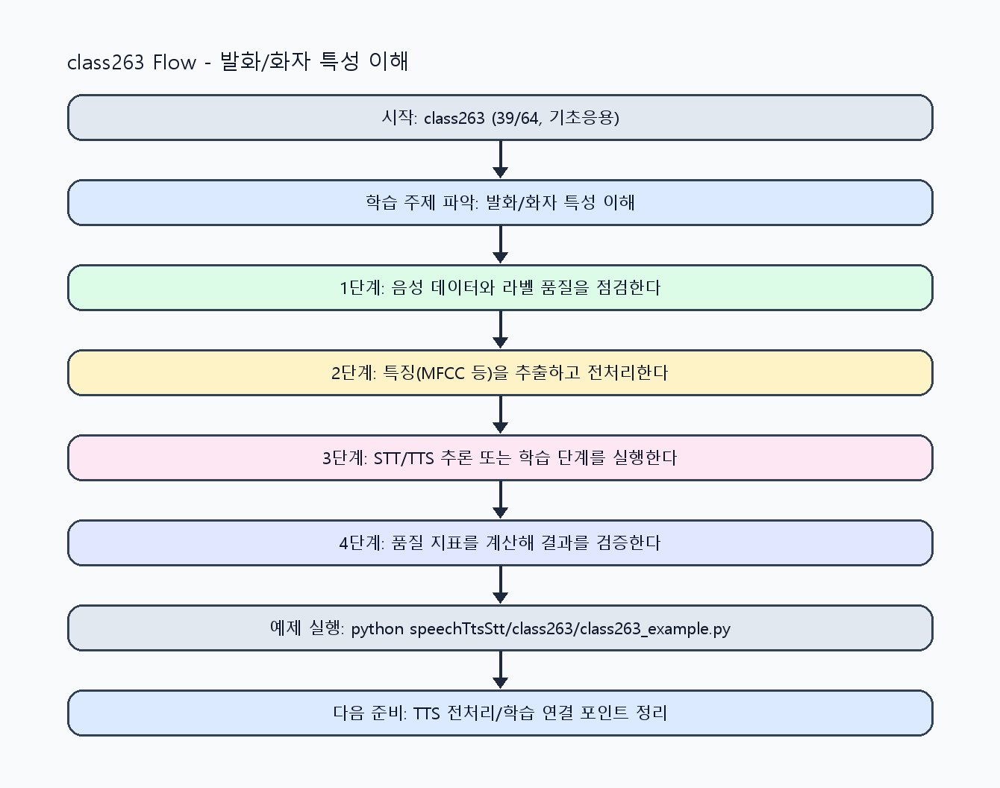

<!-- 이 파일은 www.edumgt.co.kr 의 에듀엠지티에 저작권이 있습니다 -->
# class263 자기주도 학습 가이드

## 1) 오늘의 학습 정보
- 교과목: **음성 데이터 활용한 TTS와 STT 모델 개발**
- 학습 주제: **발화/화자 특성 이해 · 단계 7/7 운영 최적화 [class263]**
- 세부 시퀀스: **39/64**
- 일정: **Day 33 / 7교시**
- 난이도: **기초응용**

### 교과목·학습주제 어휘 해설 (IT 강사 스타일)
#### 교과목 표현 분석: `음성 데이터 활용한 TTS와 STT 모델 개발`
- 문법 포인트: 명사와 명사를 대등하게 묶는 병렬 명사구 구조입니다.
- 기술 포인트: 음성 신호를 정제하고 STT/TTS 모델로 연결하는 음성 AI 교과목입니다.
| 용어 | 문법/품사 | 한글·한자 | 영어 | 기술 설명 |
| --- | --- | --- | --- | --- |
| `음성` | 명사 | 음성 (音聲) | speech/audio | 사람의 발화 신호를 디지털로 표현한 데이터입니다. |
| `데이터` | 명사(외래어) | 데이터 (한자 없음) | data | 분석, 학습, 추론의 입력이 되는 관측값 집합입니다. |
| `활용` | 명사/동사 어근 | 활용 (活用) | utilization | 이론이나 도구를 실제 문제 해결 맥락에 적용하는 행위입니다. |
| `TTS` | 약어명사 | TTS (한자 없음) | Text-to-Speech | 텍스트를 자연스러운 음성으로 합성하는 기술입니다. |
| `STT` | 약어명사 | STT (한자 없음) | Speech-to-Text | 음성 신호를 텍스트로 변환하는 기술입니다. |
| `모델` | 명사(외래어) | 모델 (한자 없음) | model | 입력과 출력 관계를 수학적으로 근사한 계산 구조입니다. |

#### 학습주제 표현 분석: `발화/화자 특성 이해 · 단계 7/7 운영 최적화 [class263]`
- 문법 포인트: 핵심 개념 명사를 중심으로 한 명사구 구조입니다.
- 기술 포인트: 이번 차시는 `발화/화자 특성 이해 · 단계 7/7 운영 최적화 [class263]` 용어를 중심으로 문제 정의, 코드 구현, 결과 검증까지 연결합니다.
| 용어 | 문법/품사 | 한글·한자 | 영어 | 기술 설명 |
| --- | --- | --- | --- | --- |
| `발화` | 명사 | 발화 (發話) | utterance | 화자가 실제로 말한 하나의 문장 단위 음성 샘플입니다. |
| `화자` | 명사 | 화자 (話者) | speaker | 음성을 발화한 사람(또는 음색 정체성)을 나타냅니다. |
| `특성` | 명사(기술 개념어) | 특성 (한자 없음) | (context-specific) | 용어 `특성`: 이번 학습주제에서 정의해야 할 핵심 개념 용어입니다. |
| `이해` | 명사(기술 개념어) | 이해 (한자 없음) | (context-specific) | 용어 `이해`: 이번 학습주제에서 정의해야 할 핵심 개념 용어입니다. |
| `단계` | 명사(기술 개념어) | 단계 (한자 없음) | (context-specific) | 용어 `단계`: 이번 학습주제에서 정의해야 할 핵심 개념 용어입니다. |
| `운영` | 명사(기술 개념어) | 운영 (한자 없음) | (context-specific) | 용어 `운영`: 이번 학습주제에서 정의해야 할 핵심 개념 용어입니다. |

## 2) 이전에 배운 내용 (복습)
- 이전 차시: **class262 / 발화/화자 특성 이해 · 단계 6/7 실전 검증 [class262]** (Day 33 / 6교시)
- 복습 연결: 이전에 배운 **발화/화자 특성 이해 · 단계 6/7 실전 검증 [class262]** 를 떠올리며, 오늘 **발화/화자 특성 이해 · 단계 7/7 운영 최적화 [class263]** 와 어떤 점이 이어지는지 비교해 보세요.

## 3) 주제를 아주 쉽게 이해하기
- 한 줄 설명: 화자 특성과 발화 특성이 STT/TTS 성능에 미치는 영향을 분석하는 차시입니다.
- 왜 배우나요?: 화자별 음색·속도·억양 차이를 이해해야 화자 독립 모델과 화자 적응 모델을 설계할 수 있습니다.

### 핵심 개념 3가지
1. `화자 특성`은 음색, 발화 속도, 억양 등 모델 일반화 성능에 영향을 줍니다.
2. `화자 클로닝`은 특정 화자의 음색을 모사하는 기술로 윤리/동의 이슈 관리가 필요합니다.
3. `발화 단위 분석`은 STT 인식 오류와 TTS 자연스러움 문제를 추적하는 기초입니다.

### 비유로 이해하기
- 노래 경연 점수를 매길 때 음정, 박자, 발음을 항목별로 보는 것과 비슷해요.

## 4) 실습 환경 만들기 (항상 먼저)
아래 명령은 **처음 한 번** 준비해 두면 이후 학습이 쉬워집니다.

### Windows PowerShell
```powershell
cd C:\DevOps\Python-AI_Agent-Class
python -m venv .venv
.\.venv\Scripts\Activate.ps1
python -m pip install --upgrade pip
pip install -r requirements.txt
```

### Linux/macOS (bash)
```bash
cd /path/to/Python-AI_Agent-Class
python3 -m venv .venv
source .venv/bin/activate
python -m pip install --upgrade pip
pip install -r requirements.txt
```

## 5) 오늘의 예제 코드
- 예제 파일: `class263_example1.py`
- 실행 명령:
```bash
python speechTtsStt/class263/class263_example1.py
```

### example1~example5 단계별 테스트 확장
1. example1: 발화/화자 특성 통계를 계산한다.
2. example2: 화자별 품질 분포를 확장해 비교한다.
3. example3: 화자 편향/불균형 케이스를 점검한다.
4. example4: 화자 클로닝 개념 적용 시나리오를 검토한다.
5. example5: 화자 특성 기반 품질/안전 기준을 정리한다.

<!-- AUTO-GENERATED: TECH_STACK_FLOW START -->
### 기술 스택
- 언어: `Python 3`
- 실행: `CLI` (`python speechTtsStt/class263/class263_example1.py`)
- 주요 문법: `화자 메타데이터`, `발화 통계`, `특성 비교 리포트`, `안전 정책 항목`
- 학습 포커스: `발화/화자 특성 이해 · 단계 7/7 운영 최적화 [class263]`

### 실습 example1.py 동작 원리 (Mermaid Flowchart)


### Flow PNG 캡처

<!-- AUTO-GENERATED: TECH_STACK_FLOW END -->

### 예제 코드를 볼 때 집중할 포인트
1. 화자 편향이 학습/평가 데이터에 존재하는지 확인하기
2. 클로닝 적용 시 동의·보안 정책이 포함되는지 점검하기
3. 특성 분석 결과가 모델 개선 액션으로 연결되는지 확인하기

## 6) 퀴즈로 복습하기 (10문항)
- 퀴즈 파일: `class263_quiz.html`
- 브라우저에서 열기:
```bash
speechTtsStt/class263/class263_quiz.html
```
- 버튼 설명:
1. `채점하기`: 현재 선택한 답으로 점수를 계산해요.
2. `다시풀기`: 선택을 모두 지우고 처음부터 다시 풀어요.

## 7) 혼자 실습 순서 (초등학생 버전)
1. 코드를 한 번 그대로 실행해요.
2. 숫자/문장 값을 1개 바꿔요.
3. 결과가 왜 바뀌었는지 한 줄로 적어요.
4. 함수를 1개 더 만들어 작은 기능을 추가해요.

### 실습 미션
1. 화자별 발화 길이/속도/품질 지표를 비교하세요.
2. 발화 특성 변화가 STT 인식 정확도에 미치는 영향을 분석하세요.
3. 화자 클로닝 개념과 안전 가이드라인을 정리하세요.

## 8) 스스로 점검 체크리스트
- [ ] 화자/발화 특성 차이를 데이터로 설명할 수 있다.
- [ ] 화자 클로닝의 기술 개념과 주의사항을 이해했다.
- [ ] 특성 차이가 모델 결과에 미치는 영향을 기록했다.

## 9) 막히면 이렇게 해결해요
1. 에러 메시지 마지막 줄을 먼저 읽어요.
2. 함수 이름과 괄호 짝을 확인해요.
3. `print()`를 넣어 중간 값을 확인해요.
4. 그래도 안 되면 어제 성공한 코드와 한 줄씩 비교해요.

## 10) 학습 후 다음에 배울 내용
- 다음 차시: **class264 / TTS 전처리/학습 · 단계 1/6 입문 이해 [class264]** (Day 33 / 8교시)
- 미리보기: 다음 차시 전에 **발화/화자 특성 이해 · 단계 7/7 운영 최적화 [class263]** 핵심 코드 1개를 다시 실행해 두면 TTS 전처리/학습 · 단계 1/6 입문 이해 [class264] 학습이 더 쉬워집니다.

## 11) 다음 차시 연결
- 다음 차시에서는 TTS 전처리/학습 실습으로 톤·속도 제어를 적용합니다.
- 오늘 코드를 복사하지 말고, 직접 다시 작성해 보세요.
