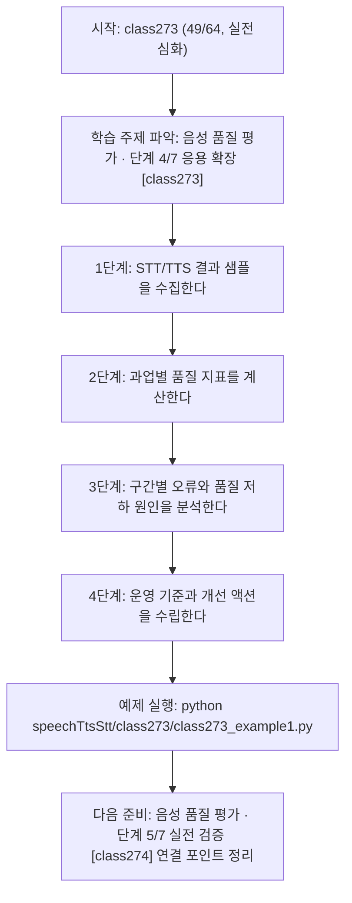
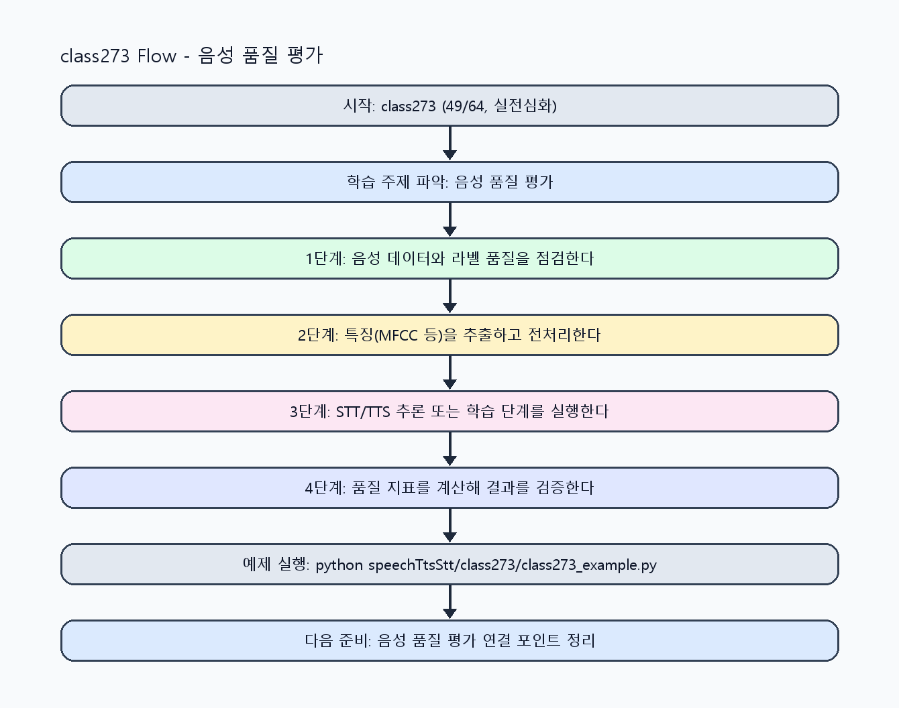

<!-- 이 파일은 www.edumgt.co.kr 의 에듀엠지티에 저작권이 있습니다 -->
# class273 자기주도 학습 가이드

## 1) 오늘의 학습 정보
- 교과목: **음성 데이터 활용한 TTS와 STT 모델 개발**
- 학습 주제: **음성 품질 평가 · 단계 4/7 응용 확장 [class273]**
- 세부 시퀀스: **49/64**
- 일정: **Day 35 / 1교시**
- 난이도: **실전심화**

### 교과목·학습주제 어휘 해설 (IT 강사 스타일)
#### 교과목 표현 분석: `음성 데이터 활용한 TTS와 STT 모델 개발`
- 문법 포인트: 명사와 명사를 대등하게 묶는 병렬 명사구 구조입니다.
- 기술 포인트: 음성 신호를 정제하고 STT/TTS 모델로 연결하는 음성 AI 교과목입니다.
| 용어 | 문법/품사 | 한글·한자 | 영어 | 기술 설명 |
| --- | --- | --- | --- | --- |
| `음성` | 명사 | 음성 (音聲) | speech/audio | 사람의 발화 신호를 디지털로 표현한 데이터입니다. |
| `데이터` | 명사(외래어) | 데이터 (한자 없음) | data | 분석, 학습, 추론의 입력이 되는 관측값 집합입니다. |
| `활용` | 명사/동사 어근 | 활용 (活用) | utilization | 이론이나 도구를 실제 문제 해결 맥락에 적용하는 행위입니다. |
| `TTS` | 약어명사 | TTS (한자 없음) | Text-to-Speech | 텍스트를 자연스러운 음성으로 합성하는 기술입니다. |
| `STT` | 약어명사 | STT (한자 없음) | Speech-to-Text | 음성 신호를 텍스트로 변환하는 기술입니다. |
| `모델` | 명사(외래어) | 모델 (한자 없음) | model | 입력과 출력 관계를 수학적으로 근사한 계산 구조입니다. |

#### 학습주제 표현 분석: `음성 품질 평가 · 단계 4/7 응용 확장 [class273]`
- 문법 포인트: 핵심 개념 명사를 중심으로 한 명사구 구조입니다.
- 기술 포인트: 이번 차시는 `음성 품질 평가` 핵심 개념을 코드 구현, 결과 해석, 점검 기준으로 연결합니다.
| 용어 | 문법/품사 | 한글·한자 | 영어 | 기술 설명 |
| --- | --- | --- | --- | --- |
| `음성` | 명사 | 음성 (音聲) | speech/audio | 사람의 발화 신호를 디지털로 표현한 데이터입니다. |
| `품질` | 명사 | 품질 (品質) | quality | 정확도, 일관성, 안정성처럼 결과가 요구사항을 만족하는 정도를 나타내는 기준입니다. |
| `평가` | 명사 | 평가 (評價) | evaluation | 지표 기반으로 모델이나 결과물 품질을 측정하는 단계입니다. |
| `STT` | 약어명사 | STT (한자 없음) | Speech-to-Text | 음성 신호를 텍스트로 변환하는 기술입니다. |
| `성능` | 명사(주제 핵심 용어) | 성능 (한자 없음) | (topic-specific) | 이번 차시 맥락: 모델 성능은 숫자 지표와 사용자 체감 품질을 함께 점검해야 실제 서비스에서 안정적으로 운영됩니다. 이를 기준으로 `성능`를 코드와 결과 해석에 연결합니다. |
| `TTS` | 약어명사 | TTS (한자 없음) | Text-to-Speech | 텍스트를 자연스러운 음성으로 합성하는 기술입니다. |

## 2) 이전에 배운 내용 (복습)
- 이전 차시: **class272 / 음성 품질 평가 · 단계 3/7 기초 구현 [class272]** (Day 34 / 8교시)
- 복습 연결: 이전에 배운 **음성 품질 평가 · 단계 3/7 기초 구현 [class272]** 를 떠올리며, 오늘 **음성 품질 평가 · 단계 4/7 응용 확장 [class273]** 와 어떤 점이 이어지는지 비교해 보세요.

## 3) 주제를 아주 쉽게 이해하기
- 한 줄 설명: STT 정확도와 TTS 자연스러움 관점의 품질 평가 지표를 통합해 다루는 차시입니다.
- 왜 배우나요?: 모델 성능은 숫자 지표와 사용자 체감 품질을 함께 점검해야 실제 서비스에서 안정적으로 운영됩니다.

### 핵심 개념 3가지
1. `STT 성능`은 추출 텍스트 품질(예: CER/WER 유사 지표)과 자막 분할 품질로 평가합니다.
2. `TTS 성능`은 발음 정확도, 자연스러움, 톤 일관성 지표로 평가합니다.
3. `통합 품질 평가`는 STT/TTS 파이프라인 전체 지연과 오류 복구 가능성까지 포함합니다.

### 비유로 이해하기
- 노래 경연 점수를 매길 때 음정, 박자, 발음을 항목별로 보는 것과 비슷해요.

## 4) 실습 환경 만들기 (항상 먼저)
아래 명령은 **처음 한 번** 준비해 두면 이후 학습이 쉬워집니다.

### Windows PowerShell
```powershell
cd C:\DevOps\Python-AI_Agent-Class
python -m venv .venv
.\.venv\Scripts\Activate.ps1
python -m pip install --upgrade pip
pip install -r requirements.txt
```

### Linux/macOS (bash)
```bash
cd /path/to/Python-AI_Agent-Class
python3 -m venv .venv
source .venv/bin/activate
python -m pip install --upgrade pip
pip install -r requirements.txt
```

## 5) 오늘의 예제 코드
- 예제 파일: `class273_example1.py`
- 실행 명령:
```bash
python speechTtsStt/class273/class273_example1.py
```

### example1~example5 단계별 테스트 확장
1. example1: STT/TTS 품질 지표 기본 계산을 실행한다.
2. example2: 구간별 자막 생성 품질과 낭독 품질을 비교한다.
3. example3: 품질 저하/오류 케이스를 점검한다.
4. example4: 통합 품질 대시보드 지표를 구성한다.
5. example5: 품질 임계치/알림/롤백 기준을 정리한다.

<!-- AUTO-GENERATED: TECH_STACK_FLOW START -->
### 기술 스택
- 언어: `Python 3`
- 실행: `CLI` (`python speechTtsStt/class273/class273_example1.py`)
- 주요 문법: `오차 지표 계산`, `품질 점수 집계`, `구간별 자막 평가`, `통합 대시보드 항목`
- 학습 포커스: `음성 품질 평가 · 단계 4/7 응용 확장 [class273]`

### 실습 example1.py 동작 원리 (Mermaid Flowchart)


### Flow PNG 캡처

<!-- AUTO-GENERATED: TECH_STACK_FLOW END -->

### 예제 코드를 볼 때 집중할 포인트
1. STT/TTS 지표가 동일 기준 데이터로 비교되는지 확인하기
2. 품질 저하 구간을 발화/화자 특성과 연결해 분석하는지 점검하기
3. 운영 임계치와 알림 기준이 정의되는지 확인하기

## 6) 퀴즈로 복습하기 (10문항)
- 퀴즈 파일: `class273_quiz.html`
- 브라우저에서 열기:
```bash
speechTtsStt/class273/class273_quiz.html
```
- 버튼 설명:
1. `채점하기`: 현재 선택한 답으로 점수를 계산해요.
2. `다시풀기`: 선택을 모두 지우고 처음부터 다시 풀어요.

## 7) 혼자 실습 순서 (초등학생 버전)
1. 코드를 한 번 그대로 실행해요.
2. 숫자/문장 값을 1개 바꿔요.
3. 결과가 왜 바뀌었는지 한 줄로 적어요.
4. 함수를 1개 더 만들어 작은 기능을 추가해요.

### 실습 미션
1. STT 결과 텍스트를 기준 스크립트와 비교해 오차 지표를 계산하세요.
2. TTS 샘플 문장 낭독 결과에서 톤/속도 품질을 점검하세요.
3. STT/TTS 통합 지표 대시보드 항목을 설계하세요.

## 8) 스스로 점검 체크리스트
- [ ] STT/TTS 품질 지표를 각각 설명할 수 있다.
- [ ] 자막 생성/낭독 품질을 사례 기반으로 점검했다.
- [ ] 서비스 운영 관점의 통합 품질 기준을 정의했다.

## 9) 막히면 이렇게 해결해요
1. 에러 메시지 마지막 줄을 먼저 읽어요.
2. 함수 이름과 괄호 짝을 확인해요.
3. `print()`를 넣어 중간 값을 확인해요.
4. 그래도 안 되면 어제 성공한 코드와 한 줄씩 비교해요.

## 10) 학습 후 다음에 배울 내용
- 다음 차시: **class274 / 음성 품질 평가 · 단계 5/7 실전 검증 [class274]** (Day 35 / 2교시)
- 미리보기: 다음 차시 전에 **음성 품질 평가 · 단계 4/7 응용 확장 [class273]** 핵심 코드 1개를 다시 실행해 두면 음성 품질 평가 · 단계 5/7 실전 검증 [class274] 학습이 더 쉬워집니다.

## 11) 다음 차시 연결
- 다음 차시에서는 모델 추론 및 튜닝으로 실전 성능 개선을 수행합니다.
- 오늘 코드를 복사하지 말고, 직접 다시 작성해 보세요.
