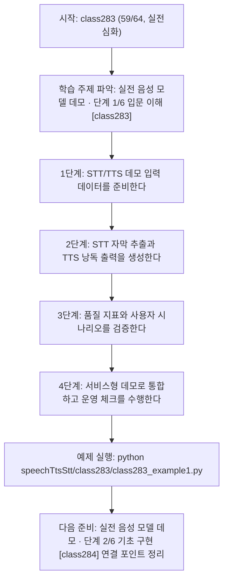
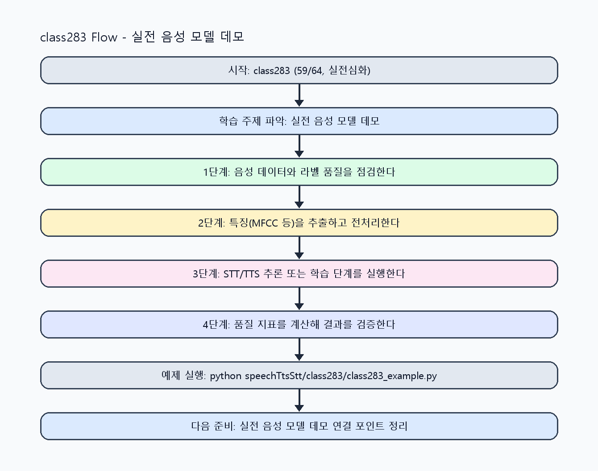

<!-- 이 파일은 www.edumgt.co.kr 의 에듀엠지티에 저작권이 있습니다 -->
# class283 자기주도 학습 가이드

## 1) 오늘의 학습 정보
- 교과목: **음성 데이터 활용한 TTS와 STT 모델 개발**
- 학습 주제: **실전 음성 모델 데모 · 단계 1/6 입문 이해 [class283]**
- 세부 시퀀스: **59/64**
- 일정: **Day 36 / 3교시**
- 난이도: **실전심화**

### 교과목·학습주제 어휘 해설 (IT 강사 스타일)
#### 교과목 표현 분석: `음성 데이터 활용한 TTS와 STT 모델 개발`
- 문법 포인트: 명사와 명사를 대등하게 묶는 병렬 명사구 구조입니다.
- 기술 포인트: 음성 신호를 정제하고 STT/TTS 모델로 연결하는 음성 AI 교과목입니다.
| 용어 | 문법/품사 | 한글·한자 | 영어 | 기술 설명 |
| --- | --- | --- | --- | --- |
| `음성` | 명사 | 음성 (音聲) | speech/audio | 사람의 발화 신호를 디지털로 표현한 데이터입니다. |
| `데이터` | 명사(외래어) | 데이터 (한자 없음) | data | 분석, 학습, 추론의 입력이 되는 관측값 집합입니다. |
| `활용` | 명사/동사 어근 | 활용 (活用) | utilization | 이론이나 도구를 실제 문제 해결 맥락에 적용하는 행위입니다. |
| `TTS` | 약어명사 | TTS (한자 없음) | Text-to-Speech | 텍스트를 자연스러운 음성으로 합성하는 기술입니다. |
| `STT` | 약어명사 | STT (한자 없음) | Speech-to-Text | 음성 신호를 텍스트로 변환하는 기술입니다. |
| `모델` | 명사(외래어) | 모델 (한자 없음) | model | 입력과 출력 관계를 수학적으로 근사한 계산 구조입니다. |

#### 학습주제 표현 분석: `실전 음성 모델 데모 · 단계 1/6 입문 이해 [class283]`
- 문법 포인트: 핵심 개념 명사를 중심으로 한 명사구 구조입니다.
- 기술 포인트: 이번 차시는 `실전 음성 모델 데모 · 단계 1/6 입문 이해 [class283]` 용어를 중심으로 문제 정의, 코드 구현, 결과 검증까지 연결합니다.
| 용어 | 문법/품사 | 한글·한자 | 영어 | 기술 설명 |
| --- | --- | --- | --- | --- |
| `실전` | 명사(기술 개념어) | 실전 (한자 없음) | (context-specific) | 용어 `실전`: 이번 학습주제에서 정의해야 할 핵심 개념 용어입니다. |
| `음성` | 명사 | 음성 (音聲) | speech/audio | 사람의 발화 신호를 디지털로 표현한 데이터입니다. |
| `모델` | 명사(외래어) | 모델 (한자 없음) | model | 입력과 출력 관계를 수학적으로 근사한 계산 구조입니다. |
| `데모` | 명사(기술 개념어) | 데모 (한자 없음) | (context-specific) | 용어 `데모`: 이번 학습주제에서 정의해야 할 핵심 개념 용어입니다. |
| `단계` | 명사(기술 개념어) | 단계 (한자 없음) | (context-specific) | 용어 `단계`: 이번 학습주제에서 정의해야 할 핵심 개념 용어입니다. |
| `입문` | 명사(기술 개념어) | 입문 (한자 없음) | (context-specific) | 용어 `입문`: 이번 학습주제에서 정의해야 할 핵심 개념 용어입니다. |

## 2) 이전에 배운 내용 (복습)
- 이전 차시: **class282 / 모델 추론 및 튜닝 · 단계 6/6 운영 최적화 [class282]** (Day 36 / 2교시)
- 복습 연결: 이전에 배운 **모델 추론 및 튜닝 · 단계 6/6 운영 최적화 [class282]** 를 떠올리며, 오늘 **실전 음성 모델 데모 · 단계 1/6 입문 이해 [class283]** 와 어떤 점이 이어지는지 비교해 보세요.

## 3) 주제를 아주 쉽게 이해하기
- 한 줄 설명: 오픈소스 STT/TTS 모델 기반으로 자막 생성과 낭독 서비스를 구현하는 프로젝트형 마무리 차시입니다.
- 왜 배우나요?: 실습 결과를 실제 서비스 시나리오로 연결해야 데이터 기반 음성 AI 구현 역량이 완성됩니다.

### 핵심 개념 3가지
1. `STT 실습`은 음성 파일에서 텍스트 추출, 구간별 자막 생성, 성능 확인까지 포함합니다.
2. `TTS 실습`은 텍스트 음성 변환, 톤/속도 조절, 샘플 문장 낭독, 한국어 합성 검증을 포함합니다.
3. `서비스 구현`은 API 흐름, 오류 처리, 모니터링 기반 운영 구조를 갖춰야 합니다.

### 비유로 이해하기
- 노래 경연 점수를 매길 때 음정, 박자, 발음을 항목별로 보는 것과 비슷해요.

## 4) 실습 환경 만들기 (항상 먼저)
아래 명령은 **처음 한 번** 준비해 두면 이후 학습이 쉬워집니다.

### Windows PowerShell
```powershell
cd C:\DevOps\Python-AI_Agent-Class
python -m venv .venv
.\.venv\Scripts\Activate.ps1
python -m pip install --upgrade pip
pip install -r requirements.txt
```

### Linux/macOS (bash)
```bash
cd /path/to/Python-AI_Agent-Class
python3 -m venv .venv
source .venv/bin/activate
python -m pip install --upgrade pip
pip install -r requirements.txt
```

## 5) 오늘의 예제 코드
- 예제 파일: `class283_example1.py`
- 실행 명령:
```bash
python speechTtsStt/class283/class283_example1.py
```

### example1~example5 단계별 테스트 확장
1. example1: 오픈소스 STT로 텍스트 추출을 실행한다.
2. example2: 구간별 자막 생성과 STT 성능 확인을 확장한다.
3. example3: 텍스트를 음성으로 변환하는 TTS 실습을 수행한다.
4. example4: 톤/속도 조절과 한국어 TTS 샘플 낭독을 비교한다.
5. example5: STT+TTS 통합 데모 서비스를 운영 기준으로 정리한다.

<!-- AUTO-GENERATED: TECH_STACK_FLOW START -->
### 기술 스택
- 언어: `Python 3`
- 실행: `CLI` (`python speechTtsStt/class283/class283_example1.py`)
- 주요 문법: `STT 추출 함수`, `자막 분할`, `TTS 합성 함수`, `통합 서비스 라우팅`
- 학습 포커스: `실전 음성 모델 데모 · 단계 1/6 입문 이해 [class283]`

### 실습 example1.py 동작 원리 (Mermaid Flowchart)


### Flow PNG 캡처

<!-- AUTO-GENERATED: TECH_STACK_FLOW END -->

### 예제 코드를 볼 때 집중할 포인트
1. STT/TTS 출력이 사용자 시나리오 요구와 일치하는지 확인하기
2. 구간별 자막 품질과 낭독 품질을 동시에 점검하는지 확인하기
3. 서비스 장애 시 복구/재시도 로직이 포함되는지 확인하기

## 6) 퀴즈로 복습하기 (10문항)
- 퀴즈 파일: `class283_quiz.html`
- 브라우저에서 열기:
```bash
speechTtsStt/class283/class283_quiz.html
```
- 버튼 설명:
1. `채점하기`: 현재 선택한 답으로 점수를 계산해요.
2. `다시풀기`: 선택을 모두 지우고 처음부터 다시 풀어요.

## 7) 혼자 실습 순서 (초등학생 버전)
1. 코드를 한 번 그대로 실행해요.
2. 숫자/문장 값을 1개 바꿔요.
3. 결과가 왜 바뀌었는지 한 줄로 적어요.
4. 함수를 1개 더 만들어 작은 기능을 추가해요.

### 실습 미션
1. 오픈소스 STT 모델로 음성 파일 자막 생성 파이프라인을 구현하세요.
2. 한국어 TTS 모델로 텍스트 낭독과 톤/속도 제어를 실습하세요.
3. STT/TTS 결과를 하나의 데모 서비스 흐름으로 통합하세요.

## 8) 스스로 점검 체크리스트
- [ ] STT 자막 생성과 성능 점검을 완료했다.
- [ ] 한국어 TTS 낭독과 톤/속도 제어를 완료했다.
- [ ] 음성 AI 서비스 데모의 입력-출력-오류 처리 흐름을 구현했다.

## 9) 막히면 이렇게 해결해요
1. 에러 메시지 마지막 줄을 먼저 읽어요.
2. 함수 이름과 괄호 짝을 확인해요.
3. `print()`를 넣어 중간 값을 확인해요.
4. 그래도 안 되면 어제 성공한 코드와 한 줄씩 비교해요.

## 10) 학습 후 다음에 배울 내용
- 다음 차시: **class284 / 실전 음성 모델 데모 · 단계 2/6 기초 구현 [class284]** (Day 36 / 4교시)
- 미리보기: 다음 차시 전에 **실전 음성 모델 데모 · 단계 1/6 입문 이해 [class283]** 핵심 코드 1개를 다시 실행해 두면 실전 음성 모델 데모 · 단계 2/6 기초 구현 [class284] 학습이 더 쉬워집니다.

## 11) 다음 차시 연결
- 다음 과목에서는 음성/텍스트/LLM 통합 파이프라인으로 확장할 수 있습니다.
- 오늘 코드를 복사하지 말고, 직접 다시 작성해 보세요.
